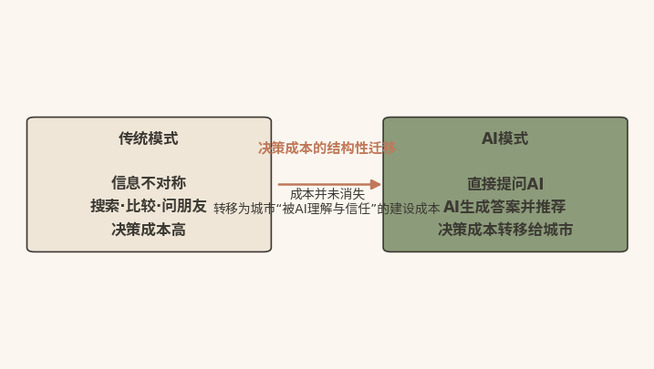

#  失效之警

## ------信任不对称取代信息不对称，旧武器失灵

  ------------------------------------------------------------------------------------------------------------------------------------------------------------
  本章速读：城市营销的旧逻辑正在失效，决策成本从消费者一侧转移到AI系统一侧，信任不对称取代信息不对称。城市营销的核心命题，从"让用户相信你"变为"让AI相信你"。

  ------------------------------------------------------------------------------------------------------------------------------------------------------------

【本章导读】

每个时代都有自己的关键词。当城市管理者合上年度营销报告，他面对的不再是"怎么让更多人知道我们"这个旧问题，而是一个新困惑：广告投了、活动做了，真正想来的人却越来越难触达。

从现有证据看，症结通常在范式，而非预算或团队。

本章是全书的"问题章"，回答一个根本问题：传统城市营销为何在AI时代系统性失效。诊断分三个层面展开：先看现象层面的三大结构性困局，再看机制层面的决策成本转移，最后看工具层面的传统武器失效。三者环环相扣，指向同一个结论：失效的根源不在方法过时，而在底层假设的崩塌。

读完本章，读者将获得一套诊断旧范式失效的分析框架，能够判断自己的城市在多大程度上仍依赖正在瓦解的旧假设。至于失效之后"新范式应该是什么"，破圈力的系统定义、四力模型与能力分层，将在第二章完整展开；破圈力每一种子能力的技术演进脉络，则在第三章追溯。

需要先说明的是，本章的诊断不是为了否定传统营销的历史价值。报纸广告、电视宣传片、搜索引擎竞价、社交媒体投放，都曾是特定技术条件下的最优解。问题在于，技术条件变了，最优解也随之改变。看清这一点，比急于寻找"新方法"更重要：找不到失效的真正根源，任何新方法都可能只是旧思路的新包装。

## 失效根源：三大困局动摇传统营销的底层假设

**【沙盘推演】**2025年春天，南方某省会城市文旅局的会议室里，一场内部复盘会让在座干部沉默良久。屏幕上的数据显示：过去一年，全市文旅宣传投入同比增长35%，覆盖人次增长42%，实际到访游客却只增长6.3%。更值得深思的是后续测试：面对"最适合短途旅行的省会城市"这类高频提问，这座城市在几家主流AI助手的推荐中排在第五名开外。

这不是个例。2025年，全球营销预算从2020年占营收11%的高点滑落至7.7%\[1\]，国内不少城市的文旅宣传投入同期仍在增加。问题不在于预算不足，而在于同样的预算能换回的"有效关注"正在减少。

综合上述迹象可以判断：传统城市营销正在系统性失效。但失效的根源比具体方法的过时更深一层：支撑整个传统营销大厦的底层假设，正在被AI系统性瓦解。

将这场复盘会再往前推一步。如果与会干部把"投入增长35%、到访增长6.3%"简单归因为"创意不够好"或"渠道没选对"，下一年度的解决方案大概率是：换一家广告公司、追加一个投放渠道、再拍一条更精美的宣传片。这正是范式失效最隐蔽的地方：它伪装成执行问题，诱使决策者在旧框架内不断加大投入，而投入越多，路径依赖越深。只有跳出执行层、回到假设层，才能看清问题的全貌。

### 困局总览：三层变化环环相扣，失效是结构性而非周期性

先看这个底层假设是什么。无论报纸广告、电视宣传片，还是搜索引擎竞价、社交媒体投放，传统城市营销都建立在同一个假设上：用户自己搜集信息、自己比较选项、自己做决策。SEO的逻辑是"让用户搜索时先看到你"；OTA（在线旅游平台）竞价的逻辑是"让用户比价时排在你前面"；社交媒体投放的逻辑是"让用户浏览时刷到你"。所有策略都指向同一目标：在用户的"信息搜集"阶段占据有利位置。

然而，正是在这个假设之下，传统城市营销始终背着三个环环相扣、无法在旧范式内部解决的结构性困局。

说它们"环环相扣"，是因为三者分属不同层面却互为因果。信息超载是环境层的变化，使用户单凭自身注意力无法处理海量信息；技术赋权是工具层的变化，把筛选和验证的武器交到用户手中；代际变迁是主体层的变化，决定新工具被采纳的速度与深度。环境变化催生工具需求，工具普及重塑用户习惯，用户习惯又反过来加剧环境对传统传播方式的"免疫"。

理解这种咬合关系，是理解失效为何"结构性"而非"周期性"的前提。

### 信息超载：注意力成为稀缺资源

全球每天产生的信息量已难以用传统计量单位衡量，用户的注意力窗口以秒计。过去，花一千万拍一条宣传片，可以在央视黄金时段轮播一个月；今天，同一条片子进入"无限信息流"，与海量内容同场竞争，转瞬即逝。传统城市营销建立在"信息相对稀缺"的环境假设之上。当信息从"稀缺"变为"过剩"，传播声量再大，也可能淹没在噪音之中。

信息超载对城市营销的冲击，可以拆成三个递进层面。其一，到达率下降：同样一笔预算，能确保触达的受众比例持续走低。其二，留存率下降：即便触达，信息在受众心智中的停留时间也以秒计，难以形成记忆。其三，转化率下降：即便形成记忆，用户也习惯在决策前再验证、再比较，单一声量难以直接转化为行动。三个层面叠加，意味着"声量→关注→记忆→决策"这条传统传播价值链的每一个环节都在漏水。

更深一层看，注意力稀缺改写了传播的价值公式。信息稀缺时代，"被看到"本身就是稀缺资源，声量几乎可以等同于影响力；信息过剩时代，"被看到"只是入场券，声量与影响力之间隔着"是否被筛选工具放行""是否被用户采信"两道关卡。声量不等于关注，关注不等于记忆，记忆不等于决策。这个不等式链条，是理解后文"决策成本转移"的必要铺垫。

对预算决策者而言，这三个层面提供了一把新的尺子。评估任何一笔传播预算，不再只看"能买多少曝光"，而要检验三点：这笔投入能否穿透筛选工具抵达用户，抵达之后能否在几秒之内被记住，被记住之后能否经得起用户的再验证。三点中只要有一点不成立，这笔预算的实际效能就要大打折扣。用这把尺子重新丈量既有的预算结构，许多城市会第一次看清"有效关注"流失的具体环节。

### 技术赋权：消费者握起决策权杖

移动互联网和社交媒体，在很大程度上改写了用户与城市之间的权力结构，用户手里多了三重"权力武器"。一是选择权：跳过广告、屏蔽推送，直接截断传统广告的流量入口；二是验证权：查阅第三方测评、对比真实口碑------宣传片里的"千年古都"，用户一搜就发现景区排队两小时、厕所卫生堪忧，信息不对称由此被UGC显著打破；更关键的是第三重，信用权的转移：用户更信任"陌生人写的游记"，而不是"城市拍的宣传片"，这也是失效最深层的根源。

尼尔森（Nielsen）2021年全球广告信任度调查（覆盖56个国家和地区约4万名消费者）显示：88%的消费者最信任"认识的人推荐"，信任各类品牌付费广告的比例均明显低于口碑推荐\[2\]。城市花最多的钱，做公众最不相信的事，这本身就是结构性悖论。

信用权转移之所以是"最深层"的根源，在于它直接改写了营销的基本等式。传统模式下，信任的主要来源是"谁在说"：权威媒体的背书几乎等同于信任本身，而权威媒体的版面与时段是可以购买的。新模式下，信任的主要来源变成"有多少独立来源在说同一件事"：游记、点评、测评、晒单，彼此无关联却相互印证。

前者可以购买，后者只能积累；前者是支出，后者是资产。当信任的生成机制从"可购买的背书"转向"需积累的印证"，以购买为核心的传统营销预算结构，便从根基上被动摇。

### 代际变迁：Z世代重构价值判断体系

Z世代（本书采用1995---2009年出生的界定）是数字原住民，普遍追求真实、热衷参与、偏爱价值认同，对硬性推销套路较为排斥，决策路径也与传统游客截然不同。传统营销瞄准线性决策："我要去旅游→我该去哪"；Z世代却常常是逆向的："我刷到一个有意思的打卡点→原来它在XX市→那就顺便去一趟"，驱动这一决策的是内容，而非目的地。

逆向决策路径对城市营销的含义，远不止"决策顺序颠倒"这么简单。在线性路径中，目的地是起点，内容是工具，城市只要在有明确出行意向的人群中争夺排序即可，竞争范围可控。在逆向路径中，内容是起点，目的地是附属信息，城市实际上是在与全网所有内容争夺注意力，而用户从"刷到"到"动身"之间还存在漫长的衰减链条。这解释了为何许多城市"话题很热、到访很冷"：它们赢得的是内容维度的曝光，却没有建成从曝光到到访的转化通道。

从价值判断的维度看，Z世代的"新"集中在三个偏好上。一是偏好"可参与的真实"甚于"被包装的光鲜"：未经修饰的现场感，反而比精修的形象片更能赢得信任。二是偏好"平等的对话"甚于"单向的宣传"：官方账号居高临下地说话，往往适得其反。三是偏好"意义的认同"甚于"功能的罗列"：一个城市代表什么样的生活方式和价值主张，比它有多少个A级景区更能打动这一代人。这三个偏好与三大困局中的信用权转移互为表里，共同宣告了"我说你听"式营销的终结。

**【沙盘推演】**设想两座资源禀赋相近的古城，同获一笔千万元级营销预算。甲城沿用传统思路：拍摄城市形象大片、购买开屏广告、投放搜索引擎关键词。三个月后，监测显示曝光量可观，但年轻客群的实际到访增长有限。乙城则用相当一部分预算梳理可传播的真实体验点、培育本地内容生态、维护多平台信息的一致性。三个月后，乙城声量不及甲城，却在"周末去哪儿"类话题和AI助手的相关推荐中频繁出现，年轻客群到访稳步上升。两种结果的差异，不在于谁更努力，而在于谁更贴近新的决策路径。

于是，传统营销最深层的困境显现出来：精心策划的"城市形象"，可能不如游客随手拍的一条短视频；经营多年的品牌口号，传播热度可能不及一碗偶然走红的地方小吃。这并非城市不作为，恰恰是过度依赖"传统意义上的正确营销"的结果。

三大困局叠加，构成一个难以在旧范式内部解开的死结：信息超载稀释了声量，技术赋权架空了背书，代际变迁改写了路径。任何单一手段的优化，都只能缓解其中一个困局的表层症状，同时被另外两个困局抵消。

  --------------------------------------------------------------------------------------------------------------------------------------------
  "系统性失效"的准确含义：失效的不是某个环节，而是环节之间的整个连接方式。要理解这种连接方式为何崩塌，需要下潜到更基础的决策成本的结构层面。

  --------------------------------------------------------------------------------------------------------------------------------------------

## 成本转移：从信息不对称转向AI信任不对称

以上三大困局并非各自孤立，它们共同指向一个更根本的结构性变化，本书称之为"决策成本的结构性迁移"（见图1-1）。

{width="4.330555555555556in" height="1.5125in"}

图1-1 决策成本结构性迁移示意图

先看传统模式下的决策成本。那时，消费者面对的核心成本是"信息不对称"：不知道哪个城市更适合自己，需要搜索、读攻略、比评价、问朋友。传统城市营销的核心策略，就是降低这个成本：搜索排名降低搜索成本，KOL视频降低认知成本，各类榜单降低比较成本。这套逻辑百余年未变，改变的只是手段。

值得强调的是，这套旧逻辑曾经长期稳固。无论媒介形态如何更替，"谁在用户搜集信息的环节占据有利位置，谁就赢得决策"这一法则始终成立。城市营销的全部技巧，如创意、投放、排名、公关等，本质上都是围绕这一法则展开的"占位技术"。正因为法则本身百余年未受挑战，从业者很容易把"占位技术"的精进误认为营销的全部。但这忽视了一个更根本的问题：一旦用户不再亲自搜集信息，占位便失去意义。

回顾这套"占位技术"的演进史，可以更清楚地看到法则的连续性。报纸时代占的是版面，电视时代占的是时段，搜索时代占的是排名，社交时代占的是信息流。每一次媒介更迭，淘汰的只是占位的具体技术，而不是"占位"本身。正是这种"技术换了几轮、法则始终有效"的历史经验，让许多从业者形成惯性判断：AI也不过是下一个需要占位的媒介而已。后文将看到，这一次被瓦解的恰恰是法则本身。当信息搜集不再由人完成，"占人的位"就必然让位于"占AI的认知"。

再看AI如何瓦解这个假设。用户不再逐条浏览搜索结果，不再逐篇阅读攻略，也不再逐项对比评分，而是把整个"信息搜集与比较"环节外包给了AI助手。用户输入"预算三千元、带老人出行、最好是历史古城、不要太商业化"，AI通常在几秒内即可完成过去需要数小时乃至数天的信息处理工作。用户不再需要知道"哪个城市更好"，只需在AI给出的有限选项里做一道"选择题"。

这一转变常被轻描淡写为"又多了一个新渠道"，实则不然。渠道之变，改变的是信息抵达用户的路径；此次变化，改变的是信息处理的主体。过去，无论路径如何曲折，处理信息、形成判断的都是用户本人，营销只需影响"人"这一个对象。现在，信息处理发生在AI系统内部，营销需要同时影响"机器的判断"和"人对机器判断的信任"。对象变了，对象的判断机制也变了，围绕旧对象建立的全部方法论，自然需要重估。

**【沙盘推演】**设想一个正在成形的日常场景。周五傍晚，一位年轻白领对AI助手说："帮我规划一个两天一夜的周边游，高铁两小时内，要有好吃的，适合拍照，人均预算八百元。"几秒钟后，AI给出三个候选城市及完整行程。这一场景中，城市营销的"触点"已经改变：用户没有打开任何攻略App，没有输入任何城市名，没有观看任何宣传片。城市甚至没有机会"被浏览"；只有在AI的候选清单里"被想到"，才可能进入这个周末的行程。如果一座城市在这个清单里缺席，它失去的不是一次曝光，而是整个决策的入场资格。

但这里有一个关键差异：AI推荐的逻辑，和搜索引擎排名的逻辑完全不同。搜索引擎依据关键词匹配和外链数量排序，这套逻辑城市营销沿用了二十多年。AI优先推荐的，却不是"关键词匹配度最高"的城市，而是"可信度最高"的城市（AI-RAG五维加权评估框架详见第六章）。AI判断可信度，看的是语义相关性、信源权威性、内容结构化完整度、多源交叉一致性，以及内容新鲜度与用户反馈（两者合为一个维度）。这恰恰是传统城市营销从未系统建设过的领域。

由此，一种新的"不对称"产生了：消费者的核心焦虑，从"我不知道哪个城市更好"，转移为"我不确定AI的推荐是否可靠、是否公正"。本书将这种新焦虑称为"AI信任不对称"。过去，"央视播了我们的宣传片"是一种信任信号；现在，用户依赖AI的交叉验证，看的是城市无法"包装"的东西：政府认证的级别、学术文献的引用频次、主流媒体的独立报道、多平台信息的一致性、真实用户的评价分布。城市营销的核心命题由此根本转移：从"让用户相信你"变为"让AI相信你"。因为在多数消费场景中，用户已把"该信谁"的决策权部分外包给了AI。

之所以在"迁移"前冠以"结构性"三字，是因为这场变化至少包含三个层层递进的深层含义。第一，成本承担者转移了：信息搜集与比较的成本，从消费者身上转移到AI系统身上，消费者转而支付一种新的成本，即对AI推荐是否可信的"信任成本"；第二，成本性质转变了：过去的营销投入多为一次性消耗，广告停播，效果即止；面向AI认知库的建设则更接近资本性投入，数据、信源、内容一旦沉淀，会持续产生推荐权重；第三，迁移方向不可逆：用户一旦习惯"问AI"，就很难回到"翻十页搜索结果"的旧方式，正如习惯了导航的司机很难再回到纸质地图。

这三层含义对城市管理者各有指向。成本承担者的转移，提示营销对象从"人"扩展为"人与AI"；成本性质的转变，提示预算观需要从"费用思维"转向"资产思维"：今天的结构化数据建设，就是明天的推荐权重复利；迁移的不可逆，则提示观望是有成本的：AI认知库中的排位具有先发累积效应，起步越晚，追赶所需的建设量越大。

换一个角度看，"AI信任不对称"也重新定义了城市竞争的公平性。信息不对称时代，知名度是一种可以继承的"存量优势"：历史名城、传统强市凭借多年积累的声量，天然占据用户的候选清单。AI信任不对称时代，决定推荐的是可验证、可交叉印证的"证据质量"，而非历史声量的简单延续。声量大的城市若证据薄弱，推荐排位未必靠前；声量小的城市若证据扎实，反而可能获得与其知名度不相称的推荐机会。认知竞争的天平，正在从"存量"倒向"增量"。

决策成本的结构性迁移，给城市营销带来三个根本性的后果。

第一，主战场转移。竞争的主战场，从"搜索结果页"转移到"AI认知库"。两套战场之间不存在天然的"流量传导"：在OTA平台排名第一，并不代表在AI推荐中也排名第一。两套战场，需要两套完全不同的武器。

第二，能力要求升级。传统模式的核心能力是"传播力"：能不能把信息推出去。AI时代的核心能力是"破圈力"：能不能成为AI优先推荐、用户愿意相信、大众自发传播的对象。传播力可以花钱买到：投广告、买排名、请KOL。破圈力必须通过建数据、建信源、建内容、建生态的系统工程才能获得。

第三，竞争格局重塑。每个城市在AI认知库中站在同一条起跑线上，不看GDP排名，不看历史资历，只看"数据资产+权威信源+内容质量+真实口碑"。从现有趋势看，一个资源禀赋一般但AI建设领先的城市，有可能超越资源丰富但数字化转型滞后的传统旅游强市。城市竞争格局，正在经历一轮由AI驱动的重新排序。

三个后果之间存在清晰的递进关系：主战场转移回答"在哪里竞争"，能力要求升级回答"凭什么竞争"，竞争格局重塑回答"竞争的结果是什么"。对城市而言，第三个后果既是警报，也是机遇。警报在于，既有的资源优势不再自动兑换为认知优势；机遇在于，认知优势的建设窗口对几乎所有城市同时敞开。在AI认知库这条新起跑线上，先发与后发之间，目前只隔着建设的决心与方法，而不是不可逾越的历史差距。

这一变局对不同类型城市的含义，值得分别申明。对资源禀赋优越的传统旅游强市而言，第三个后果意味着"护城河变浅"：过去的优势建立在资源稀缺和信息不畅之上，而AI正在同时消解这两者，守成比开拓更危险。对数量更多的中小城市而言，这则是一次罕见的"换道"机会。旧战场上，它们受预算规模所限，几乎不可能在声量上反超强市；新战场上，数据资产、权威信源、内容质量与真实口碑四要素，都不完全取决于预算规模。率先完成AI认知库建设的城市，有机会实现推荐排位的"非对称超越"。

## 武器失效：广告、SEO与KOL解决不了新问题

新战场上，传统城市营销的三件武器（广告投放、SEO优化、KOL种草）系统性失效。并非"效果变差了"，而是"需要解决的问题变了"。

先看广告投放。它解决的是"让用户看到你"，但用户已把"看"外包给了AI。投入一千万元做广告，如果没有被AI抓取、被结构化标记、被权威信源背书，就无法转化为AI的推荐权重。买到的只是"用户的眼球"，而用户的眼球正看向AI的屏幕。

再看SEO优化。它解决的是"让用户搜索时先看到你"，但用户正在从"搜索"转向"提问"：从"黄山旅游攻略"，变成"给我推荐一个适合带父母去的山岳景区"。这一差异是结构性的：前者只是"承接既有需求"，后者才是"创造新需求"的入口。传统SEO无法覆盖这个入口，因为用户根本没有输入任何关键词。

最后看KOL种草。它解决的是"让用户信任的人来推荐你"，但用户越来越意识到，KOL推荐背后可能有商业合作。信任的天平，正从"个体KOL"倾斜到"海量UGC的统计分布"，这不是"一个人说好"，而是"一千个人里八百个人说好"。而聚合这个证据需要AI，问题由此又回到"让AI信任你"这一主战场。

  --------------------------------------------------------------------------------------------------------------------------------------------------------------------------
  三件武器解决的，都是旧模式下的"信息不对称"问题，但用户的决策路径已经绕过了它们。把旧战场的武器搬到新战场，如同以弓箭对抗导弹：并非弓箭不够锋利，而是战争的性质已经不同。

  --------------------------------------------------------------------------------------------------------------------------------------------------------------------------

进一步拆解可以发现，三件武器失效的方式各不相同，却共享同一个根源。广告失效在"对象"：它作用于人，而关键环节已前移至AI。SEO失效在"入口"：它承接关键词，而用户已不再输入关键词。KOL失效在"信用"：它依赖个体背书，而信任已转向可统计、可交叉验证的群体分布。对象、入口、信用，恰好是营销链条的三个支点。三者同时位移，说明这不是武器本身的磨损，而是武器所瞄准的靶场整体搬迁了。

需要澄清的是，"失效"不等于"无用"。广告仍能塑造品牌调性，SEO仍能承接存量搜索需求，KOL仍能在特定圈层制造话题。准确的判断是：它们从"解决问题的完整方案"，退化为"整体方案的局部组件"。其产出必须经过结构化沉淀、权威背书和多源印证，才能在新战场上生效。继续把它们当作主武器，是资源错配；把它们嵌入以AI认知库为目标的新体系，才是物尽其用。

这一判断对预算配置有直接的指导意义。务实的做法，是给预算做一次"体检式重排"，而非"一刀切"地砍掉传统投放。先盘清现有预算中，多大比例服务于旧战场的"占位"，多大比例能沉淀为新战场的"资产"。再逐步把前者中效能最低的部分，转投数据结构化、权威信源建设、真实口碑培育等能形成长期积累的领域。换言之，"传统武器留不留"是伪问题，真问题是让每一件武器在新体系中找到正确的位置。

至此，本章的诊断逻辑已经完整：三大困局是"症"，成本转移是"病"，武器失效是"旧药方对新病无效"。诊断的价值在于指向治疗。当"让用户相信你"让位于"让AI相信你"，城市需要一种全新的、可建设、可评估的系统能力。这种能力就是本书的核心概念"破圈力"。它的完整定义、四力模型与建设路径，将在第二章系统展开。

## 自查三问：诊断城市对旧范式的依赖度

在进入第二章之前，建议城市管理者用三个问题做一次快速自查。第一问：假设明天停止所有付费投放，城市在AI助手的相关推荐中是否仍会被提到。这一问检验的是认知资产的存量。付费流量是"租来的"，AI认知库中的结构化沉淀才是"建起来的"。第二问：城市最引以为傲的文化资源，是否已转化为AI可读、可引用的结构化数据。这一问检验的是数据资产的起点。第三问：面对一条突发的负面舆情或意外的流量洪峰，城市是否具备跨部门的快速响应机制。这一问检验的是组织协同的底线能力。

三问之中，第一问对应主战场，第二问对应数据根基，第三问对应响应能力。若三问皆无肯定答案，说明城市仍整体运行在旧范式之内，当务之急是启动面向AI认知库的基础建设，而非追加传播预算。若已有部分肯定答案，则说明破圈力的某些组件已经萌芽，需要的是系统化的整合与升级。带着这份自查结果阅读第二章，四力模型的每一项建设建议，都会更容易对上自己城市的实际缺口。

自查之后，行动上可以从三件"低成本、高杠杆"的小事起步。

其一，做一次"AI盲测"：以普通游客的身份，围绕"周边游""亲子游""文化体验"等真实场景，向几家主流AI助手提问，记录自己的城市是否被提及、排在什么位置、推荐理由是什么。这份记录，就是城市在AI认知库中的第一份"体检报告"。

其二，盘点一次"数据家底"：确认城市最核心、最独特的文化与旅游资源目前以什么形态存在，是宣传册上的形容词，还是结构化、可检索、可引用的数据。

其三，建立一条"跨部门信息线"：文旅、宣传、数据、市场监管等部门围绕城市认知资产，建立常态化的信息共享机制，为后续系统建设打好组织地基。三件事都不需要大规模投入，却能直接校准第二章建设路径的起点。

## 本章小结：旧范式的失效源于决策成本的结构性迁移

本章完成了全书的第一项基础工作：诊断旧范式的失效根源。

本章分三节揭示了传统城市营销失效的三个层面。现象层面：信息超载、技术赋权与代际变迁三大困局环环相扣，稀释声量、架空背书、改写路径。机制层面：决策成本发生结构性迁移，消费者的核心焦虑从"信息不对称"转为"AI信任不对称"，成本的承担者、性质与方向随之根本改变。工具层面：广告、SEO、KOL三件传统武器分别失效于对象、入口与信用的位移，从"完整方案"退化为"局部组件"。

贯穿全章的关键线索是"决策成本的结构性迁移"。它解释了为什么失效不是周期性的低谷，而是结构性的转折；也解释了为什么城市营销的核心命题，已从"让用户相信你"变为"让AI相信你"。章末的三问自查，帮助读者把这一诊断框架落到自己城市的具体处境上。

读完本章，读者应当能够回答三个问题：传统城市营销为何正在失效，失效的根源在方法层还是假设层，以及自身城市对旧范式的依赖度有多深。至于"失效之后怎么办"，第二章将给出建设性的答案：破圈力的系统定义、四力模型与能力分层，为城市提供一幅从"诊断"走向"建设"的战略地图。

+:-----------------------------------------------------------------------------------------+
| 失效的不是某个方法，而是方法背后的假设；找不到真正的根源，新方法往往只是旧思路的新包装。 |
|                                                                                          |
| 过去，城市营销的核心是"让用户相信你"；今天，核心已变为"让AI相信你"。                     |
|                                                                                          |
| 付费流量是租来的，AI认知库中的沉淀才是建起来的。                                         |
+------------------------------------------------------------------------------------------+

### 参考文献

\[1\] Gartner. Gartner 2025 CMO spend survey reveals marketing budgets
have flatlined at 7.7% of overall company revenue\[N/OL\].
(2025-05-12)\[2026-08-07\].
https://www.gartner.com/en/newsroom/press-releases/2025-05-12-gartner-2025-cmo-spend-survey-reveals-marketing-budgets-have-flatlined-at-seven-percent-of-overall-company-revenue.

\[2\] NIELSEN. 2021 Trust in Advertising Study\[R/OL\].
(2021-10)\[2026-08-07\].
https://www.nielsen.com/insights/2021/trust-in-advertising-2021/.
