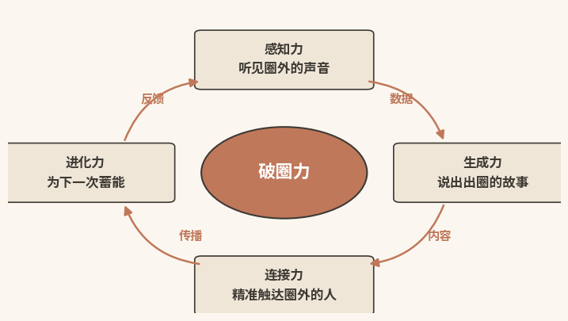
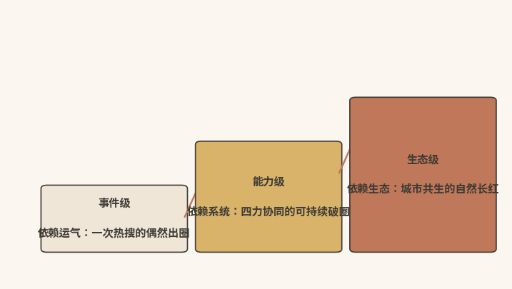

#  破圈之力

## ------四力模型把偶然出圈变成可复制的系统能力

  --------------------------------------------------------------------------------------------------------------------------------------------------------------
  本章速读：破圈力不是运气，而是由感知力、生成力、连接力、进化力咬合而成的系统能力。四力闭环让出圈从偶然变为可复制；能力高低分事件级、能力级、生态级三个层级。

  --------------------------------------------------------------------------------------------------------------------------------------------------------------

【本章导读】

第一章的诊断留下了一个问题：当传统营销的底层假设被AI瓦解，当"让用户相信你"让位于"让AI相信你"，城市需要一种新的能力形态。本章给出定义：破圈力。

本章是全书的定义章，回答三个层层递进的问题：破圈力是什么，与"出圈""破圈"有何本质区别；四力如何协同成一个有机整体；从"偶然出圈"到"持续长红"，中间隔着几个台阶。

章末以景德镇为完整案例，检验框架的解释力。读完本章，读者将获得一个理解AI时代城市竞争的新框架，即从"传播术"到"系统能力"，以及一把判断城市所处层级的尺子。

## 系统定义：破圈力是可建设的系统能力

第一章讨论的决策成本结构性迁移，解释了"旧范式为什么失效"；本节要回答的是"新范式应该是什么"：破圈力是什么，由什么构成，为什么是AI时代城市最稀缺的战略资产。

### 概念递进：出圈是结果，破圈是过程，力是系统

理解"破圈力"，需要先分清三个层次完全不同的概念：出圈、破圈、破圈力。

出圈：传播结果。

**"出圈"是描述性概念，指向传播的终点**：一座城市因某个事件、某种特质冲破原有圈层壁垒，闯入大众视野。哈尔滨因冰雪季的服务细节出圈（详见第四章），天水因一碗麻辣烫出圈（详见下文）\[1\]，荣昌因一次意外的投喂互动出圈（详见第八章）。

出圈是"发生了"的事实，但它不解释"为什么发生"，也不回答"还会不会再发生"。多数出圈带有偶发性：流量来了是惊喜，走了是常态。

破圈：创新过程。

**"破圈"是过程性概念，指向城市主动、系统的创新行动：**打破行业、思维与地域边界，靠跨界融合、技术赋能和制度创新，完成价值重构和能力升级。

景德镇不是"突然爆火"的故事。它靠多年系统性建设（古陶瓷基因库\[2\]、"一码"服务体系\[3\]、AIGC场景化应用\[4\]、"候鸟计划"\[5\]），一步步从"千年瓷都"蜕变为"数字文化产业新高地"。没有爆款事件，但每一次搜索，都有更多人在发现它。

"破圈"的核心是主动和持续：不等流量降临，主动打破边界；一次性"破开一个缺口"不够，要持续突破、持续升级。

破圈力：系统能力。

**出圈是"结果"，破圈是"过程"，破圈力则是支撑过程、让结果可持续的内在系统。**它不是某个能人的个人能力，也不是某次好运气，而是一套内置于城市系统、可反复调用、可持续升级的能力体系。

可以作一个类比。出圈，像偶然走进一家好餐厅，吃到一顿好饭；破圈，像自己学会了烹饪；破圈力，则是拥有一套完整的厨房。没有厨房的人也能靠外卖吃到好饭，但明天还能不能吃到，没有把握。要义在于：能力是内生的，运气是外生的。

### 本质特征：可复制、可迭代、可评估、抗归零

破圈力有四个本质特征。它们把破圈力与"运气""天赋"这类模糊概念区分开，把它立为一个真正的"能力"概念。

特征一：可复制性。破圈力不是某个能人、某次灵感的偶然产物，而是别的城市能学、能借鉴、能部署的方法论。景德镇的"一码"服务体系、荣昌的"首席推介官"机制（详见第八章）、哈尔滨的舆情快速响应流程（详见第四章），都可以复制。复制不等于照搬，但底层的四力模型通用。破圈力是知识，不是天赋。

特征二：可迭代性。破圈力随技术演进和市场变化持续升级，不会固化成一成不变的"标准操作流程"。今天的感知力靠舆情监测，明天可能接入数字孪生的实时数据流；今天的生成力靠AIGC图文，明天可能涵盖全息视频和交互式AR。破圈力是活的系统，不是死的流程。

特征三：可评估性。破圈力不靠"我感觉我们有"的主观判断，靠可量化诊断的能力指标，第九章将系统介绍五维评估体系。破圈力是可管理的战略资产，决策者可以像看财务报表一样看破圈力指标。

特征四：抗归零性。这是最关键的一条。破圈力一旦建立，不会因一次失败的出圈尝试清零。恰恰相反，失败会带来数据反馈、经验教训和策略修正，让系统在"失败→学习→迭代"的循环里变得更强。靠运气的出圈失败了，一切归零；靠破圈力的出圈失败了，进化力启动，系统比上次更强。需要限定的是，这里说的抗归零，指学习积累不因单次失败清零。它不等于认知资产不会损耗。认知资产的可损性，本书将在结语"认知主权"部分展开。

### 四力模型：四种子能力构成生命有机体

破圈力不是笼统的"大能力"，而是四个相互咬合的子能力构成的复合体：感知力、生成力、连接力、进化力（见图2-1所示）。它们如同一个有机体的四种生命功能，远非四个并列的"工具箱"。

{width="4.330555555555556in"
height="2.446527777777778in"}

图2-1 破圈力四力模型

感知力：让城市"听见"圈外的声音

感知力要解决的问题是：做任何营销决策之前，城市是否真正知道圈外正在发生什么、公众在关心什么。没有感知力的城市，像闭着眼走路的人：只能凭经验决定往哪走，要么错过窗口期，要么方向严重跑偏。

感知力有三个层次。

第一层是听见：知道有多少人在讨论你，讨论量在升还是在降。第二层是听懂：不光知道"多少人在讨论"，还要知道"在讨论什么""情绪是正是负"，这需要借助NLP（自然语言处理）技术做语义分析和情感识别。第三层是预见：在话题还没热起来之前，就基于历史数据做模式识别、基于实时信号做捕捉，预判它的爆发潜力。传统城市营销的感知力停在第一层（年底一次满意度调查、每季度一份舆情简报），偶尔碰到第二层，几乎没到过第三层。AI时代的感知力，一般以第三层为起点。

生成力：让城市"说出"出圈的故事

生成力要解决的问题是：城市知道了该说什么，是否真能规模化、个性化、持续地"说出来"。缺生成力的城市，像心中有千言万语却说不出口的人：禀赋深厚，却变不成可传播的内容产品，产能被锁死在"一两个工作人员+外包团队"的上限里。

生成力同样有三个层次。

第一层是能产：有内容产出，且能持续产出，不管有没有活动、预算和外包团队，城市都能保持稳定的内容供给；第二层是能爆：产出"能传播"的内容，这要求深刻理解传播规律，即什么内容引发共鸣、什么形式激发分享；第三层是能共：城市激发起一个"内容共生生态"，AIGC做种子内容，UGC做情感内容，KOC（关键意见消费者，详见附录二十）做口碑内容，官方做权威内容，四者共存、互促、共振。城市的"故事"，往往在多方参与中被"共生"出来，而不是被单方"生产"出来。

连接力：让内容穿透圈层壁垒

连接力要解决的问题是：好内容作出来了，如何冲破圈层壁垒，触达"原本不会关注这座城市"的人。更重要的是，不仅要让受众"看到"，更要让其"相信"。缺连接力的城市，像在自家客厅演讲的人：听众永远是原本就关注它的那群人。

连接力也有三个层次。

第一层是触达：内容被推送到目标人群的设备上，靠的是渠道建设和分发策略；第二层是穿透：不止"送到了"，还要"看进去了"，靠的是对受众画像的理解；第三层是信任：受众不只"看到"，而且"相信"了。信任的建立，本质上不是传播学问题，而是"证据链"问题：关键在于城市有没有提供可验证、多源一致、权威背书的凭证。

AI时代，连接力的第三层有了新含义：不只"让人相信"，更要"让AI相信"。当AI引用城市的官方数据和权威认证作为推荐依据，用户对城市的信任就完成了"AI背书"的闭环。

进化力：让城市从每一次出圈中"长本事"

进化力要解决的问题是：这次出圈成功了，下次如何确保还成功；失败了，如何从中学到东西。缺进化力的城市，像原地打转的仓鼠：每次都全力以赴，却每次都近乎从零开始。

进化力包含四个层次。

第一层是事后复盘：每次活动后做系统性复盘，这是"数据驱动的根因诊断"，而不是"凭经验的主观总结"；第二层是实时调优：从事后复盘走向事中调优，AI根据实时监测指标动态调整策略，靠A/B测试实现在线优化；第三层是预判布局：不止应对已发生的，更在趋势成形前布局，提前储备内容、渠道与资源，下一个机会窗口开启时，城市已经站在门前；第四层是文化进化：把每次实践的经验沉淀为组织知识，让系统本身"升级"，成功经验标准化为策略模板，下一次出圈直接调用适配，最终内化为组织的文化与本能。这是进化力的最高形态。

需要说明的是，四力的层次数按各能力成熟阶段自然划分（感知力、生成力、连接力各三层，进化力四层），求的是解释力，不是形式上的整齐。

### 系统协同：四力闭环反馈形成自增强回路

四个子能力之间，要害是"协同"，而非简单"并列"。

感知力是四力中的"侦察兵"。它走在最前面，主要输出趋势报告、情感分析、受众画像等，是其他三力的决策输入。

生成力是四力中的"弹药库"。它照着侦察报告，生产适配不同场景、人群、平台的内容弹药。没有感知力，是"蒙眼造子弹"；没有生成力，是"光侦察不射击"。

连接力是四力中的"狙击手"。它拿着生成力的弹药，瞄准感知力锁定的目标，在最合适的时机精准打入受众心智。没有弹药只能打"空包弹"，没有目标就成了"扫射"。

进化力是四力中的"军师"。每仗打完，它复盘整个链条，把经验沉淀为战术手册。没有进化力，前三力"打完一仗忘一仗"。

这一协同关系可以概括为一句话：感知力告诉你"往哪破"，生成力给你"破的工具"，连接力帮你"破进去"，进化力确保你"越破越强"。

更关键的是，四力协同不是线性的"A→B→C→D"，而是一个闭环：进化力的输出反哺其他三力。这个反馈回路让破圈力成为"自增强系统"，这正是"抗归零性"的来源。

这个闭环的实际含义，在于"短板效应"与"飞轮效应"并存。系统效能受制于最弱的一力；四力一旦全部迈过门槛，闭环就开始自我加速。建设的战略顺序，因此是"先补齐短板、再启动飞轮"，而非优先把某一力做到最高水平。

### 时代前提：完整的破圈力只在AI时代成立

四力模型还蕴含着一个更深层的判断：完整的破圈力，只有在AI时代才真正成为可能。AI出现之前，城市也能在一定程度上拥有四力：舆情监测公司做感知，广告团队做生成，媒体投放做连接，年度复盘做进化。但这些能力通常零散、以人力为主，每一项都受制于人的产能上限。

AI的出现改变了这一格局。

感知力上，AI把感知从"抽样的、滞后的、主观的"，升级为"全量的、实时的、数据驱动的"。深圳等先锋城市的数字孪生平台，已实现城市级空间数据实时映射。

生成力上，AI把生成从"手工的、高成本的、低产量的"，升级为"规模化的、低成本的、可持续的"：AIGC让内容生产的边际成本显著下降，"一人一团队"也能维持过去外包团队的产能。

连接力上，AI把连接从"撒网式的、泛化的、难以评估的"，升级为"精准的、个性化的、效果闭环的"。基于精细画像的人群定向、秒级的个性化行程规划，没有AI始终可望而不可即。

进化力上，AI把进化从"经验驱动的、滞后的、偶然的"，升级为"数据驱动的、实时的、系统化的"：进化不再是"聪明人做总结"，而是"系统本身的自我升级"。

由此就可以理解，本书为何把破圈力界定为AI时代的城市核心能力。不是AI"加持"了破圈力，而是AI"实现"了破圈力。这一范式澄清，第三章将专节展开。前AI时代的城市也有"破圈"实践（如哈尔滨，详见第四章），但那更像有天赋的人"无意中"做对了一切。AI的价值，在于把"无意中做对"变成"可以系统地做对"。

## 能力分层：从事件级到能力级再到生态级

理解了四力结构，还需要回答一个问题：所有具备破圈力的城市，是否处在同一水平线上。答案是否定的。哈尔滨仍需"再来一次冰雪季"证明自己（详见第四章）；成都却不需要任何事件，就能"长红"（详见第十章）。

原因在于：破圈力有层级之分（见图2-2所示）。看清层级差异，城市才能清醒评估自己处在哪个阶段。这三个层级，既是建设路径上的递进阶段（"怎么建"），也是三种认知境界（"怎么看"）。第十章将从后者再次审视它们。

{width="4.330555555555556in"
height="2.446527777777778in"}

图2-2 破圈力的三层级

### 事件级破圈：靠反应速度接住偶然降临的流量

定义：事件级破圈力是破圈力的初级形态，核心特征是靠单次事件的爆发实现出圈，核心能力在于快速感知和响应。

要说明的是，事件级破圈力不等于"没有破圈力"。部分城市连事件级都不具备：事件来了感知不到，感知到了又响应不了。

**典型代表：**天水。2024年2月13日（农历大年初四），返乡大学生"一杯梁白开"随手拍的一条7秒麻辣烫短视频意外走红，播放量超8000万次\[6\]。随后一个月内，"甘肃麻辣烫"话题持续冲上热搜\[1\]。复盘天水的应对：迅速感知话题爆发，感知力启动；全城动员、升级服务保障，生成力和连接力初步激活；流量洪峰过后复盘优化，进化力初步尝试。

天水"接住了"一次幸运的降临，但还没有能力"主动创造"下一次幸运，这就是事件级的能力边界。

事件级破圈力的四个特征：

特征一：依赖外部事件的偶然触发（一条短视频、一个热搜）

特征二：核心能力是"感知+快速响应"而非"主动创造"

特征三：出圈效果与事件热度强相关，事件退潮后归于沉寂

特征四：每次出圈都是一次"重新启动"，经验难以系统积累

事件级破圈力并非没有价值。相反，它是破圈力建设的"入口"：一次成功的事件级出圈，正是说服决策者投入资源建设更高层级的最佳论据。

### 能力级破圈：靠系统建设主动制造出圈机会

定义：能力级破圈力是破圈力的中级形态，核心特征是不再依赖单次事件的偶然触发，而是靠系统化建设获得持续产出和持续转化的能力，完成从"等待机会"到"创造机会"的转变。

典型代表：景德镇。它的出圈没有靠偶然爆款，靠的是多年系统性建设：古陶瓷基因库是感知力\[2\]，AIGC体验区和春碗文创是生成力\[4\]\[7\]，"一码"体系是连接力\[3\]，"候鸟计划"是进化力\[5\]。它不在等一个"7秒短视频"来引爆自己，而是用五年时间，从"只有过去"的城市，变成"持续拥有未来"的城市。

能力级破圈力的四个特征：

特征一：不靠单一事件的偶然触发，拥有持续的内容产出和服务迭代能力

特征二：四力模型中至少两个子能力达到"系统化建设"的水平

特征三：能"主动创造"出圈机会，而不只是"被动接住"

特征四：每次出圈都在为下次铺路，数据在积累、方法在优化、能力在增强

从事件级跃迁到能力级，关键在"系统化"。事件级是"人治"：靠能干的领导、敏锐的员工、临时的部门协同。能力级是"法治"：感知有数据中台和AI监测，生成有AIGC内容工厂，连接有用户画像和智能分发，进化有闭环反馈和自动优化。本书中篇四章，就是四力系统化建设的操作指南。

### 生态级破圈：城市本身内化为流量永动机

定义：生态级破圈力是破圈力的高级形态，核心特征是破圈力已内化为"城市的DNA"。城市不再是"拥有破圈力"，而是"成为一个持续破圈的有机体"。用一个类比来说：事件级是"一个人的才能"，能力级是"一个组织的制度"，生态级是"一片森林的生态系统"。

**典型代表：**成都。它是中国少有的接近生态级破圈力的样本。魅力不需要"做活动"来证明，知名度不需要"投广告"来维持。市民、游客、商家共同构成自我强化、自然传播的生态系统（完整案例详见第十章）。

生态级破圈力的四个特征：

特征一：不需要刻意"制造"出圈，城市本身就存在一种"自然出圈"的潜力

特征二：市民、商家、游客、企业、政府形成"价值共生的生态网络"

特征三：单个要素的波动（某景区关闭、某活动取消）不影响整体破圈力

特征四：破圈力不再是一种需要"建设"的能力，而是城市生命的一部分

能到生态级的城市极少，这需要漫长历史积累的底蕴、个性和氛围。不是每座城市都能成为成都，也不需要成为成都。对大多数城市来说，务实的目标是在事件级和能力级之间找到自己的位置。

### 递进逻辑：层级越高，内化越深，抗脆弱越强

事件级→能力级→生态级，是递进式跃迁而非"达标就完"，每次跃迁都伴随两个深层变化。

第一，能力的"内化"程度加深。事件级是"外在的"，靠外部事件触发；能力级是"半内化"的；生态级是"完全内化"的，破圈力已融进城市基因。

第二，系统的"抗脆弱性"增强。事件级非常脆弱，一次响应失误就可能让积累归零。能力级能从失败中学习。生态级的抗脆弱性极强，单一要素波动几乎不影响整体。

这个框架的实践意义，是帮城市回答两个问题："我在哪里""我要去哪里"。大多数中国城市，正处在从事件级向能力级跃迁的关键窗口期。本书的核心使命，就是为这次跃迁提供一幅可操作的战略地图。

## 瓷都样本：能力级破圈力的景德镇验证

前两节建立了理论框架，本节用一个完整案例来解读。我们选择景德镇，是因为它是"非典型"的出圈城市：没有一夜爆红的热搜，没有全民追捧的爆款单品，却正在被越来越多的人发现、讨论、前往。这正是理解"能力级破圈力"的最佳窗口。

### 能力觉醒：五项举措共振推动瓷都悄然转型

二十年前，"千年瓷都"的旅游业态是"看看古窑、买买瓷器、吃吃土菜"。游客来了，看过、买过，就走了。十年前，标签开始分化："景德镇太老了""去过一次就够了"。传统业态的增长触及上限。

五年前，景德镇开始了一场不事声张的能力觉醒。一系列看似分散、实则指向同一方向的举措，悄然形成共振。

数字化：2022年6月，景德镇御窑博物院联合相关机构创立全球首个"古陶瓷基因库"。截至2024年底，已采集2200套、1.2万余件明代官窑标本，生成约30万条基因数据\[2\]。

智能化：2024年12月，景德镇市政府办公室印发"智慧智能"旅游互联网工作实施方案，部署"一码食""一码宿""一码行"等八个"一码"服务入口\[3\]。

内容化：景德镇中国陶瓷博物馆引入AIGC技术，打造沉浸式AI拍照体验区。截至2025年3月，已吸引超过4万人次参与体验\[4\]。

国际化：据2025年世界互联网大会乌镇峰会案例集，景德镇依托"候鸟计划"，已吸引52个国家和地区的4200余名国际青年艺术家驻场创作\[5\]，从"中国的瓷都"变为"世界陶瓷艺术的交流中心"。

年轻化：2023年，馆藏瓷雕"沉思罗汉"因"无语菩萨"表情包走红\[8\]；亮相2025年央视春晚的"春碗"文创，当年春节期间销售额接近4000万元\[7\]。

这些举措指向同一个目标：把"文化资源"变成"数字资产"，再变成"内容产品"和"品牌势能"。

### 四力验证：景德镇实践完整映射四力模型

用四力模型逐一审视景德镇过去五年的实践，一幅清晰的破圈力建设路线图浮现出来：

感知力：文化遗产的数据化重构。

景德镇的感知力建设，始于一个关键动作：把最核心的文化资源，变成AI能理解和调用的"数据资产"。古陶瓷基因库不是简单的"数字化存档"，而是以"8+X"采集框架，形成可量化、可溯源、可复用的结构化数据体系\[2\]。

这一转变的含义在于：AI处理"景德镇陶瓷文化"时，面对的是可供精准定位、交叉比对、智能生成的结构化知识库，而不再是"瑰宝"式的非结构化描述。感知力建设，让景德镇以AI能理解的方式"知道自己有什么"。

生成力：从"手工艺"到"内容工厂"。

有了数据化的文化资产，生成力建设就有了不竭的"原材料"。AIGC拍照体验区把"乾隆瓷"的文化元素，变成游客可参与、可分享的互动体验\[4\]；每一次参与和分享，都是一次UGC的生成。"春碗"文创则把陶瓷文化接入春节消费场景\[7\]。

内容共生效应开始显现：AIGC"播种"、UGC"繁衍"、KOC"授粉"，互动数据再反馈到AIGC系统，优化下一轮生成。一个相对完整的内容共生生态，正在景德镇成形。

连接力：一码通全城的"无感服务"。

八个"一码"构成的数字化服务体系，覆盖游客行前、行中、行后的全旅程\[3\]。核心设计理念是"让系统主动适配游客"：一个码、一次认证、全城通行。

连接力的另一个关键维度是信任建设。景德镇"数字瓷都"入选2025年世界互联网大会乌镇峰会"携手构建网络空间命运共同体"实践案例集（精品案例），"古陶瓷基因库"入选峰会"文化遗产数字化"优秀案例\[5\]。2024年，景德镇中国陶瓷博物馆全年接待游客303万人次，同比增长约70%\[9\]，多次跻身"中博热搜榜"热门博物馆专题馆前十\[10\]。这些权威认证和真实热度，构成景德镇在AI知识库中的"信任锚点"。

进化力：候鸟计划的"全球创意输入"。

"候鸟计划"表面上是国际人才交流项目，更深层的功能是为破圈力系统提供持续的"外部刺激"和"进化动力"。来自52个国家和地区的4200余名国际青年艺术家，带着各自的文化背景与传播网络来到景德镇\[5\]。他们的作品是"景德镇故事"的全球传播节点，也是文创产品迭代的灵感来源。

进化力还体现在景德镇自身的迭代速度上：从"古窑景区"到"千馆之城"，从"陶瓷工艺品"到"AIGC互动体验"，每一次升级都不否定前一次，做的是叠加和跃迁。

### 建设原则：同步培育四力，以支点撬动跃迁，以向善为归宿

启示一：破圈力的建设不是"先建这个再建那个"，而是四力的同步培育。

景德镇没有"先感知力、再生成力、再连接力、最后进化力"的线性计划，四力交织推进。建基因库的同时，就在规划数据怎么变成内容；建"一码"体系的同时，就在通过"候鸟计划"引入外部创新。四力是系统的四个方面，拆不成四个独立工程。

启示二：破圈力的建设是"杠杆式"的，找到一个支点，撬动整体跃迁。

景德镇的"支点"是陶瓷文化。但关键不在"有陶瓷文化"。任何城市都能说"我们有XX文化"。关键在于，景德镇用古陶瓷基因库的"8+X"结构化采集框架，给陶瓷文化装上了"AI可读取的数据接口"。每座城市都有自己的"文化支点"，关键往往不在支点本身，而在撬动的方式是否得当。

启示三：破圈力的最终目标不是"更会营销"，而是"让城市成为更好的自己"。

景德镇的实践贯穿着一条清晰的逻辑：让本身的魅力以年轻人能理解和参与的方式呈现出来，而非把自己变成"年轻人喜欢的样子"。AIGC体验区、"春碗"文创、"候鸟计划"，意不在迎合或宣传，而在让文化内涵、千年技艺与全球创作者各得其所。当城市真正成为"更好的自己"，出圈便成了"变得更好"的自然结果。

## 本章小结：破圈力是可建设、可复制的系统能力

本章完成了全书最重要的一项定义工作：系统界定破圈力这一核心概念。

第一节从"出圈（传播结果）→破圈（创新过程）→破圈力（系统能力）"的概念递进出发，阐明四个本质特征（可复制、可迭代、可评估、抗归零），进而提出全书的核心理论框架，即闭环协同、自增强运转的四力模型，并揭示AI为何是破圈力的"实现者"而非"加持者"。这一定义与第一章的失效诊断首尾呼应：正因为旧范式已系统性失效，破圈力才成为AI时代城市必须建设的系统能力。

第二节划分了破圈力的三个层级：事件级（靠反应速度"接住"流量）、能力级（靠系统建设"制造"流量）、生态级（城市本身就是"流量永动机"）。

第三节以景德镇为完整案例，验证了框架的解释力：破圈力主要不是天赋或运气，而是一套可以被系统建设的能力体系。

读完本章，读者应当能够回答三个问题：破圈力是什么，四力如何协同，以及自己的城市在哪个层级。

接下来，第三章将追溯破圈力的演进史：前AI时代的城市为何从未拥有完整的破圈力，AI又如何解锁"规模×个性×速度"的不可能三角。

+:---------------------------------------------------------------------------------------+
| 出圈多靠运气，破圈则靠能力，破圈力不是"更会营销"的术，而是"让城市成为更好的自己"的道。 |
|                                                                                        |
| 感知力告诉你往哪破，生成力给你破的工具，连接力帮你破进去，进化力确保你越破越强。       |
+----------------------------------------------------------------------------------------+

### 参考文献

\[1\] 界面新闻. "天水牌"麻辣烫来了，小城文旅火了\[N/OL\].
(2024-03-18)\[2026-08-07\].
https://www.jiemian.com/article/10926721.html.

\[2\] 中国旅游新闻网.
景德镇古陶瓷基因库与数字化平台------解锁两千万古瓷片里的基因密码\[N/OL\].
(2025-01-03)\[2026-08-07\].
https://www.ctnews.com.cn/chanye/m/content/2025-01/03/content_169019.html.

\[3\] 景德镇市人民政府办公室.
关于印发景德镇市推进"智慧智能"旅游互联网工作实施方案的通知\[Z/OL\].
(2024-12-30)\[2026-08-07\].
https://jdz.gov.cn/zwgk/fdzdgknr/zcwj/gfxwj/yx/t1007046.shtml.

\[4\] 央视网.
AI赋能，让国潮更"新"潮！Uniclone亮相景德镇中国陶瓷博物馆\[N/OL\].
(2025-03-14)\[2026-08-07\].
https://mp.weixin.qq.com/s?\_\_biz=MzkzMjQxNDAxMg==&mid=2247485403&idx=1&sn=e06c3d1631afc09b580d9fefa4ce02f7.

\[5\] 中国网.
让陶瓷成为跨文明对话"通用语言"：景德镇"数字瓷都"和"古陶瓷基因库"入选世界互联网大会案例\[N/OL\].
(2025-11-11)\[2026-08-07\].
http://ci.china.com.cn/2025-11/11/content_43272945.html.

\[6\] 光明网.
甘肃"麻""辣""烫"出圈秘籍，找到啦！全国推广难度加大，咋办？\[N/OL\].
(2024-03-15)\[2026-08-07\].
https://m.gmw.cn/toutiao/2024-03/15/content_1303686499.htm.

\[7\] 新华网. 守正创新 融合赋能
谱写千年瓷都文旅高质量发展新篇章\[N/OL\]. (2026-01-23)\[2026-08-07\].
http://www.jx.xinhuanet.com/20260123/88d283d0a22a44fab20c0d5c46d808b5/c.html.

\[8\] 大江网. 博物馆里的"显眼包"戳中你了吗\[N/OL\].
(2024-07-09)\[2026-08-07\].
http://www.ddjiangxi.com/system/2024/07/09/020563819.shtml.

\[9\] 景德镇市人民政府. 文旅融合风正劲 千年瓷都焕新颜\[Z/OL\].
(2025-10-09)\[2026-08-07\]. https://jdz.gov.cn/zwzx/jrcd/t1049817.shtml.

\[10\] 光明网. 全国百强，景德镇+1\[N/OL\]. (2024-07-17)\[2026-08-07\].
https://m.gmw.cn/toutiao/2024-07/17/content_1303794388.htm.
