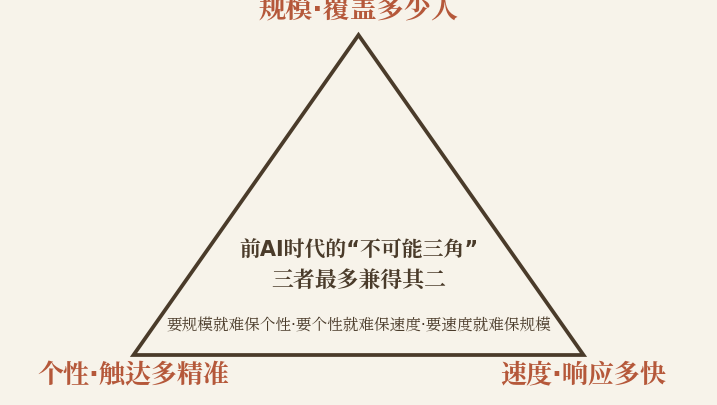
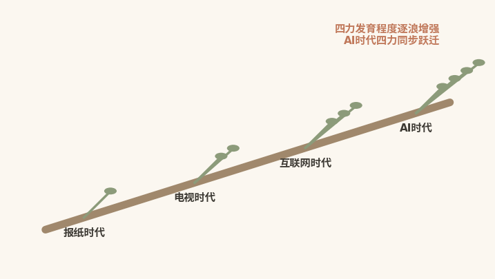
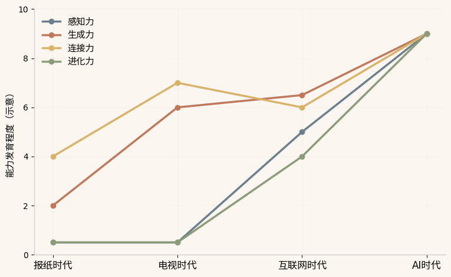

# 破圈演进

## ------四次技术浪潮证明AI终结不可能三角

  ------------------------------------------------------------------------------------------------------------------------------------------
  本章速读：报纸、电视、互联网三次浪潮只带来单维主导，前AI时代的"不可能三角"无解。唯有AI破圈力的四力同步跃迁，方具备破解不可能三角的能力。

  ------------------------------------------------------------------------------------------------------------------------------------------

【本章导读】

第二章将破圈力定义为由感知力、生成力、连接力、进化力构成的系统能力复合体。但一个历史性问题随之而来：破圈力如此重要，却直到最近才进入公共讨论；在前AI时代，即使最成功的城市营销案例也难以持续复制。淄博之后是哈尔滨，哈尔滨之后的下一座城市始终难以预判。

答案藏在技术史中。破圈力的每一种子能力都不是"突然被发明"的，各自有一段漫长的技术前史。但在AI出现之前，这四种能力从未被"同时拥有"：感知提升了，生成跟不上；生成强化了，连接粗放低效；连接追求精准，进化无暇顾及。

本章的核心规律如下：前AI时代，破圈力始终面临规模×个性×速度"不可能三角"难以兼得的困境。AI的出现第一次同时打破三角的三条边，让破圈力从"理论可能"变成"技术现实"。

接下来，本章将沿着报纸、电视、互联网、AI四次媒体浪潮的城市营销足迹，追溯每一种子能力的发育史，画出破圈力的"进化树"，并回答一个贯穿全书的问题，即破圈力作为一个完整的系统能力，为何只有在AI时代才真正成为可能。

## 不可能三角：前AI时代规模个性速度难兼得

在AI出现之前，城市营销经历了三次浪潮，即报纸时代、电视时代、互联网时代。每一次浪潮都带来某种能力的显著提升，也都留下一道无法填平的能力鸿沟。这道鸿沟，本书称之为破圈力的"不可能三角"。

### 三角定义：规模、个性、速度三者不可兼得

在任何技术条件下，城市营销始终面临三个维度的追求（见图3-1）：

{width="4.330555555555556in"
height="2.527083333333333in"}

图3-1 前AI时代的"不可能三角"

一是覆盖多少人的规模，它衡量信息传播的广度，即多少人能接收到城市信息；二是有多么个性化的精准，它衡量信息传播的精度，即触达的是真正可能感兴趣的人，还是无差别的泛化受众；三是多快的速度，它衡量信息传播的时效，即从城市的"想法"到受众的"看到"，中间隔了多久。

理想的破圈力，要在这三个维度上同时达到高水平：大规模覆盖，让足够多的人知道；高精度触达，让对的人知道；高速度响应，在恰当的时机让人知道。

但现实存在刚性约束：绝大多数技术条件下，城市往往只能在其中两个维度上做到优秀，而牺牲第三个。这就是破圈力的"不可能三角"。需要说明的是，本书借用"不可能三角"这一修辞，意在刻画同一资源约束下三个维度此消彼长的结构性张力。它是基于四次技术浪潮归纳的分析框架，而非蒙代尔三角式的严格经济学定理。

### 报纸时代：赢得规模却输了个性与速度

时间：19世纪末至20世纪中期。

核心媒介：报纸、杂志、旅游手册。

核心模式：城市政府或旅游部门通过报纸广告、旅游专版，把信息单向输出给公众。

规模：有一定规模。报纸的发行量决定了传播覆盖面：一份省级报纸通常以十万份计，全国性报纸可达百万份量级。在当时的媒介环境下，这就是"大规模传播"的代名词。

个性：几乎为零。报纸广告面向"所有读者"，不分年龄、兴趣和出行需求。城市不知道谁是读者，更不知道他是否对旅游感兴趣、是否有出行计划。仅有的"精准"是地域精准：在某座城市的报纸上投广告，触达的是这座城市的居民。

速度：极慢。从"想要推广"的念头，到策划文案、设计版面、联系报社、排期出版、送达读者，整个流程以周乃至月计。热点发生时，报纸的下一期往往还没印出，城市完全无法响应。

**典型案例：**1893年芝加哥世界哥伦布博览会。组织者通过报纸、地图和宣传册向全美推广芝加哥，第一次实现了城市信息的"大规模单向传播"。但这些信息是静态的，提前数月便已制作完成；是泛化的，面向所有读者；也是滞后的，展会结束时，宣传册可能还在印刷。

概括而言，报纸时代的城市拥有了初步的"规模"能力，但"个性"和"速度"几乎为零。

### 电视时代：规模速度双升而个性依旧缺席

时间：20世纪中期至21世纪初。

核心媒介：电视、广播。

核心模式：城市通过电视宣传片、旅游综艺节目、纪录片等形式，以视听语言制造情感冲击。

规模：达到巅峰。

一条央视黄金时段的城市宣传片，可在同一瞬间触达数亿观众。世纪之交，智纲智库（王志纲工作室）为昆明创作的"彩云之南、万绿之宗"城市形象广告经电视传播广为人知，成为中国城市电视营销的早期代表，"七彩云南"的品牌口号随之深入人心。2008年1月起，"好客山东"系列形象广告登陆央视综合频道、国际频道、新闻频道；据央视索福瑞统计，当年全国约71%的电视观众（9.12亿人次）观看了这一广告\[1\]。

速度：质的提升。电视可以实现"当天拍摄、当天剪辑、当晚播出"。虽仍无法实时响应，但相比报纸已是代际跃迁。

个性：几乎为零，甚至比报纸时代更差。报纸至少能实现粗糙的"地域精准"，电视广告则面向全国观众。对历史文化毫无兴趣的年轻人，和正在策划文化之旅的中年人，看的是同一条宣传片。"受众泛化"，是电视时代最大的结构性缺陷。

概括而言，电视时代让城市在"规模"与"速度"上双重提升，"个性"的短板反而因"超级覆盖"被进一步放大。单向传播的形态，也让城市几乎无法接收外界的实时反馈。

### 互联网时代：三维皆有提升却受限于人的产能

时间：21世纪初至2020年代。

核心媒介：社交媒体（微博、微信、抖音、小红书）、OTA平台（携程、飞猪、马蜂窝）、搜索引擎。

核心模式：从"城市说"到"大家说"，UGC（用户生成内容）兴起，每个游客都成为城市内容的潜在生产者。

互联网时代是一次革命性的飞跃，也是一次充满遗憾的飞跃：三个维度都实现跨代升级，但每个维度的升级都伴随着更深层的问题。

规模：不再是"一次覆盖几亿人"的单次规模，而是"持续覆盖、长尾覆盖、裂变式覆盖"的动态规模。2024年走红的天水麻辣烫，相关短视频和信息的全网点击播放量到2024年9月已突破500亿次\[2\]。但新的问题是信息过载：城市信息不再是"稀缺品"，而成了"噪音的一部分"。宣传片要和搞笑视频、社会新闻、明星八卦竞争注意力，规模越大，注意力越稀释。

个性：算法推荐第一次让"千人千面"的分发成为可能，平台根据用户的兴趣标签和行为数据精准推送，而非漫无目的地撒网。但算法黑箱成了新问题：城市无法控制算法，最想推广的深度文化体验，可能因不符合"高互动率"偏好而无人问津。"信息茧房"则让城市无法触达另一群人：他们可能感兴趣，算法却不这么认为。

速度：一条短视频从拍摄到百万播放，可在数小时内完成；一场退票风波从发酵到政府响应，可压缩在24小时内（详见第四章哈尔滨案例）。但速度越快，失控风险越大：负面信息同样能在数小时内发酵成舆情危机。多数城市都面临"快速响应"与"审慎决策"之间的抉择。

互联网时代让城市第一次在三个维度上同时取得显著提升，感知、生成、连接、进化四力均获质的进展。

但这个时代的破圈力有一个关键的结构性缺陷：每一个子能力都被"人的产能"锁死。感知要人监测，生成要人创作，连接要人投放，进化要人复盘。单个维度可以做到很高水平，三者同时做到，却仍然不可能。

### 浪潮遗产：三次推进仍填不平不可能三角

回顾三次浪潮，可以得出一个清晰的判断：

报纸时代解决了"能把信息推出去"的问题，但推给了所有人，却不知道推给了谁；电视时代解决了"能让人记住"的问题，但覆盖越广、浪费越大，印象深刻却无法转化为行动；互联网时代解决了"能让人参与"的问题，但每一次出圈都依赖"人的操作"，无法规模化复制、系统化迭代。

三次浪潮各自推进了破圈力，却共同留下一道无法填平的鸿沟：规模×个性×速度的"不可能三角"。要打破它，"更多的预算"和"更好的团队"都不够，要靠一次技术范式的根本变革。

这次变革，就是AI。

## AI解锁：四力同步跃迁终结不可能三角

AI的出现，不只是在互联网基础上"多了一个工具"，而是城市营销第四次浪潮中一次与前三次完全不同的、根本性的范式跃迁。

AI与前三次浪潮的差异在于：前三次浪潮都只是"强化旧模式"，即更好的渠道、更丰富的内容形式、更快的传播速度；底层逻辑却没有改变，城市始终通过"人"来感知、生成、连接、进化，而人的产能是有限的。

AI时代的核心突破在于：它第一次让城市在"不需要人的同步参与"的情况下，完成高质量的感知、生成、连接、进化。破圈力由此从"人的能力的延伸"变成"系统自身的能力"。这就是从"不可能三角"到"能力同步跃迁"的本质跨越。

### 四维突破：感知生成连接进化全面规模化

规模化感知：从"抽样调查"到"全域实时"。

传统感知是"抽样的"：几百份问卷、几十万条社交数据，试图拼凑出几千万潜在游客的"全貌"。而调查结论出来时，游客的偏好往往已经变了。AI感知是"全量的"。它可以同时抓取社交媒体、搜索引擎、OTA平台、交通、气象等多源数据，秒级更新分析结果。

深圳的全市域统一时空信息平台（CIM平台）构建了地上下、室内外、海陆空一体的数字孪生底座，汇聚海量城市要素数据，实现城市实体与模型数据的实时关联\[3\]。2025年4月上线的利川文旅大模型应用平台"AI游利川"，作为全国首个县域文旅大模型，汇聚了当地"吃住行游购娱"全域数据\[4\]。

因此，当一座城市可以"全量感知"而非"抽样调查"时，它就不再是"猜"游客的需求，而是"看"游客的需求。

规模化生成：从"手工作坊"到"AIGC+UGC共生"。

传统生成是"手工作坊"式的：产出受制于团队产能的上限，团队越忙，质量越不稳定。AI生成是"工厂化"的。AIGC可以在几秒内生成多条不同风格、适配不同平台的文案。

在利川"AI游利川"的商户端，过去要花半天撰写的推广文案，如今一键即成（运行成效数据详见第四章；原始报道见本章文献\[5\]）。说"AI替代了人"并不准确：AI做的是人做不完的事：让AI做效率，人做灵魂。

更关键的突破在于，AI让生成力从城市的"独舞"变成一场"全民共创"。AIGC降低了创作门槛，每一个游客、每一个市民都可能成为内容生产者。

景德镇"鸡排哥"即为一例：一位以6元价格售卖鸡排、以幽默互动著称的普通摊主，经网友自发拍摄传播，成为带动当地文旅热度的现象级人物。AIGC时代的内容主角，往往是普通人\[6\]。

规模化连接：从"撒网式投放"到"精准制导"。

传统连接是"撒网式"的：宣传片投向大众媒体，覆盖面虽广，有效触达却很少；投向垂直媒体，触达精准了些，覆盖面又太小。AI连接是"精准制导"。搜索引擎平台基于用户的搜索行为与兴趣标签体系实现人群定向。

2025年3月上线的飞猪"AI行程助手"，集成了DeepSeek-R1与通义千问大模型能力，可秒级生成个性化行程规划\[7\]。算法不仅知道"这个用户对旅游感兴趣"，还知道他的出行场景、预算与偏好。

更关键的是，AI让连接从"一次性的触达"变成"持续的对话"。用户的每一次搜索、点击、停留都在提供信号，下一次触达因此更精准。这不再是"城市推送内容给用户"，而是"AI帮用户找到最适合他的城市"。

规模化进化：从"事后复盘"到"实时学习"。

传统进化是"事后"的：活动结束才复盘，依据是几个关键数据和团队的"感觉"。结论出来时，下一次活动已开始筹备，教训来不及吸收。

AI进化是"实时"的。活动进行中，AI已自动监测不同平台、不同内容、不同人群的效果差异，将资源向高效方向倾斜：A/B测试同步投放，即时比较、即时调整。上一秒的经验，下一秒就被用到策略优化中。

更重要的是，AI让进化从"个体学习"变成"系统学习"。传统复盘依赖某个聪明人的总结，人员一旦离开，经验随之流失。AI则把每一次成败沉淀为结构化的数据、模板和可调用的策略库，系统本身越来越聪明。

### 三角崩塌：规模个性速度首次被同时满足

当AI同时在四个维度上实现规模化突破，前AI时代的"不可能三角"便随之瓦解。

规模不再受限于"人能投放多少"，AI可以自动在多平台、多时段、多形态铺开内容矩阵；个性不再受限于"人能理解多少受众"，AI可以基于海量行为数据构建精细的用户画像，实现"一人千面"的精准触达；速度不再受限于"人能多快响应"，AI可以实时监测、实时分析、实时生成、实时分发、实时优化。

更重要的是，这三个维度的突破并非各自独立，而是彼此共生。当规模、个性、速度可以在同一技术架构内被同时满足，破圈力就从一道"不可兼得的选择题"，变成一道"可以同时追求的必答题"。

在有据可查的城市营销史上，规模、个性、速度三者被同时满足的情形，此前极为罕见。

### 范式澄清：AI不是工具加持，而是破圈力的实现条件

这里需要做一个关键澄清，以免误读AI的角色。

一个常见的说法是"AI加持了城市营销"，好像AI只是在传统城市营销之上"加了一层"。这种说法低估了AI对破圈力的意义。

更准确的表述是：AI"实现"了破圈力。正如望远镜不是"加持"了天文学，而是让天文学从一门裸眼观测的技艺变成一门现代科学。在望远镜出现之前，人类也在"看星星"，但那不是现代意义上的天文学。

同理，AI出现之前，城市就在通过报纸广告、电视宣传片、社交媒体运营做"营销"。但彼时的城市始终无法同时拥有"大规模的感知""个性化的生成""精准的连接""系统性的进化"。任何一个能力被做到很高水平，往往意味着其他三个被牺牲。前AI时代的城市营销因此始终是一门"手艺"，依赖个别能人的直觉、经验和运气。

AI让这门手艺变成了一门"工程"，它可以被设计、被建造、被测量、被迭代。这正是本书将破圈力定义为"AI时代的城市核心能力"的原因：不是AI"锦上添花"，而是AI让"破圈力作为一个系统"第一次成为可能。

## 增长曲线：四次浪潮绘出破圈力进化树

如果把破圈力的演进画成一棵树的生长，一幅清晰的"破圈力进化树"便浮现出来（见图3-2所示）：每一次浪潮都让主干更加粗壮，四力如分枝逐浪萌发、渐次繁茂，到AI时代第一次四枝同盛。

{width="4.330555555555556in"
height="2.446527777777778in"}

图3-2 破圈力进化树

### 曲线轨迹：从单点突破走向四力同步跃迁

再把四种子能力在四次浪潮中的发育程度量化描点，便得到四条增长曲线（见图3-3所示）。先看四条曲线的总体轨迹。

{width="4.330555555555556in" height="2.65625in"}

图3-3 四次浪潮中的破圈力增长曲线

报纸时代，四条曲线几乎全部贴在地面上：感知力约等于零，没有实时反馈；生成力极低，文字加图片，人力密集；连接力极弱，发行网络即传播边界；进化力为零，无数据、无追踪、无复盘。仅有的亮点是连接力的"规模维度"，报纸的发行量提供了最早的规模化传播能力。

电视时代，感知力依然约等于零，城市几乎听不到外界的声音；生成力显著跳升，从二维的文字图片跃迁到视听结合、声画并茂的情感冲击；连接力在规模维度上达到巅峰，央视黄金时段可同时触达数亿人；精度维度却几乎为零，所有人看同一条广告。进化力约等于零：广告效果几乎无法追踪，也无法知道谁看了广告、谁因此来了这座城市。

互联网时代，四条曲线开始分化。感知力获得第一次质的飞跃，社交媒体、搜索引擎、OTA平台提供了前所未有的数据源，但"全量实时感知"仍无法实现。生成力迎来爆发，UGC让内容生产从官方拓展到全民，供给量不再受官方产能限制；连接力在精度维度上完成革命，算法推荐让"千人千面"成为可能，但受制于"信息茧房"和"算法黑箱"；进化力从零到有，数据可追踪、效果可度量，但"实时优化"和"系统自进化"仍无法实现。

AI时代，四条曲线同时跃迁到新层级。感知力从"抽样"变"全量"，从"滞后"变"实时"，从"人的解读"变"AI的洞察"。生成力从"人力的"变"人机共智的"，从"单产"变"量产"，从"城市一个人说"变"AIGC+UGC的共生生态"。连接力从"精准推荐"升级到"信任背书"（"五真"信任体系），从"触达"升级到"说服"。进化力从"事后复盘"升级到"实时优化"，从"个人经验"升级到"系统学习"。

### 核心规律：前三次单点突破，AI时代同步跃迁

四条增长曲线揭示了一个核心规律：前三次浪潮是"单维主导型"，每个时代虽有一至数项能力率先跃升，但始终无法四力同步高水平提升，未被浪潮眷顾的能力要么停滞，要么倒退。

报纸时代：连接力（规模维度）提升，感知力、生成力、进化力停滞；电视时代：生成力显著提升，连接力（规模维度）达到巅峰，但感知力和进化力依然为零，连接力（精度维度）反而比报纸时代更差；互联网时代：感知力、生成力、连接力、进化力都有质的提升，但每一种能力都被"人的产能"锁死。

AI时代则是"同步跃迁型"，它的四种能力在同一技术周期中被同时激活。

这不是简单的"1+1+1+1=4"，而更接近"1+1+1+1=10"的协同效应。前三次浪潮中，四种能力的发育彼此孤立；AI时代，四力之间建立起"数据→内容→传播→反馈"的闭环：感知力的输出是生成力的输入，生成力的产出是连接力的弹药，连接力的数据是进化力的燃料，进化力的洞察又反过来升级感知力。

四力之间的闭环飞轮，让破圈力从"四种能力的机械组合"，变成"一个自我增强的生命系统"。

### 国际镜鉴：首尔四十年走完从事件到能力的进化

**【国际镜鉴】首尔是理解"四次浪潮与破圈力进化"的典型国际案例。四十年间，它完整经历了从报纸、电视到互联网、AI的浪潮更迭，每一波浪潮都在破圈力上留下印记。**

**电视时代（1988年）：汉城奥运会。**首尔借这场全球体育盛事，完成了第一次全球性的城市品牌展示。电视转播覆盖全球逾十亿观众，"汉江奇迹"的城市叙事传遍世界。但这是一次"高光但不可持续"的出圈：奥运会结束后，首尔的全球关注度迅速回落，因为它依赖的是"事件"，而不是"能力"。

**互联网时代（2012年）：鸟叔（Psy，朴载相）的《江南Style》在全球互联网上引发现象级传播。**2012年12月，其YouTube播放量突破10亿次，成为YouTube历史上第一个达成这一纪录的视频\[8\]。"骑马舞"在全球范围被竞相模仿，首尔的"江南区"由此成为全球文化符号。但这是一次"意外但不可复制"的出圈：它出自创作者的个人作品，并非首尔市政府的策划。首尔没有"生成力"来持续产出这样的全球爆款。

**AI时代（2023年）：2023年10月，首尔宣布将与谷歌、微软、Naver等洽谈合作开发基于生成式AI的多语言旅行规划服务\[9\]。2025年2月，该服务在官方旅游平台"Visit
Seoul"（App端）试点上线，定名"Visit
Seoul旅行规划师"，整合首尔景区、餐饮、文化活动等实时信息，以多种语言为外国游客生成个性化行程建议\[10\]。**它不是"一个大事件"或"一个爆款视频"，而是一个"持续运转的智能系统"。

**首尔四十年的进化给出清晰启示：**电视时代给了首尔"规模"，即全球曝光；互联网时代给了首尔"速度"，即病毒传播；AI时代给了首尔"系统"，即一个持续感知、持续生成、持续连接、持续进化的智能平台。前两个时代的成就是"事件的"，无法复制；AI时代的成就是"能力的"，可以迭代。这就是破圈力从"单点突破"到"同步跃迁"的质变。

## 本章小结：AI以四力同步跃迁终结了不可能三角

本章回答了一个历史性的问题，即破圈力为何在AI时代才真正成为可能。

第一节揭示了前AI时代的结构性困局："不可能三角"，即规模×个性×速度无法兼得。三次浪潮各自推进了破圈力，却始终无法将它集成为一个完整的系统。

第二节论证了AI如何打破这一三角：它在感知力的"全量实时化"、生成力的"AIGC+UGC共生"、连接力的"精准信任化"、进化力的"实时系统化"四个维度上同时实现代际跃迁。AI不是"加持"了破圈力，而是第一次"实现"了破圈力。

第三节绘制了破圈力的四力增长曲线，揭示了"前三次浪潮是"单维主导型"，AI时代是同步跃迁"的核心规律，并以首尔的四十年破圈力进化作为国际镜鉴。

读完本章，你应当理解：破圈力不是"突然被发明"的新概念，而是在四次技术浪潮的积累与AI的催化之下，完成了从量变到质变的系统性跃迁。前三次浪潮提供了"基因片段"：报纸的大规模传播、电视的情感冲击、互联网的全民参与；AI将这些片段整合为一个完整的生命体。

接下来，中篇四章将逐一展开这个生命体四种"器官"的建设方法。从理论到实践的桥梁，将在第四章正式架起。

+:-------------------------------------------------------------------------------------------------------------------------------------+
| 在前AI时代，城市永远在"更准""更广""更快"之间做选择。AI让城市第一次不需要选择。AI不是给城市加了一个"外挂"，而是给城市装了一颗"大脑"。 |
|                                                                                                                                      |
| 三次浪潮给了破圈力基因片段，AI让这些片段拼接成了一个活的系统。                                                                       |
+--------------------------------------------------------------------------------------------------------------------------------------+

### 参考文献

\[1\] 大众日报. "好客山东" 从形象品牌走向产品品牌\[N/OL\].
(2014-05-19)\[2026-08-07\].
https://dzrb.dzng.com/articleContent/24_21912.html.

\[2\] 甘肃经济信息网. "天水麻辣烫"全网点击浏览量破500亿大关\[EB/OL\].
(2024-09-05)\[2026-08-07\].
https://www.gsei.com.cn/html/1660/2024-09-05/content-537603.html.

\[3\] 周剑明. 智慧为笔 绘就超大城市创新治理新图景\[EB/OL\].
深圳市政务服务和数据管理局, (2025-09-08)\[2026-08-07\].
https://www.sz.gov.cn/szzsj/gkmlpt/content/12/12350/mpost_12350759.html.

\[4\] 吴纯新, 许可亮, 韦娟. 湖北利川上线 全国首个县域文旅大模型\[N/OL\].
科技日报, (2025-04-28)\[2026-08-07\].
https://digitalpaper.stdaily.com/http_www.kjrb.com/kjrb/html/2025-04/28/content_588022.htm?div=-1.

\[5\] 极目新闻.
从避暑胜地到"算力热土"：看利川如何用AI再造一座"数字凉城"\[N/OL\].
(2025-04-24)\[2026-08-07\].
https://www.ctdsb.net/c1676_202504/2429593.html.

\[6\] 观察者网. 景德镇与"鸡排哥"，谁成就了谁？\[EB/OL\].
(2025-10-11)\[2026-08-07\].
https://www.guancha.cn/qiche/2025_10_11_792882.shtml.

\[7\] 杭州日报. 同程、飞猪等在线旅企先后接入DeepSeek\[N/OL\].
(2025-03-06)\[2026-08-07\].
https://hznews.hangzhou.com.cn/jingji/content/2025-03/06/content_8873941.htm.

\[8\] BBC News. Gangnam Style becomes first YouTube video to hit 1bn
views\[N/OL\]. (2012-12-21)\[2026-08-07\].
https://www.bbc.com/news/technology-20783034.

\[9\] LEE S E, CHOI H R. Seoul to launch AI chatbot service for foreign
visitors\' tour planning\[N/OL\]. The Korea Economic Daily Global
Edition, (2023-10-11)\[2026-08-07\].
https://www.kedglobal.com/travel-leisure/newsView/ked202310110019.

\[10\] 韩联社. 首尔观光财团推出生成式AI旅行日程推荐服务\[N/OL\].
(2025-02-24)\[2026-08-07\].
https://www.yna.co.kr/view/AKR20250224084100004.
