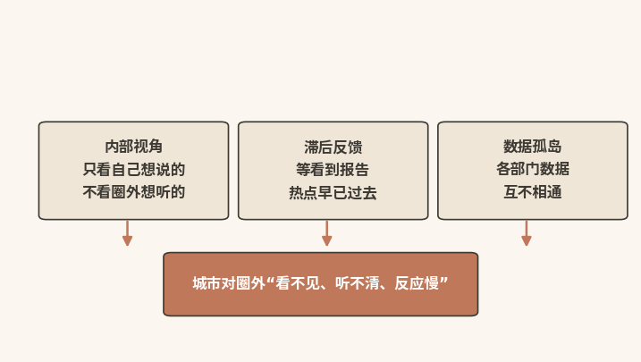
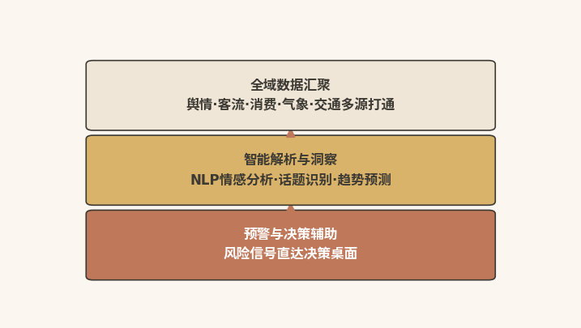
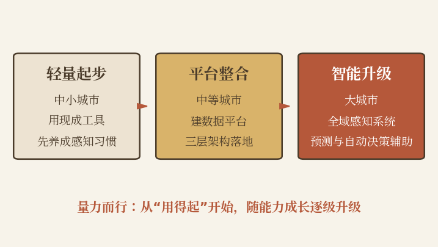
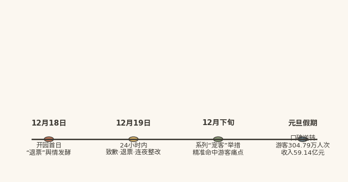

# 感知之力

## 让城市听见圈外真实的声音，看见公众眼中的自己

|  |
|:---|
| 本章速读：传统感知存在内部视角、滞后反馈、数据孤岛三大盲区。AI感知力以"全域汇聚---智能解析---预警辅助"三层架构系统性拆除盲区；轻量起步、平台整合、智能升级三条路线，量力而行。 |

【本章导读】

本书中篇共四章，由此从"定义"转入"建设"。从本章起，逐一展开四种子能力的建设方法。

本章聚焦四力中的"侦察兵"感知力，任务只有一个：让城市知道"圈外正在发生什么"。任务看似简单，传统城市营销却几乎从未真正完成。原因在于三个结构性盲区：内部视角陷阱、滞后反馈困境、数据孤岛割裂。意愿并非主要障碍；盲区的根源，是缺乏全量、实时、智能感知的技术手段。

AI的出现，在相当程度上改写了这一局面。

本章系统展开AI感知力的三层架构：全域数据汇聚层、智能解析与洞察层、预警与决策辅助层，并给出三条不同量级的建设路线。章末以哈尔滨冰雪季完整复盘，呈现感知力如何在实战中驱动城市的"反向操作"。

## 感知失明：传统感知听不见圈外的真实声音

**先看一个例子。**2023年冬天，哈尔滨冰雪大世界遭遇退票风波（完整复盘见本章第四节）。游客的负面情绪并非突然爆发，而是从零星抱怨一路爬坡到集中爆发。若在"零星抱怨"阶段就感知到情绪变化，风波或许不会登上全网热搜。

现实却是：多数中国城市要等投诉电话接连不断、热搜冲上榜首，才发现出了问题。这不是某一座城市的个案，而是传统感知系统的结构性缺陷：信息从海量产生到被管理者知晓，中间要经历巨大的压缩、延迟与失真。

### 视角陷阱：内部自评不等于公众感知到的吸引力

**【咨询调研】**2024年，某地级市文旅局做了一次内部自评。"我们的核心优势"一栏，他们列出八项："三千年历史底蕴""5A级景区""国家级非遗传承"等。每一项都有据可查，每一项都是"事实"。这些自评内容在我们承接的文旅咨询业务中非常普遍。

第三方随后用AI分析了主流社交媒体上关于该城市的200万条UGC内容，结果形成鲜明反差：排名前十的"公众感知关键词"中，城市自评的八项"核心优势"仅出现一项；排前三的词是夜市、性价比、适合拍照。（本案例基于作者团队咨询项目，城市作匿名化处理）

城市管理者眼中的城市，和公众眼中的城市，是两座不同的城市。

这不是认知偏差，而是"信息输入端口"的差异：管理者看到的城市，来自内部报告、工作总结、领导视察与媒体报道；公众看到的城市，来自社交媒体、短视频、游记攻略与朋友推荐。两个"城市"之间的信息差，就是内部视角陷阱的本质。

诺贝尔经济学奖得主丹尼尔·卡尼曼在《思考，快与慢》中揭示的"可得性启发"效应，可以解释这一陷阱：决策者往往过度依赖最容易获得的信息，而忽视更具代表性却更难获取的外部数据\[1\]。"三千年历史"被当作核心优势，往往是因为它在管理语境中最容易被想起，而非它在公众心中真的最突出。

后果有两个。其一，传播内容与公众兴趣系统性错位，城市投入最多资源推广的，未必是公众最感兴趣的；其二，城市陷入"自说自话"：文案写着"历史悠久，文化灿烂"，公众想看的却是"这座古城的年轻人怎么玩""哪里拍照最出片"。

### 反馈滞后：感知速度追不上传播速度

传统城市营销的反馈速度，大致呈"季度节奏"：舆情报告每季度一份，游客满意度调查每半年一次，品牌资产评估每年一次。

游客在社交媒体上的评论要进入城市的感知系统，需要走完一条漫长的路径：用户发布→被监测工具抓取→数据汇总到第三方公司→分析师撰写报告→报告提交至文旅局→分管领导审阅→转化为行动决策。

走完这条路径，通常要一周到一个月。而负面信息的传播周期在推荐算法的加速下一再压缩：从以天计，到以小时计，再到以分钟计。感知速度追不上传播速度，这是传统感知系统最根本的结构性缺陷。

滞后反馈最典型的后果，是错过窗口期。正面话题本该在"即将升温而尚未升温"时介入放大，可城市感知到"它热了"时，热度往往已过顶峰；负面情绪本该在"零星抱怨"阶段疏导，可城市感知到"出事了"时，舆情已进入集中爆发期。

哈尔滨退票风波的教训正在于此（详见本章第四节）。负面情绪从"零星"到"集中"存在一个时间窗口；2023年12月18日那天，这个窗口只有几个小时。城市若能在此期间感知情绪变化并作出响应，事情的走向可能完全不同。

### 孤岛割裂：部门数据沉默离散，难以汇成洞察

**【咨询调研】**在对城市跨部门数据盘点中经常发现：文旅局、交通局、商务局、公安局各有一套数据系统，彼此互不联通。同一个游客，在文旅局系统里是"来自上海的游客"，在交通局系统里是"乘坐G1234次高铁到达的旅客"，在商务局系统里是"在某商圈消费1200元的顾客"，在公安局系统里是"在某酒店入住两晚的住客"。四个数据ID，无法关联为"同一个人"。

数据孤岛带来两个问题。其一，拼不出游客的"全息画像"：知道他从哪里来，却不知道他怎么来的；知道他买了什么，却不知道他为什么买。其二，形不成跨部门的协同感知："客流量上升""道路拥堵加剧""重点区域人流超标"，本是同一趋势的三个侧面，在数据孤岛里却只是三个无法关联的碎片。

感知力不等于"拥有数据"，而等于"让数据说话"。数据只有被汇聚、被关联、被分析时才会开口。孤岛割裂之下，城市坐拥海量数据，它们却沉默而离散，变不成洞察。

## 三层架构：AI以技术体系逐一拆除三大盲区

内部视角、滞后反馈、数据孤岛三大盲区（见图4-1），很大程度上是技术问题，解题钥匙也主要在技术。

图4-1 传统感知系统的三大结构性盲区

AI感知力用三层架构，系统性拆除三大盲区（见图4-2）。

图4-2 AI感知力的三层架构

### 全域汇聚：让散落的数据在同一平台开口说话

第一层，也是最基础的一层，是"看见"数据。

让所有与城市相关、原本散落在不同系统中的数据，汇聚到同一个平台上。全域数据汇聚不是简单的"数据搬家"，它要解决三个技术问题。

第一，多源接入：城市数据分布在至少六类来源中，包括社交媒体（微博、微信、抖音、小红书）、搜索引擎（百度指数、微信指数）、OTA平台（携程、飞猪、马蜂窝、美团）、政府部门（文旅、交通、商务、公安、气象）、物联网设备（景区闸机、停车场感应器、Wi-Fi探针）与第三方数据（银联消费数据、手机信令数据）。各类来源的格式、更新频率、接入协议各不相同，感知力平台需要建立"多源数据适配器"统一接入。

第二，数据清洗与标准化：原始数据充满噪声，且存在重复与格式不一致。比如，同一条微博可能被三个监测工具各抓一次；同一个景区，在文旅局系统中叫"XX风景区"，OTA平台上叫"XX景区"。清洗、去重、标准化，均可交给AI自动完成。

第三，隐私合规与数据安全：全域汇聚必须严格遵循数据安全法规。游客的个人隐私数据（姓名、手机号、身份证号）必须脱敏处理，行为数据的采集必须符合《个人信息保护法》，存储与传输必须达到等保三级以上标准。合规是"前置条件"，而非"附加项"。

### 智能洞察：将原始数据炼成可行动的判断

数据汇聚只是起点。如果汇聚后的数据只是变成大屏上的一张图表，感知力就仍停留在"被看"阶段，信息只不过是从"分散的纸"搬到了"集中的屏"上。第二层要做的，是把"原始数据"炼成"可行动的洞察"，让感知力完成从"看见"到"看懂"的跃迁。具体包含三种能力。

情感分析：不只是"有人讨论我们"，而是"他们怎么讨论我们"。

传统舆情监测只能告诉城市："上周关于我们的讨论量上升了30%。"它说不出："这30%中，60%是正面的，10%是负面的，其余30%为中性的；而那10%的负面讨论中，核心情绪词是'排队'（68%）、'服务'（22%）、'价格'（10%）。"NLP（自然语言处理）技术可自动识别数百万条UGC中的情感倾向（正面/中性/负面）、核心话题（排队/风景/美食/住宿/交通）与情绪强度（轻微不满/强烈愤怒/惊喜赞叹）。

趋势预判：不只是"什么正在热"，而是"什么即将热"。

传统趋势分析是"追尾灯"：看到话题上了热搜才知道"火了"，此时介入已是"赶末班车"，因为话题热度通常在登顶后迅速衰减。AI趋势预判的价值在于"看到车头灯"：在话题大规模爆发前预判其潜力。具体看三个信号：一是传播加速度，看增速而非绝对值，一小时内增长300%的话题，即使绝对值不大，爆发潜力也高；二是情绪浓度，评论若充满"我也要去""求地址"等行动意向词汇，转化潜力远高于"哈哈哈哈"式娱乐话题；三是跨平台共振，同一话题在微博、抖音、小红书同步爬升，是高置信度的"即将爆发"信号。

画像聚类：不只是"游客从哪来"，而是"他们是怎样的人"。

传统游客画像停留在人口统计学层面："来自一线城市""年龄25---35岁""女性占比60%"。这些标签有用，但支撑决策仍然不够。AI画像聚类能把游客细分为更具策略价值的行为画像群体。

四类群体的行为画像与商业价值各异：文化探索者客单价不高，但口碑传播力极强，游记和推荐具有高度的"信任溢价"；美食打卡族客单价中等，复购率极低，需要不断有新的话题激活；亲子家庭客单价高、复购率中等、品牌忠诚度较高，一旦认可一座城市"适合带孩子去"，便会反复前往；打卡出片族客单价低，但内容传播力极强，是UGC的主要生产者。四类画像的搜索关键词、决策路径与触达策略，详见第六章附表。

### 预警决策：让感知在事发之前触发行动

感知力的最高层次，不是"知道发生了什么事"，而是"在事情尚未完全发生之前，预判它的走向，并触发相应的行动"。这是AI感知力与传统舆情监测最本质的区别，靠三种机制支撑。

情绪阈值预警。城市可为核心监测指标设置"情绪阈值"：某话题的负面情感占比一旦突破警戒线，系统即自动触发预警，推送至相关决策者。阈值需基于历史数据与城市特征校准，例如，以"服务体验"为品牌承诺的城市，负面情绪容忍阈值应远低于以"自然景观"为核心吸引力的城市。

传播趋势预判。AI基于历史舆情的传播模式库，模拟当前正在发酵话题的未来扩散路径：何时达到峰值、哪个平台会成为主战场、哪些人群最可能被卷入。有了这些预判，城市可以提前布防、提前介入。

智能工单与跨部门协同。感知最终要落到"行动"上，"知情"只是中间站。系统识别到"某景区排队时间异常增加"的信号，不应只在大屏上弹出警告，而应自动生成一张跨部门智能工单：推送给景区管理部门（增开通道或启动分流）、交通部门（增派运力）、文旅局（发布实时排队信息、疏导游客预期）、属地街道办（增加现场志愿者）。从"感知到异常"到"触发行动"的链路越短，感知力的实战价值越大。

## 建设路线：三条路径适配不同预算的城市

三层架构的完整形态规模庞大，但对大多数中国城市而言，真正要回答的问题是"从哪里开始""花多少钱"。关键在于量力而行。本节按预算量级给出三条建设路线（见图4-3）。

图4-3 城市感知力的三档建设路线

### 轻量起步：中小城市先用工具养成感知习惯

预算有限的中小城市，感知力建设从"用工具"起步，而非先"建系统"。具体有三件事：

社交媒体舆情监测：采购成熟的SaaS舆情监测工具（如清博、识微、微热点等，列举仅为示例，不构成推荐），设置城市关键词矩阵。年费通常5万---20万元（市场价格经验值，供参考），可提供实时监测、情感分析、竞品对比等基础功能。

AI搜索测试：每月定期用主流AI工具（DeepSeek、文心一言、通义千问、豆包）测试城市核心问题，如"XX城市值得去吗""XX城市有什么好玩的""XX城市适合什么季节去"，手工记录AI回答的变化，追踪城市"AI认知份额"的变化趋势。

社交媒体人工巡检：指定专人（文旅局内部员工、实习生或志愿者均可），每天固定时间巡检主流社交平台的城市相关话题，手工记录高频关键词、代表性内容与情感倾向。

轻量起步的核心价值，不在于"数据多全面"，而在于"养成感知的习惯"。一座"每天看数据、看评论、看趋势"的城市，与一座"做完宣传就等结果"的城市，差距从一开始就拉开了。

### 平台整合：中等城市打通部门数据建统一中台

感知需求超出"人工巡检"和"SaaS工具"的承载能力时，就需要打通数据孤岛，建立统一的数据中台。具体分四步走。

第一步：确立数据标准。由文旅局牵头，联合大数据局，制定统一的"城市文旅数据标准"，统一数据格式、统一字段定义、统一API接口规范。这是后续所有整合工作的基础。

第二步：打通核心部门数据。优先打通3---5个最核心部门的数据：文旅局（游客、景区数据）、交通局（交通流量、公共交通数据）、商务局（消费数据）、公安局（客流监控数据）、气象局（天气数据）。不必一次打通所有部门，先用核心部门跑通数据流通的技术路径与组织流程。

第三步：接入社交平台API。通过合规方式接入主流社交平台的公开API（如微博开放平台、抖音开放平台），实现社交数据的自动抓取与结构化存储。

第四步：构建数据看板。为决策者构建统一的"城市文旅数据看板"，涵盖核心指标（客流量、满意度、社交声量）、实时预警（负面情绪突增、热门话题爬升）与趋势对比（同比、环比、竞品对比）。看板的价值，在于"让每个需要决策的人在对的时机看到对的数据"。

### 智能升级：大城市以数字孪生构建城市感知平台

预算和技术基础充足的大城市，感知力的终极形态是"城市级智能感知平台"：以AI大模型为核心引擎、以数字孪生为底座，实现全域、实时、智能的城市感知。

核心技术组件：

城市数字孪生平台：构建城市的数字镜像，实时映射物理空间中的城市运行状态（深圳模式\[2\]\[3\]）。

AI大模型能力中台：部署或调用AI大模型，为感知系统各层提供自然语言理解、情感分析、趋势预测、智能工单等AI能力。

多源数据融合引擎：接入六类数据源（社交、搜索、OTA、政务、物联网、第三方），实现数据的实时汇聚与智能关联。

智能预警与决策辅助：建立自动化的事件分级预警机制与智能工单流转系统。

**县域文旅大模型实践案例：**利川的智算投入规模与深圳不可同日而语，但其建设思路值得大多数城市借鉴。依托华为昇腾国产化算力底座，利川市属平台与科大讯飞合作建设武陵山（利川）人工智能计算中心，2024年3月26日一期50P算力上线，运行一年后算力利用率达95%\[4\]；算法层引入科大讯飞星火大模型与DeepSeek开源算法协同，不"从零造轮子"，而是以成熟大模型为底座，注入本地"吃住行游购娱"文旅语料，微调出全国首个县域文旅大模型"AI游利川"。一年多平台试运行后（政府/平台方披露数据），游客平均停留时长提升30%，二次消费提升45%\[4\]。一个县级市以首期约2.6亿元\[5\]投入，撬动了可观的文旅感知力杠杆。

## 冰城样本：感知力驱动的哈尔滨反向操作

2023年12月18日，第25届哈尔滨冰雪大世界开园当天遭遇"退票"风波，最终以一场载入中国城市营销史册的"反向操作"收场：从被骂上热搜，到公开致歉、连夜整改，再到被夸上热搜，口碑逆转在随后几天内完成\[6\]。

结果已被广泛报道，我们更关心结果背后的感知力机制：哈尔滨感知到的内容、感知发生的时点，以及感知之后采取的行动。下面沿时间线逐一拆解（见图4-4）。

### 舆情复盘：从零星抱怨到口碑逆转皆有信号可循

图4-4 哈尔滨冰雪季舆情时间线

12月18日（开园首日）：上午11时，第25届哈尔滨冰雪大世界正式开园，不到3小时，预约游玩人数已达4万。但部分现场游客因排队时间过长、无法体验心仪的热门项目，高喊"退票"。相关视频与负面评论从当天下午起在微博、小红书等平台快速扩散，引发全网关注\[6\]。

这是感知力的第一重考验：城市需要在开园首日的混乱信号中，识别出这不是一次普通的景区纠纷。

12月19日（24小时内）：冰雪大世界发布《致广大游客的一封信》，就未能满足部分游客需求公开致歉，表示将深刻反思并连夜整改，同时启动退票程序\[6\]。哈尔滨市文旅部门同步介入督导。从舆情发酵到公开道歉、宣布整改，整个响应被压缩在24小时之内\[6\]。

12月下旬至元旦前后，哈尔滨陆续推出一系列后来被称为"宠客"的举措：冻梨、冻柿子切好摆盘；索菲亚教堂上空用无人机升起"人造月亮"；松花江上推出带翅膀的"飞马踏冰"和热气球；鄂伦春族人牵着驯鹿走上中央大街；交响乐团现身商场演出；机场空姐跳舞迎客；广场上建起供游客取暖的"温暖驿站"\[7\]。值得注意的是，每条措施都精准命中游客此前抱怨的痛点：抱怨"天冷受罪"，暖驿站、热饮随即跟上；抱怨"夜景单调"，无人机人造月亮升空；抱怨"除了冰雕没别的"，热气球、驯鹿、逃学企鹅轮番登场\[7\]。

随后几天，舆论发生翻转。"尔滨，你让我感到陌生""哈尔滨太会了""为了宠南方小土豆，哈尔滨把家底都掏出来了"。网友自发创造的这些传播梗，把哈尔滨从"退票风波的主角"变成了"全网最宠游客的城市"\[7\]。

市场给出了最直接的回报。据哈尔滨市文化广电和旅游局大数据测算，2024年元旦假期3天，哈尔滨市累计接待游客304.79万人次，实现旅游总收入59.14亿元，两项指标均达历史峰值\[8\]。中国旅游研究院《哈尔滨冰雪旅游发展报告（2025）》显示，2023---2024年冰雪季，哈尔滨市接待游客8700多万人次，同比增长约300%，实现旅游收入1248亿元，同比增长约500%\[9\]，这一高增幅部分源于上年同期的低基数效应。

### 三重角色：探测器发现风险，导航仪指引行动

在哈尔滨的"反向操作"中，感知力扮演了三重角色：

第一重：感知风险信号的探测器。开园首日下午，"退票"视频刚开始在社交平台扩散，哈尔滨的"探测器"便已开始工作\[6\]。相比之下，部分城市要等热搜登顶数日才知道"出事了"，探测器灵敏度差了不止一个量级。

第二重：指引响应方向的导航仪。前文复盘已经呈现："宠客"操作之所以"精准"，是因为每条措施都对准游客在社交媒体上表达的真实痛点\[7\]。这就是"导航仪"功能：它负责指明"痛点在哪里"，把"该做什么"留给决策者创造性地设计解决方案。

第三重：缩短从"感知"到"行动"链路的加速器。哈尔滨的响应速度在传统城市中罕见：从舆情发酵到公开道歉、连夜整改，不超过24小时\[6\]；从第一批"宠客"举措到形成系列"宠客套餐"，也不过一两周。支撑这种速度的，不是"某个领导的英明决策"，而是一个高效运转的"感知→决策→执行→反馈"闭环。

### 经验镜鉴：每一个洞察都应触发一个行动

哈尔滨的案例并非一部无缺憾的"感知力教科书"：它既暴露了传统城市感知系统的几处顽疾，也带来了重要启示。

|  |
|:---|
| **哈尔滨的启示：感知力首先是"识别"的能力。开园首日的混乱信号里，城市需要识别出这不是一次普通的景区纠纷，而是可能波及整个城市品牌的舆情事件。负面情绪增速异常、且直指品牌承诺，就必须按品牌事件响应。** |

教训一：感知的"滞后区间"仍然存在。12月18日上午游客开始排队受阻，到当天下午舆情集中爆发，中间有几个小时的"灰色地带"：不满情绪已在现场和局部社交平台积聚，却尚未进入城市管理者的决策视野。在AI感知力的三层架构下，这个"灰色地带"可被自动化预警机制显著压缩：负面情绪一旦突破预设阈值，系统即自动触发预警、直推决策者，而不必等到"退票"喊声响彻园区、视频传遍全网。

教训二：感知需要"跨部门"的响应机制。退票风波涉及的不只是冰雪大世界，也不只是文旅局，还有交通、公安、市场监管、宣传等多个部门。如果感知系统的输出只停留在"文旅局知道了"，触发不了跨部门协同行动，感知力的实战价值便大打折扣。

启示：感知不是"看完就完"，而是"行动的前置"。不少城市把舆情监测当成"大屏上的一个数字"，一句"还好，没什么大事"便告结束。感知力的正确用法是：每一个洞察，原则上都应触发一个相应的行动。

### 国际镜鉴：威尼斯"智慧控制室"的客流预警实践

2020年9月，威尼斯市政厅联合电信运营商 TIM 建成"智慧控制室"（Smart
Control
Room），通过全城摄像头与匿名化手机信令，实时统计老城（常住约5万）内游客规模、来源国、停留时长与动线\[10\]。疫情前旺季单日游客峰值曾达约11万人次。控制室的价值不在"自动闸机"，而在把过去靠估算的客流变成可观测数据：当圣马可广场、里亚托桥等节点密度异常时，市府可结合后续的预约准入、一日游入城费（2024年起试行）、错峰引导等工具提前干预，而非事后清场\[11\]。它印证的是：感知层先行，才能让限流、收费、预约这些"硬手段"有处下手；但"事前化解危机"的真正闭环，是数据系统+门票制度+现场管控三段拼起来的，不是一间控制室单独完成的。

## 本章小结：三层架构让城市听见圈外的真实声音

本章是破圈力建设的第一战：感知力。

第一节揭示了传统城市感知的三大盲区：内部视角陷阱让城市"想说的"与公众"想听的"系统性错位；滞后反馈困境让城市始终"追着舆情跑"而非"拦在舆情前"；数据孤岛割裂让城市拥有海量数据却无法形成洞察。

第二节展开了AI感知力的三层架构：全域数据汇聚层（让所有数据在一个平台上"说话"）、智能解析与洞察层（让原始数据转化为可行动的洞察）、预警与决策辅助层（让感知自动触发行动）。

第三节提供了三条量力而行的建设路线，包括轻量起步、平台整合、智能升级，让不同预算的城市都能找到自己的路径。

第四节以哈尔滨冰雪季的"反向操作"为完整案例，展示感知力实战中的三重角色：探测器（感知风险信号）、导航仪（指引响应方向）、加速器（缩短从感知到行动的链路），以及传统感知系统的教训和改进方向。

读完本章，你应当理解：感知力不是"安装一套舆情监测软件"，而是"给城市装上一套从不休息的耳目"。没有感知力的城市，如同闭着眼睛开车，前方的路再宽，也难免撞上障碍。

接下来，第五章将进入破圈力建设的第二战：生成力。感知解决的是"该说什么"的问题，生成力要回答的，则是如何规模化、个性化、持续地"说出来"。

|  |
|:---|
| 感知力的价值不在于"知道什么"，而在于"在事情尚未完全发生之前，启动应对"。先于问题行动一秒，舆论场里就主动一分。 |

### 参考文献

\[1\] 丹尼尔·卡尼曼. 思考，快与慢\[M\]. 胡晓姣，李爱民，何梦莹，译.
北京：中信出版社，2012.

\[2\] 深圳市人民政府办公厅.
深圳市数字孪生先锋城市建设行动计划（2023）\[Z/OL\].
(2023-06-09)\[2026-08-07\].
https://www.sz.gov.cn/cn/xxgk/zfxxgj/zcfg/content/post_10641382.html.

\[3\] 樊怡君. 深圳：城市"会思考" 服务有温度\[N/OL\]. 深圳特区报,
(2025-08-18)\[2026-08-07\].
http://mp.weixin.qq.com/s?\_\_biz=MjM5MDA2MDMwMA==&mid=2651331050&idx=1&sn=91bf86bb5dc6dfc938fdbb98d9176a08.

\[4\] 鲁腾, 韦娟, 谭小兵. 全国首个县域文旅大模型在利川上线\[N/OL\].
湖北日报, (2025-04-18)\[2026-08-07\].
https://epaper.hubeidaily.net/pc/content/202504/18/content_311824.html.

\[5\] 恩施州人民政府. 武陵山区首个智算中心在利川上线启用\[EB/OL\].
(2024-03-27)\[2026-08-07\].
http://www.enshi.gov.cn/xw/xsdt/202403/t20240327_1563601.shtml.

\[6\] 孟嘉多, 俞佳欣.
从退票风波到口碑逆转，哈尔滨冰雪大世界为何能转"危"为"机"\[N/OL\].
中国青年报, (2023-12-25)\[2026-08-07\].
http://news.cyol.com/gb/articles/2023-12/25/content_xaKQJmhVxA.html.

\[7\] 财联社. 哈尔滨旅游爆火 冰雪游业态受关注度高\[N/OL\].
(2024-01-08)\[2026-08-07\]. https://www.cls.cn/detail/1564140.

\[8\] 澎湃新闻.
元旦假期哈尔滨实现旅游总收入59.14亿，游客接待量达历史峰值\[N/OL\].
(2024-01-02)\[2026-08-07\].
https://www.thepaper.cn/newsDetail_forward_25877150.

\[9\] 中国新闻网. "网红"尔滨如何长红？\[N/OL\].
(2025-02-17)\[2026-08-07\].
https://www.chinanews.com/m/cj/2025/02-17/10369788.shtml.

\[10\] Fabbrica Digitale. Venice Smart Control Room
(Mindicity)\[EB/OL\]. \[2026-08-07\].
https://www.fabbricadigitale.com/en/scr-venice-mindicity/.

\[11\] DYKINS R. Venice control room will monitor tourists to combat
overtourism\[N/OL\]. (2021-03-15)\[2026-08-07\].
https://globetrender.com/2021/03/15/venice-control-room-will-monitor-tourists-to-combat-overtourism/.
