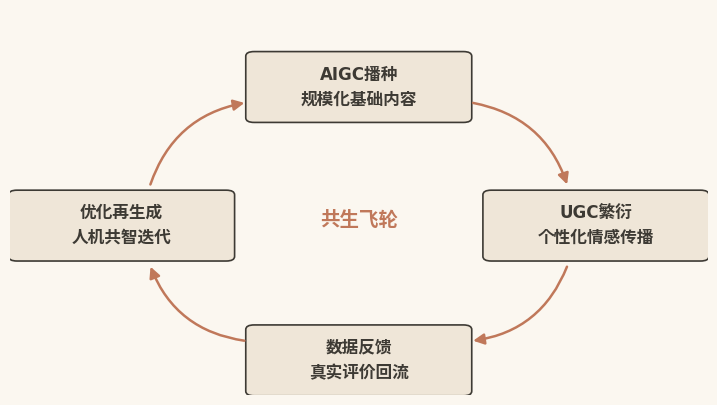
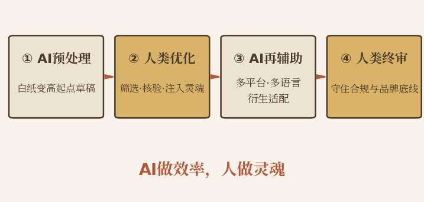
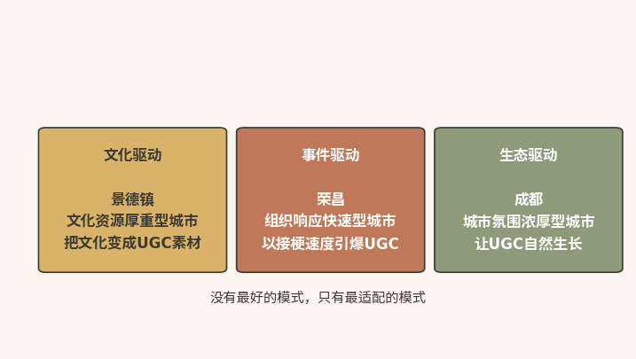

# 生成之力

## 让每座城市都拥有讲好故事的产能

|  |
|:---|
| 本章速读：AIGC负责播种、UGC负责繁衍，双轮构成共生飞轮。人机共智四阶段工作流让AI做效率，人做灵魂；文化驱动、事件驱动、生态驱动三种UGC模式，适配不同资源禀赋的城市。 |

【本章导读】

第四章讨论了感知力，城市由此知道"该说什么"。但知道与说出之间，横着一条巨大的鸿沟，它的名字叫"内容产能"。

这条鸿沟的宽度，从一个典型的中国地级市文旅局即可看清。负责内容生产的通常只有一两个人，日常工作是写推文、编文案、拍视频、做图文、整通稿、对接采访，而覆盖的平台数以十计，热点瞬息万变。

这就是生成力的核心命题：当感知力判断"这个时候该说这个了"，城市需要具备"说得出来"的能力，而且要规模化、个性化、持续地说出来。

围绕这一命题，本章系统展开AI生成力的建设方法。先剖析传统城市内容生产的"三座大山"：不会写、没时间、成本高；再提出AIGC+UGC"双轮引擎"的核心框架：AIGC负责"播种"（规模化基础内容生产），UGC负责"繁衍"（个性化情感内容传播）；最后提供城市适配的落地体系，包括"人机共智"四阶段工作流、三种UGC激发模式，以及打卡点设计、话题策划、激励机制的操作方法。

## 三座大山：传统内容生产的结构性困局

**【沙盘推演】（假设情境，人物与数据均为示例）设想这样一个情景。**2024年冬天，某县级市文旅局负责新媒体运营的小刘，在年终总结中写下了这样一段话：

"全年运营7个平台账号，累计发布内容1864条，其中原创612条。最受欢迎的一条是局长在雪地里跳舞短视频，播放量127万。全年超过一半的内容阅读量不足500。很多次看到一个很好的热点话题，我们来不及做，等文案写好、视频剪完，热度已经过去了。我感觉自己不是在'做内容'，而是在'填坑'，每天醒来就欠着7个平台的内容。"

小刘的困境并非个例，它背后是中国城市内容生产的结构性困局。症结出在模式上：传统城市内容生产建立在三个前提假设之上，而这三个假设在数字时代的传播规律面前都难以成立。

### 能力短缺：公文训练写不出网感内容

第一座大山，是"人"的问题。

城市文旅部门的工作人员绝大多数是行政背景，擅长写公文："为深入贯彻落实......""取得了显著成效"。这些句式在体制内运转顺畅，搬到社交媒体上，用户的第一反应却是："谁要看这个？"

社交媒体需要的是完全不同的文体：小红书笔记要有"氛围感"，抖音短视频要前三秒抓住眼球的"钩子"，朋友圈文案要有"真诚感"。这三种文体，没有一种在公文训练的范畴之内。

外包可以在一定程度上缓解这一问题，但作用有限。外包团队有两个致命短板：一是对城市的理解流于表面，知道有什么景点，却不知道藏在巷子深处的那碗面，而真正打动人心的城市内容，恰恰来自这些细节；二是响应速度跟不上社交媒体的节奏：热点周三晚上爆发，外包初稿周五下午才出来，热度已过。

### 时间赤字：多平台高频优质的三重约束

第二座大山，是"时间"的问题。

先算一笔账。一个城市的文旅新媒体矩阵，通常包括微信公众号、微博、抖音、快手、小红书、视频号、B站，至少七个平台，内容形态各不相同。即使只按"每天每个平台更新一条"这一较低的标准，一年也需要超过2500条内容。而一篇深度攻略可能要写一天，一条创意短视频从策划到剪辑可能要两三天。

结论很明确：传统模式下，城市内容生产难以同时满足多平台、高频率、高质量的"三重约束"。

### 成本高企：一次性投入随内容下架蒸发

第三座大山，是"钱"的问题。

一条高质量的城市宣传片，制作成本动辄数十万甚至上百万，还不含投放费用。一个专业的社交媒体代运营团队，月度服务费通常在5万---20万元之间。一次KOL探店合作，报价从几万到几十万不等。

更关键的是，城市的内容需求是"持续的"：不是"拍一条片子管一年"，而是"每天都要有新内容"。如果所有内容都靠外包，每年的内容预算将达到数百万甚至上千万，这对全国近300个地级市、近3000个县级行政区划中的绝大多数而言，是难以承受的投入。

成本高还有另一个维度：沉没成本。传统内容生产的每一次产出都是一次性的：一条宣传片拍完、播出、下架，就结束了。它没有被拆解为可复用的"内容原子"，也没有进入城市的"内容资产库"。每一分钱都难以沉淀为可复用的资产。

### 范式之困：手工业模式撑不起工业级产能

"不会写""没时间""成本高"三座大山看似是三个不同的问题，实则源于同一个根源：传统城市内容生产是"手工业"模式，而数字时代的传播要求是"工业级产能"。

因此，推倒三座大山，靠的不是"更努力的人"，而是"不一样的模式"，即下一节讨论的AIGC+UGC"双轮引擎"。

## 双轮引擎：AIGC播种规模，UGC繁衍信任

如果说传统城市内容生产是"手工业"，AI时代的内容生产就是"工业+生态"：工业是用AIGC实现规模化、标准化、低成本的基础内容生产；生态是用UGC实现个性化、情感化、信任化的自传播。两者不是替代关系，而是共生关系。

这正是"第四生态"视角（本书对王金南院士"生态产品第四产业"理论的引申，详见第十章）在城市内容领域的应用：AIGC是"光合作用"，负责基础能量生产；UGC是"生物多样性"，负责个性化情感表达。健康的城市内容生态，不能只有参天大树（官方大片），也不能只有野花野草（UGC碎片），它应当是大树、灌木、花草、真菌共存的群落。

### AIGC播种：以工业产能批量生产种子内容

先看AIGC（人工智能生成内容）。它解决的是城市内容生产中"从0到1"的规模化问题：大批量、低成本、多形态地生产基础"种子内容"。具体而言，AIGC能做四件事。

一是文本生成。几秒钟内生成100条不同风格、不同平台的文案：小红书笔记、抖音脚本、公众号推文、朋友圈文案、OTA景点介绍、新闻通稿。它们都根据各平台的文体特征和用户偏好生成适配版本，而非简单复制粘贴。

新疆维吾尔自治区文化和旅游厅2025年3月14日发布的AI共创歌曲《出发吧新疆》就是一个典型案例：词作者是DeepSeek和"00后"文旅小编，作曲与演唱由AI（Xstech
AI/Suno）完成。推荐词同样来自DeepSeek："当DeepSeek的代码开始为天山作曲，当机械键盘敲出牧民的马蹄节奏，我们终于懂得，新疆永远值得更震撼的打开方式。"\[1\]

二是图像生成。根据文字描述生成海报、插图、信息图、打卡模板、头像框。

景德镇近年通过"数字景德镇"等AI文旅项目（AI伴游、AI生成专属瓷器、AR打卡等）活化陶瓷文化；早在2023年国庆假期，景德镇中国陶瓷博物馆所藏曾龙升《釉下加彩十八罗汉塑像》中的"沉思罗汉"，因被网友戏称为"无语菩萨"并制成表情包而爆火（均详见第二章）\[2\]。

三是视频生成。从文字脚本直接生成短视频，AI配图、AI配音、AI字幕、AI剪辑。

2024年"五一"假期，新华报业旗下新江苏传媒（中国江苏网）推出的城市宣传片《AI你·南京》，全流程由AI技术制作。截至5月5日上午10时，该片在抖音收获13.9万人次观看、微信视频号11.8万人次观看，并于5月1日登上抖音南京热榜TOP4\[3\]。2024年3月，央视网用AIGC生成了全国文旅宣传片《AI我中华》：34个省级行政区的名字与当地特色巧妙结合，全流程AI制作\[4\]。

2025年7月27日前后，值北京中轴线申遗成功一周年，生数科技与北京城市学院联合推出完全由AIGC生成的《中轴线上的北京文化》系列宣传片（四部曲）；创作中借助Vidu首尾帧、参考生等功能，实现了从钟鼓楼到永定门跨场景连贯运动的"一镜到底"镜头，也让文化IP在跨场景切换中保持形象一致\[5\]。这是AI视频生成在城市叙事领域的完整落地。

四是多平台一键适配。同一份核心内容（比如一份城市深度攻略），可由AI自动解构为小红书、抖音、公众号、朋友圈、OTA等多个版本；人只需做一件事：审核和微调，剩下的99%交给AI。

这场成本革命的底层动力，是生成式AI工具的全民化普及。中国互联网络信息中心（CNNIC）2025年10月发布的《生成式人工智能应用发展报告（2025）》显示，截至2025年6月，我国生成式人工智能用户规模已达5.15亿人，普及率36.5%，内容创作是其主要应用场景之一\[6\]。

在文旅营销领域，据公开报道，快手可灵AI于2025年携手淮安打造了首支城市定制主题大片《鲜活吧，淮安》（行业媒体亦称《脉承淮水》），联动11位超级创作者演绎"鲜活"淮安。据快手磁力引擎在2025中国广告论坛上披露，此次淮安城市AI营销相关话题总播放量超17亿次、视频总播放超2亿次、总互动量超3000万次\[7\]\[8\]。同样的预算，过去只能拍一条宣传片；如今，可以撬动一场全民参与的内容运动。

### UGC繁衍：用真实与信任驱动自传播

AIGC解决了规模化供给的问题，但它有一个难以克服的短板：缺乏"人的温度"。它可以把哈尔滨的冰雪拍得很美，却传达不出一个南方游客第一次踩上松花江冰面时那声"哇"的惊喜。它可以写一篇详尽的美食攻略，却复制不了深夜路边摊上和陌生人碰杯后那句"这座城市真暖"的感触。

这正是UGC不可替代的价值。UGC解决的是城市内容生产中"从1到N"的情感化问题：让每一个游客、每一个市民，都成为城市内容的生产者和传播者。具体看，UGC有四大特征。

第一是真实。UGC的力量很大程度上来自它的"反精致"。专业团队拍的宣传片，收获的是"嗯，拍得不错"；普通游客随手拍的视频，收获的却是"很想去"。宣传片的"无瑕"制造距离感，UGC的"粗糙"创造亲近感。用户会想："那个游客和我一样，他能体验到的，我也能。"

第二是信任。尼尔森（Nielsen）2021年发布的全球广告信任度调查显示，88%的消费者最信任来自熟人的推荐，这一比例高于其他各类广告形式\[9\]。这并不是说城市宣传片在"说谎"，而是用户天然认为"别人说的"比"城市自己说的"更可信。

2024年10月底，湖南怀化理发师晓华的爆火就是例证。她是一位"听得懂话"的普通理发师：不推销、不办卡，男发30元、女发45元。因真诚服务，她被网友自发拍摄传播，短短7天吸引客流超20万人次，拉动现场消费超2000万元\[10\]。人们跨越千里来打卡，不只是为了理一次发，更是为了感受那份"被真诚对待"的体验。

第三是社交属性。UGC的内在驱动力是"分享"而非"赚钱"：用户分享旅游照片，与其说"帮城市做宣传"，不如说"表达自己"。当城市内容成为用户的"社交货币"（分享你的城市能让他在朋友圈收获点赞和羡慕），UGC就有了自驱力。

第四是长尾效应。AIGC批量产出的内容，热度往往在发布后数日便快速衰减；UGC的内容却可以持续数月甚至数年。原因很简单：用户搜索"XX城市怎么玩"时，更愿意点开一篇真实游客写的详细攻略，而不是城市官方发布的标准介绍。

### 共生飞轮：数据反哺让内容飞轮越转越快

AIGC和UGC各自强大，合在一起则"你中有我"：能量的初级生产（AIGC）与物种的多样性表达（UGC），是同一个生态循环的两个环节（见图5-1）。这个循环可以拆解为四步。

图5-1 AIGC+UGC共生飞轮

第一步：AIGC播种，降低UGC的创作门槛。城市通过AIGC批量生产"内容种子"：打卡模板、话题模板、文案模板。这些种子的价值，不在于"被传播"，而在于"被模仿"：不需要创意，不需要文案功底，打开模板，填入自己的照片，一键生成。

第二步：UGC繁衍，释放全民创造力。门槛降低后，游客开始自发生产内容。他们拍摄的不是城市安排的打卡点，而是自己发现的惊喜：巷子深处的30年老店、日落时分江面上的一抹金光、酒店老板送的一碗热汤。每一次UGC，都在为城市的"内容生态"贡献新的物种。

第三步：数据反哺，UGC驱动AIGC进化。UGC产生大规模行为数据：哪些内容更容易被点赞、哪些话题更容易引发评论、哪些情绪更容易驱动分享。这些数据反馈到AIGC系统，优化下一轮的种子内容。飞轮开始旋转。

第四步：飞轮加速。飞轮一旦转动，自我强化的增长循环便开始运转：更多的AIGC种子→更多的UGC参与→更多的数据反馈→更精准的AIGC种子。每一次旋转，都在降低内容的单位成本、提升传播效率、增强品牌势能。

### 国际镜鉴：哥本哈根"CopenPay"把游客行为变成城市内容

丹麦首都哥本哈根的旅游推广机构 Wonderful
Copenhagen，于2024年7月推出名为"CopenPay"的城市奖励试点，2025年夏季扩围、2026年起转为全年常设。其运作逻辑集中体现了"城市为内容生产提供土壤"的理念。

参与机制（激励而非宣传）：游客不以金钱"支付"，而以气候友好行动"支付"，比如乘火车抵哥本哈根、市内选自行车/公交而非租车自驾、参加港口清理或在社区花园做义工等。作为回报，可兑换免费自行车租赁、博物馆/美术馆门票、运河游船、合作餐厅餐食或咖啡。

成果：合作方从2024年试点的24家增至2025年的90家（含博物馆、餐厅、景点、租赁商）；据Wonderful
Copenhagen统计，启动至2025年底累计超3万名游客参与，参与者自行车租赁量在2025年项目期间增长59%，通过运河清理共收集垃圾约1.2吨（2024年试点期）；约七成参与者表示回家后调整了旅行习惯，98%愿意向他人推荐。该计划获国际主流媒体广泛报道，使哥本哈根被国际舆论持续描述为"可持续城市旅游实验室"\[11\]。

|  |
|:---|
| 启示：UGC的秘诀不在于"城市说了什么"，而在于"城市设计了一套让人愿意参与、乐于分享的机制"------游客主动参与进来、分享值得讲述的内容，UGC如流水一般自然发生、源源不绝。 |

## 人机共智：四阶段工作流让AI做效率，人做灵魂

战略落地需要可操作的流程。本节给出一个可直接套用的"人机共智"四阶段工作流（见图5-2），明确实践中最核心的问题：在"人"和"AI"之间，谁做什么、什么时候做、如何决策。

图5-2 "人机共智"四阶段工作流

### AI预处理：把白纸变成高起点草稿

目标：利用AI的效率和规模优势，快速生成初稿和创意方向，为人的创造性工作提供"高起点"而非"白纸"。

AI做什么：基于感知力输出的"问题图谱"和"趋势洞察"自动匹配内容策略；为同一个主题同时生成小红书、抖音、公众号、朋友圈等多版本初稿；搜索并关联最新的景区开放时间、门票价格、交通信息等数据。

人的工作有两项：一是确定核心方向，比如"这个月的内容重点围绕'秋季红叶'，还是'国庆避开人群的小众路线'？"这是策略层面的判断，AI无法替代；二是设置风格参数，告诉AI这座城市的内容调性：景德镇是"文艺+匠心"，成都是"烟火气+巴适"，哈尔滨是"真诚+反差"。

关键原则：这个阶段，AI的作用是"把白纸变成草稿"，让人不必从零开始；创意仍由人来出。人的核心价值在于"做选择"和"定方向"，而非"码字"和"拼图"。

### 人类优化：为通用初稿注入城市灵魂

目标：本阶段全量注入人的创造力，即筛选、修改、升华AI生成的初稿，把"正确的通用内容"变成"动人的城市故事"。

人做四件事：

筛选最优版本：从AI生成的多个初稿中，选出最具传播潜力的1---2个版本。

注入城市灵魂：把"标准化内容"转化为"只有这座城市才有的故事"。AI可以写"XX市的秋天很美，红叶满山"，但它不知道："城西老街那棵200年的银杏树下，张大爷每年秋天摆一壶茶，给游客讲这条街的故事。"这正是人的不可替代之处。

添加文化判断：AI可能会生成"来XX感受千年历史"这种正确的废话，人需要把它改成"走在XX的石板路上，每一步都踩在两千年前的汉砖上"。

情感校准：AI生成的"感人"是模式化的。人需要判断：这个细节真正具有感染力，还是AI在套路化地煽情。

关键原则：这个阶段是人的"主场"。AI已经打好了地基，人负责盖出有灵魂的房子，把时间花在"判断、选择、升华"上。

### AI再辅助：把优质内容规模化送达

目标：人类定稿的优质内容，交给AI做规模化拓展。

AI做四件事。一是多平台适配：自动转化为适配不同平台的版本，这是"形式适配"而非"内容重写"，核心叙事和情感基调不变。二是多语言翻译：一键生成多语言版本，并适配不同语言的内容消费习惯。三是无障碍适配：自动生成图文的语音版本、视频的文字脚本。四是衍生内容生成：从一篇深度攻略中，提取"10个必打卡""3天2夜行程""人均消费"等碎片化内容。

人做什么：抽查审核，确保适配过程中没有丢失核心信息或歪曲品牌调性。

关键原则：这个阶段最大化AI的"规模优势"。人已经把内容做到了90分，AI负责用最低成本把它送到更多平台、更多语言、更多人群中去。

### 人类终审：发布前守住合规与品牌底线

目标：在所有内容发布之前，设置一道"人的防线"。

人的审核涵盖四个方面。一是合规红线：AI生成合成内容，是否按照2025年2月28日发布、2025年9月1日起实施的强制性国家标准GB
45438---2025《网络安全技术
人工智能生成合成内容标识方法》的要求进行了标识（"AI生成"或"AI辅助生成"的标注）\[12\]；二是文化底线：内容是否对城市的历史文化、风俗民情有不当表述（AI处理少数民族文化时可能出现敏感性问题）；三是品牌调性：内容是否与城市的核心品牌承诺一致；四是事实准确性："开放时间""门票价格""交通路线"等信息，需要人工核验。

关键原则：终审不是"走流程"，而是"守门"。

四个阶段走完，人便从重复性的码字劳动中解放出来，聚焦于"判断、创造、把关"，这些正是人不可替代的价值。

## 激发范式：三种UGC模式适配不同禀赋城市

实践中，理解UGC的价值并不难，难的是让UGC真正发生。本节提出三种UGC激发模式（见图5-3），为不同资源禀赋的城市提供适配方案。

图5-3 三种UGC模式的城市适配

### 文化驱动：景德镇把陶瓷文化变成UGC素材

适配条件：城市拥有深厚的、独特的文化资源，包括历史遗迹、非物质文化遗产、在地文化符号。

核心逻辑：城市的文化本身，就是最好的UGC素材，不需要另外制造话题请人参与。

**景德镇的实践（详见第二章）：**从博物馆数字互动打卡、陶艺拉坯体验，到"无语菩萨"表情包、文创杯具与盲盒，景德镇通过把陶瓷文化拆解为可参与（动手做瓷）、可分享（打卡/二创）、可带走（实物文创）的场景与素材，降低了内容生产门槛，使游客从旁观者转为自发的内容生产者\[2\]。

模式要点：文化驱动型的核心是"找对可UGC化的文化符号"。适合UGC化的符号有三个特征：视觉化（可以被拍照和分享）、趣味性（有情绪价值或反差感）、可参与性（游客不只是"看"，而是可以"互动"）。

### 事件驱动：荣昌以接梗速度引爆全民UGC

适配条件：城市资源禀赋一般、文化辨识度不高，政府执行力强、善于抓住机会。

核心逻辑：通过"官方接梗+放大民间创意"，将一次性的偶然事件转化为全民参与的UGC运动。

**荣昌的实践（事件始末详见第八章）。2025年3月末"卤鹅哥"林江追逐投喂"甲亢哥"引发传播，至4月上旬荣昌完成"识别---接梗---放大"的闭环，政府由观望转为授称号、报销行程、奖励10万元并下场接流，将一次偶然的个人投喂升维为全民参与的城市UGC运动；至"五一"假期兑现为全区接待游客234.5万人次、同比增长168.2%的官方成绩（完整数据与口径说明详见第八章）\[13\]。**

模式要点：事件驱动型的核心是"速度优先"。从感知"这是个机会"到作出响应，窗口期可能只有24---48小时。过了这个窗口，"接梗"就变成了"蹭热度"：前者是顺势而为，后者是尴尬跟风。

### 生态驱动：成都让UGC在城市氛围中自然生长

适配条件：城市已经形成独特的"城市氛围"，即一种不需要刻意营造、就会自然吸引内容创作的城市生态。

核心逻辑：让UGC自然发生，而非刻意"激发"。城市不需要做什么，城市本身就是内容。

**成都的实践**（详见第十章）：成都的"烟火气"不是策划出来的。这座城市的日常本身就是最好的UGC素材，游客自己在发现、拍摄、传播。成都要做的，只是确保这些"素材"持续存在且不断进化。

模式要点：生态驱动型是三种模式中门槛最高、也最难复制的UGC模式。它需要城市在漫长历史中，积累足够深厚的文化底蕴和独特的城市个性。多数城市暂不具备这种条件，但可将其作为"长期目标"：不是今天就去模仿成都，而是今天就开始培育自己的"城市个性"，让UGC的土壤一天天变厚。

## 操作闭环：打卡、话题、激励让UGC真正落地

第四节回答"什么模式"，本节回答"怎么落地"：打卡点设计、话题策划、激励机制三套操作体系，构成一个完整的UGC激发闭环。

### 打卡设计：让用户想要的场景成为内容

传统的城市打卡点是"有了什么推什么"："我们有一座千年古塔，来打卡吧。"AI时代的打卡点设计则是"用户想要什么设计什么"：通过数据分析弄清"什么场景最容易激发拍照和分享"，再据此优化和创造打卡点。具体有三种方法。

数据驱动的场景选址：AI分析社交平台上关于"城市打卡"的高互动内容，弄清哪些场景最容易被拍照、哪些角度最适合拍摄，据此选择和优化打卡点。

AI拍照助手：在打卡点部署AI拍照辅助工具，AI识别最佳构图、自动优化光线和色调、叠加城市专属滤镜和贴纸。前述景德镇AI拍照体验区的核心创意正在于此："让每一个游客都能拍出'和别人不一样'的打卡照"。

"仪式感"营造：AI根据游客的到访时间、天气、季节，自动生成带定制化文案的"专属纪念海报"。

### 话题策划：设计低门槛高共鸣的传播钩子

话题策划的本质，是"设计一个让用户忍不住参与的游戏"。好的话题有三个特征：低门槛（任何人都能参与）、高共鸣（参与后能获得情感回报）、易模仿（有清晰的"复制公式"）。围绕这三点，AI可以在三个环节发力。

热点预测与嫁接：AI的话题热度预测模型，可以在话题爆发前24---72小时识别出"即将热"的信号。城市的任务，是将自身资源与即将到来的热点创造性嫁接，靠"制造相关性"而非"蹭热度"。前述新疆文旅厅在AI话题热度上升时推出《出发吧新疆》（见本章第二节），正是这一逻辑：让AI写一首关于新疆的歌，而不只是宣告"我们也用了AI"\[1\]。

情绪点的AI挖掘：AI分析高互动UGC的评论内容，了解用户在讨论什么情绪、表达什么渴望、吐槽什么痛点，再将其转化为"话题钩子"。"在XX花100元能吃多少东西""在XX三天，我的精神内耗被治好了"之所以有效，是因为它们精准击中用户的情感缺口。

"易模仿"模板的规模化生成：AI批量生成"复制公式"，包括打卡三步法（拍下食物特写→与店主互动→配上固定句式文案）、挑战框架（"在XX一天只花XX元"）、对比模板（"XX前vsXX后"）。每一个模板都附带清晰的参与指南，用户不需要创意，只需要"照着做"。

### 激励机制：让分享者积累社交资本

即使打卡点出片、话题有趣，如果用户"没有动力参与"，UGC仍然不会发生。激励机制的核心，是让UGC行为产生"社交资本"：分享城市内容，能让分享者在自己的社交网络中"获得什么"。

积分与等级体系：城市建立"城市探索者"数字身份系统。游客通过打卡、发布带话题的内容、参与互动获得积分，AI自动审核并授予积分和虚拟徽章。积分可兑换实体优惠（景点折扣、特产礼品）或虚拟权益（专属滤镜、AI绘画次数）。这套体系将UGC行为"游戏化"，满足人们的收集欲与成就感。

"被看见"的情感激励：这是一种高效且低成本的激励方式。AI情感分析算法从大规模的UGC中，筛选出最具创意、最富真情实感的内容，再由城市官方账号、当地媒体甚至城市领导个人账号转发、评论，或收录进官方"市民游记合集"。UGC从"自娱自乐"变成"被城市看见"。这种情感回报，往往比物质激励更持久。

荣昌"首席推介官"模式（详见第八章）：一个普通创业者的自发行为，在回乡次日即被城市最高领导层"看见"并"认可"，授予称号、报销行程并予奖励\[13\]。这个激励信号传递给了所有潜在的UGC生产者："在这座城市，你的创意会被看见。"

## 本章小结：AIGC与UGC双轮共生撑起城市内容产能

本章是破圈力建设的第二战：生成力。

第一节剖析了传统城市内容生产的"三座大山"：不会写、没时间、成本高，其共同根源是"手工业"范式难以支撑"工业级产能"。

第二节提出了生成力的核心框架，即AIGC+UGC的"双轮引擎"：AIGC负责"播种"，UGC负责"繁衍"，两者是共生关系。飞轮一旦启动，边际成本持续降低，内容质量持续提升。

第三节提供了"人机共智"四阶段工作流：AI预处理构建骨架→人类优化注入灵魂→AI再辅助拓展边界→人类终审守住底线，核心理念是"让AI做效率，人做灵魂"。

第四、五节聚焦UGC的激发：三种城市适配模式（文化驱动、事件驱动、生态驱动）和三套操作体系（打卡点设计、话题策划、激励机制），为不同资源禀赋的城市提供可落地的方案。

读完本章，你应当理解：生成力的终极目标不是"城市会做内容"，而是让城市成为内容生态的"园丁"，不在于种好每一朵花，而在于培育百花盛开的土壤。

|  |
|:---|
| AIGC让城市拥有了"内容工厂"，UGC让城市拥有了"内容生态"。前者解决规模，后者解决温度。最成功的城市内容，不是"城市生产内容"，而是"城市为所有人的内容生产提供土壤"。 |

### 参考文献

\[1\] 依达依提拉·买买提依明.
新疆文旅发布AI共创宣传曲《出发吧新疆》\[N/OL\]. 阿勒泰新闻网,
(2025-03-15)\[2026-08-07\].
http://www.altxw.com/yw/202503/t20250315_27325828.html.

\[2\] 央广网. "无语菩萨"，像极了今天的我\[N/OL\].
(2023-10-06)\[2026-08-07\].
https://news.cnr.cn/native/gd/20231006/t20231006_526441795.shtml.

\[3\] 张承辰.
《AI你·南京》宣传片"五一"引爆网络，数字创意尽显大美金陵古都新韵\[N/OL\].
新华报业·新江苏, (2024-05-07)\[2026-08-07\].
https://jsnews.jschina.com.cn/nj/a/202405/t20240507_3402390.shtml.

\[4\] 数英网. 央视网用AI做了支城市宣传片，34省特色都抓准了\[N/OL\].
(2024-03-14)\[2026-08-07\].
https://www.digitaling.com/projects/281679.html.

\[5\] 中国日报网. Vidu
AI穿越700年：首部AIGC大片带你沉浸式漫游北京中轴线\[N/OL\].
(2025-07-29)\[2026-08-07\].
https://cn.chinadaily.com.cn/a/202507/29/WS68886d25a310a07bb590ac28.html.

\[6\] 中国互联网络信息中心. 生成式人工智能应用发展报告（2025）\[R/OL\].
(2025-10-18)\[2026-08-07\].
https://cn.wicinternet.org/2025-10/20/content_38354748.htm.

\[7\] TopDigital.
上海国资10亿入股智谱；百度搜索10年来最大改版；可灵AI携手淮安打造首支城市定制主题片
\| 一周AI营销大事件速报Vol.20\[N/OL\]. (2025-07-07)\[2026-08-07\].
http://mp.weixin.qq.com/s?\_\_biz=MjM5NjU0MDEyMg==&mid=2654107647&idx=2&sn=4c2930bac82c5b68caed52796b8c58c5.

\[8\] 中国广告报道.
AI重构文旅营销新引擎，快手磁力引擎亮相2025中国广告论坛\[EB/OL\].
(2025-07-17)\[2026-08-07\].
http://mp.weixin.qq.com/s?\_\_biz=MzIwOTI4ODA1Mw==&mid=2247536427&idx=2&sn=2b278d3b6c29140c5c33543104389f93.

\[9\] NIELSEN. 2021 Trust in Advertising Study\[R/OL\].
(2021-10)\[2026-08-07\].
https://www.nielsen.com/insights/2021/trust-in-advertising-2021/.

\[10\] 红网时刻新闻.
"发型师晓华"7天吸引客流超20万人，拉动现场消费超2000万元\[N/OL\].
(2024-11-12)\[2026-08-07\].
http://www.huaihua.gov.cn/swj/c110038/202411/968964d342ec4b58b9738d29b1dbcf26.shtml.

\[11\] Wonderful Copenhagen. Copenhagen expands CopenPay year-round and
takes tourist rewards global\[EB/OL\]. (2026-06-11)\[2026-08-07\].
https://www.globenewswire.com/news-release/2026/06/11/3310204/0/en/copenhagen-expands-copenpay-year-round-and-takes-tourist-rewards-global.html.

\[12\] 国家市场监督管理总局, 国家标准化管理委员会. 网络安全技术
人工智能生成合成内容标识方法: GB 45438---2025\[S\]. 北京:
中国标准出版社, 2025.

\[13\] 观察者网.
荣昌区委书记、区长"在线营业"，邀请广大网友到卤鹅哥家乡\[N/OL\].
(2025-04-16)\[2026-08-07\].
https://www.guancha.cn/ChengShi/2025_04_16_772353.shtml.
