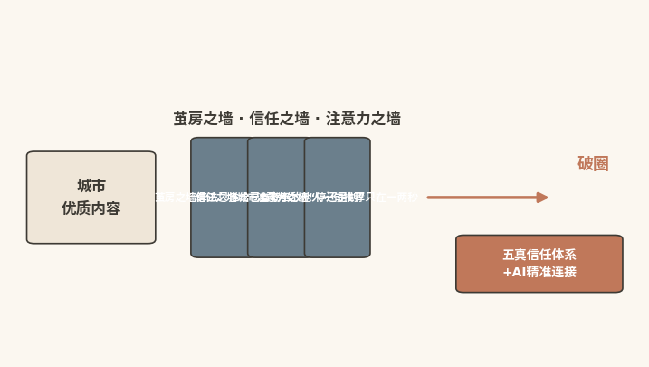
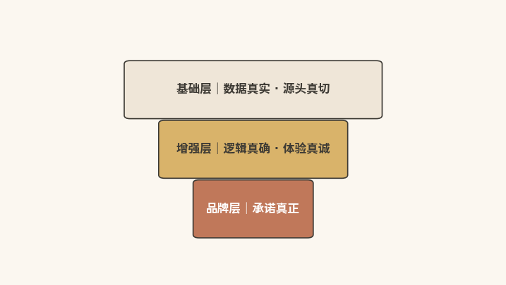
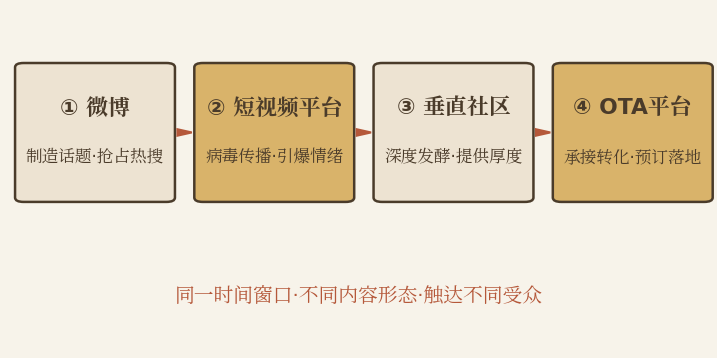

# 连接之力

## 让破圈内容精准触达圈外的人

|  |
|:---|
| 本章速读：破圈要穿透茧房、信任、注意力三堵圈墙。"五真"信任体系让AI为城市背书；微博---短视频---垂直社区---OTA四步节奏，实现多平台协同共振。 |

**【本章导读】**

第五章已解决生成力问题，城市由此具备规模化、个性化的内容生产能力。内容生产出来之后，更棘手的问题是如何确保这些内容不被困在"圈内"。

"圈内"，指一座城市既有的关注者：本地市民、已到访游客、文旅行业内部人士。他们通常不足潜在受众的5%（示例性估算），但城市的绝大多数传播资源，恰恰被这5%消费。剩下95%的人可能对这座城市感兴趣，却从未关注过它，几乎看不到城市的内容。

这就是连接力的核心命题：让城市的内容穿透圈层壁垒，精准触达那95%"还不属于你、却可能属于你"的潜在人群。更进一步，内容送达之后，还要让受众不只是"看到"，更能"相信"。

围绕这一命题，本章分五步展开连接力建设方法：先剖析传统城市传播的三堵"圈墙"（茧房之墙、信任之墙、注意力之墙）；再阐述精准画像与圈层识别，即从"人口学画像"到"行为学画像"的跃迁；接着提出信任基础设施，也就是"五真"信任体系；然后给出跨平台智能分发的协同策略；最后讨论连接力建设必须内含的风险防线。

## 三堵圈墙：好内容九成以上困在圈内

**【沙盘推演】**要理解连接力，先要看清传统传播的堵点。假设2024年某旅游城市做了一次"传播穿透力"测试：追踪十条优质内容的"圈外触达率"（触达非已有粉丝群体的比例）。结果颇具警示性：最高一条仅14.3%，最低一条2.7%，平均6.8%（示例性测算）。

这座城市并不缺优质内容：感知力锁定了"该说什么"，生成力实现了"能说出来"。但这些好内容93.2%的曝光（示例性测算）发生在"圈内"，圈外的人几乎看不到。这并非个案：三堵"圈墙"横在城市内容和圈外受众之间，是传统城市传播的结构性困境（见图6-1）。

图6-1 传统传播的三堵"圈墙"

### 茧房之墙：算法越精准破圈越难

第一堵墙，是茧房。法学家凯斯·桑斯坦（Cass R.
Sunstein）在2001年出版的《网络共和国》（Republic.com）中已对"我的日报"式信息窄化提出警示，并在2006年出版的《信息乌托邦》（Infotopia）中正式提出"信息茧房"概念\[1\]：人们倾向于接触与既有立场和兴趣一致的信息，渐渐困在由算法和自身偏好共同构建的"信息气泡"里。

对城市营销而言，信息茧房的破坏力在于：算法推荐越精准，破圈越难。算法在精准触达目标人群的同时，也把"不属于目标人群"的用户挡在传播半径之外。一个对历史文化毫无兴趣的年轻人，算法不会向他推荐任何博物馆、非遗内容，即使这座城市有一座世界一流的博物馆。用户看到什么由"算法认为你会喜欢什么"决定，而非"这座城市有什么"。过去没看过城市内容的用户，未来也不会被推送，由此被锁在"圈外"。

更值得警惕的是"自我实现的茧房效应"：运营者看到互动率低，便越发迎合现有粉丝的偏好；内容越来越"圈内化"，圈内互动率随之走高，圈外的人越来越看不到。结果是：数据越来越好，破圈越来越难。

### 信任之墙：城市自夸不敌他人一句推荐

第二堵墙，是信任。2021年8---9月，全球著名调查公司尼尔森（Nielsen）面向全球56个国家和地区约4万名消费者开展广告信任度调查。结果显示：88%的消费者最信任"认识的人推荐"（口碑），高于其他所有营销信息形式；各类品牌付费广告的信任度，均明显低于口碑推荐\[2\]。"别人说的"与"品牌自己说的"之间的巨大信任落差，就是城市传播面临的"信任赤字"。

这种赤字在日常传播中随处可见。城市在宣传片里自述"千年古都、人杰地灵"，用户的第一反应是"宣传片嘛，都这样"。文旅局长在直播间热情推介，用户心里却想"他在完成KPI"。这种不信任是整个"官方传播"模式面临的结构性困境。

信任赤字还带来一个悖论：城市投入最多资源生产的内容（官方宣传片、品牌口号、广告投放），恰恰是公众最不相信的类型；而公众最相信的真实游客评价、朋友推荐、社交UGC，城市却鲜有系统性的投资、引导和放大。

### 注意力之墙：停与划的判断只在一两秒

第三堵墙，是注意力。信息超载时代，城市内容不仅要和竞品城市竞争，还要和娱乐视频、明星八卦、萌宠萌娃竞争，而后者的竞争力通常远超前者。短视频信息流里，用户对一条内容"停还是划"的判断，往往发生在最初一两秒。市面上流传的"8秒注意力"之类说法，信源早已被证伪\[3\]；稳妥的结论是：判断窗口极短，以秒计。在这极短的窗口里，"第一帧"必须完成三件事：制造好奇、建立连接、传递价值。然而绝大多数城市内容，在第一项上就失败了：其第一帧，往往只是城市Logo和标准字体的叠加。

另一个维度是"注意力碎片化"：用户在通勤路上刷30秒、排队时刷15秒、睡前刷1分钟，消费场景从"整块时间"变成"碎片时刻"。一条30分钟的城市纪录片，制作再精良，也无法在"排队15秒"的场景里派上用场。城市不只需要"好的内容"，还需要"适配碎片化场景的内容形态"。

## 精准识别：从人口画像跃迁到行为画像

三堵"圈墙"的存在，不是"做得不好"，而是"用错了工具"：信息茧房要用"圈层识别"穿透，信任赤字要用"信任背书"填补，注意力稀缺要用"精准匹配"对抗。本节聚焦AI连接力最核心的技术能力：精准画像与圈层识别。

### 行为画像：看他做什么而非他是谁

传统用户画像是"人口学"的，典型标签如"一线城市""25---35岁""女性占比60%"。这些标签在电视时代有用，因为它们决定"投哪本杂志、哪个时段"；但在AI时代，它们正失去策略价值。原因在于，两个同为"一线城市、25---35岁、本科以上学历"的女性，出行偏好可能完全相反：一个只对博物馆、非遗感兴趣，是"文化探索者"；另一个只对网红餐厅、夜市感兴趣，是"美食打卡族"。用同一套标签触达两人，结果往往低效。

AI连接力的核心能力，是把画像从"人口学"升级为"行为学"。不看"他是谁"，而看"他做了什么、他在找什么、他关心什么"。四类城市目标受众的AI行为画像如下：

第一类：文化探索者。行为特征：搜索关键词集中在"博物馆""非遗""历史街区""名人故居"；偏好深度攻略和文化解读（单篇阅读超3分钟）。决策路径："小红书深度种草→OTA验证实用信息→AI助手确认细节"。

**触达策略：**深度内容+权威背书。提供"可被AI引用的高质量文化内容"：结构化的文物数据、专业的文化解读、权威的认证背书。话术从"快来玩"换成"这里有值得你深入了解的东西"。

第二类：美食打卡族。行为特征：搜索关键词集中在"必吃""网红店""夜市""排队"；偏好高视觉冲击的短视频和图文清单（单条停留往往只有几秒到十几秒）。决策路径："抖音/小红书种草→社交平台验证评价→冲动出游"。

**触达策略：**高密度视觉冲击+社交裂变传播。提供"一眼就能被种草"的内容：食物特写、市井烟火、价格清单；口号"人均50吃到撑的9条美食街"，而非"美食文化源远流长"。

第三类：亲子家庭客。行为特征：搜索关键词集中在"亲子""遛娃""安全""寓教于乐"；偏好宝妈社群推荐和OTA详细评价（关注安全性、便利性、性价比）。决策路径："宝妈社群问询→OTA查看评价→AI确认安全性和便利性"。

**触达策略：**安全信任+便利实用。提供"可验证的安全感和便利性"：清晰的亲子路线、设施说明、真实家庭评价。不是"适合全家出游"，而是"这条路线实测带3岁和7岁的孩子走了两天，有7个母婴室、4个儿童餐厅、全程无障碍通道"。

第四类：打卡出片族。行为特征：搜索关键词集中在"拍照""出片""氛围感""最佳机位"；重点关注构图、色调、光影。决策路径："小红书/Instagram种草→寻找最佳机位→为出片而出行"。

**触达策略：**视觉呈现+拍摄指南。提供"可复制的视觉内容"：最佳机位、最佳时间窗口、同款构图模板。"风景很美"远远不够，要给到"在这个机位、这个时间、穿这个颜色，你能拍出这样的照片"。

四类城市目标受众行为画像与触达策略

| 受众类型 | 行为特征 | 决策路径 | 触达策略 |
|:---|:---|:---|:---|
| 文化探索者 | 搜索关键词集中在"博物馆""非遗""历史街区""名人故居"；偏好深度攻略和文化解读（单篇阅读超3分钟） | 小红书深度种草→OTA验证实用信息→AI助手确认细节 | 深度内容+权威背书：提供可被AI引用的高质量文化内容（结构化文物数据、专业解读、权威认证），话术从"快来玩"换成"这里有值得你深入了解的东西" |
| 美食打卡族 | 搜索关键词集中在"必吃""网红店""夜市""排队"；偏好高视觉冲击的短视频和图文清单（单条停留往往只有几秒到十几秒） | 抖音/小红书种草→社交平台验证评价→冲动出游 | 高密度视觉冲击+社交裂变传播：食物特写、市井烟火、价格清单；口号要直给，如"人均50吃到撑的9条美食街" |
| 亲子家庭客 | 搜索关键词集中在"亲子""遛娃""安全""寓教于乐"；偏好宝妈社群推荐和OTA详细评价（关注安全性、便利性、性价比） | 宝妈社群问询→OTA查看评价→AI确认安全性和便利性 | 安全信任+便利实用：清晰的亲子路线、设施说明、真实家庭评价，提供可验证的安全感和便利性 |
| 打卡出片族 | 搜索关键词集中在"拍照""出片""氛围感""最佳机位"；重点关注构图、色调、光影 | 小红书/Instagram种草→寻找最佳机位→为出片而出行 | 视觉呈现+拍摄指南：最佳机位、最佳时间窗口、同款构图模板，提供可复制的视觉内容 |

### 圈外发现：激活潜在兴趣而非追已有需求

精准画像的价值，不仅在"找到已经感兴趣的人"，更在"找到可能感兴趣但还不知道的人"，这正是穿透信息茧房的关键。传统算法的"行为匹配"只能触达"已有需求"的人；AI连接力则通过两个机制发现"圈外人"：

一是兴趣扩展。基于协同过滤：如果A用户和B用户在文化消费、购物偏好、阅读习惯等非旅游维度上高度相似，而A已对某座城市产生兴趣，那么B有较大概率也是"潜在兴趣者"，即使他从未搜索过这座城市的任何信息。

二是场景触发。AI识别用户的"生活场景"，在触发时机推送城市内容：搜索"周末去哪里放松"的用户正处于"出行决策窗口期"；连续加班两周的用户，其社交状态暗示他可能正在计划一次"犒劳自己的旅行"。这些"非旅游场景"的信号，正是发现"圈外人"的重要线索。

### 国际镜鉴：新加坡"GEO信任实践"以权威引用赢得可见度

新加坡不仅是"花园城市"，在AI时代的城市营销中，它也被行业观察普遍视为"GEO先行者"之一。研究表明，在生成式引擎的回答中，通过引用来源、添加统计数据与权威引述等内容优化手段，信息源的可见度最高可提升约40%（为原论文自报最优值，后续独立复现研究未能完全确认该幅度）\[4\]。近年来，新加坡旅游局持续在VisitSingapore.com推进结构化数据（Schema标记）部署，覆盖景点、餐饮、文化活动等核心旅游信息，并系统建设"权威信源矩阵"，包括政府认证、行业标准、权威媒体的独立报道等。由此，AI在回答"最佳家庭旅行目的地"类问题时，更可能以官方数据和权威认证为依据推荐新加坡。尽管具体提升幅度难以从公开渠道考证，其方向与GEO研究的实证结论一致\[4\]。

新加坡的启示是：在AI时代，连接力的核心不是"让更多人看到你的广告"，而是"让AI获取你的结构化数据并以权威信源的方式推荐你"。这引出本章第三节的核心框架，即"五真"信任体系。

## 五真体系：让连接从触达升级为说服

新加坡的案例揭示了一个关键判断：在AI时代，触达≠连接。内容推送到用户面前只是"触达"；用户看了、信了、行动了，才是"连接"。两者之间隔着一座桥，叫"信任"。

AI时代的信任还有一个重要特征：它不仅是"人对城市的信任"，更是"AI对城市的信任"。用户正在把"该信谁"的验证工作外包给AI。收到推荐信息时，他不再直接判断"信不信"，而是问AI一句："XX城市真的值得去吗？"AI的回答，决定了用户的最终判断。

这就是"五真"信任体系的核心命题：构建一套让AI愿意信任、让用户敢于行动的信任基础设施。

### 五维加权：AI按五个维度决定引用谁与如何表述

在展开"五真"之前，需要先交代其背后的分析工具，即本书基于RAG（检索增强生成）机制提出的"AI-RAG五维加权评估框架"。

该框架的基本推断是：AI在组织答案时，并非平等对待所有信源，而是从语义相关性、信源权威性、内容结构化完整度、多源交叉一致性，以及内容新鲜度与用户反馈（两者合为一个维度）共五个维度进行加权评估，并据此决定"引用谁、如何表述"。

"五真"体系正是对这五个维度的正面回应：数据真实与源头真切，回应权威性与相关性；逻辑真确，回应多源交叉一致性；体验真诚与承诺真正，回应用户反馈；结构化的持续更新，则回应结构化完整度与新鲜度。需要说明的是，该框架为本书提出的分析框架，并非既有技术标准。

### 五维信任：从数据真实逐层走向承诺真正

"五真"信任体系不是五个并列要素，而是一个"基础层---增强层---品牌层"三层递进、包含五个信任维度的框架（见图6-2）。

图6-2 "五真"信任体系金字塔

第一维：数据真实，即可验证的客观事实。

城市输出的所有数据（客流量、空气质量、酒店价格、游客满意度）都必须"可验证"：每一项都标注来源、时间、统计口径。因为AI并不轻易"相信你说的"，它会去"验证你说的"。你声称"年接待游客5000万人次"，但OTA和交通部门的数据都指向约3000万人次，AI就会发现矛盾，自动调低你的"信源可信度"评分。一个可验证的"3000万"，比一个无法验证的"5000万"，对城市品牌的贡献大得多。

第二维：源头真切，也就是权威第三方的认证矩阵。

数据真实回答"你的数据可靠吗"，源头真切回答"谁说可靠"。同样一句话，由城市自述与由联合国教科文组织发布，分量截然不同：基于RAG检索与信源排序机制可以合理推断，两者在AI信源评估中的权重可能相差悬殊。AI对信源权威性的排序大致是：政府认证＞学术引用＞行业标准＞权威媒体报道＞城市自述；普通用户评价与匿名信息的权重更低。

因此，城市需要系统性地建立第三方权威信源矩阵，包括四个层次。一是政府/国际组织认证层：5A景区、世界遗产、历史文化名城，属AI权重体系中的"最高等级信源"。二是学术引用层：考古发现被论文引用、非遗技艺被人类学研究、治理创新被选为教学案例，是AI最重要的"信任锚点"之一。三是行业标准层：旅游相关ISO认证、国家旅游度假区评定。四是权威媒体层：央视、新华社、人民日报的独立报道。

景德镇是一个典型案例（详见第二章）：其《基于大数据的古陶瓷基因库数字化平台》与《瓷联世界：景德镇数字瓷都构建全球陶瓷文明互鉴新生态》分别入选《世界互联网大会文化遗产数字化案例集（2025）》与2025年"携手构建网络空间命运共同体"精品案例\[5\]。这类"非旅游领域的技术奖项"，恰是AI交叉验证中对城市"信任评分"的有力支撑。

第三维：逻辑真确，指多平台信息的自洽性。

AI会交叉比对同一城市在不同平台上的信息。官网写"拥有300家非遗工坊"，OTA搜索"非遗体验"却只返回200个结果，矛盾就会被标记为"信息不一致"，拉低信源评分。公众号定位"最具幸福感的城市"，微博热门话题却是"工资低房价高"，AI就会抓取到"品牌承诺与实际反馈之间的断裂"。需要强调的是，逻辑真确不要求"复制粘贴同一段话"，要求的是"核心信息统一+渠道适配表达"：统一的是数据（300家就是300家），差异的是表达方式。

第四维：体验真诚，即真实的、有褒有贬的评价体系。

这是最反直觉的一维。部分城市把"清一色五星好评"当成信任的证明，但事实恰恰相反。基于RAG检索与信源排序机制可以合理推断，"零差评"的评价会被AI视为"低可信度"信号，甚至触发"虚假评价"标记，因为真实的评价分布，本应有高有低、有褒有贬。体验真诚的核心，是展示真实、完整、未经修饰的反馈，包括正面评价、中性评价（"风景不错，但交通不便，建议自驾"）与建设性批评（"旺季人太多，建议错峰"）。更重要的是城市对反馈的回应质量：一个"公开所有评价、真诚回应批评、展示改进时间表"的城市，在AI信任评分中将远超"全是好评"的城市。

第五维：承诺真正，即城市品牌承诺的可兑现性。

这是"五真"的最高维，比"数据是否真实"更进一步：承诺能否兑现。声称"宠客"，就要有公开可量化的服务标准（"排队超30分钟即启动分流""退款24小时内完成"），有独立的监督和投诉渠道，也有"承诺未兑现的补救机制"。

哈尔滨退票风波的启示在于（案例详见第四章）：它之所以能"化危为机"，关键在于危机后的一系列"承诺兑现"。承诺开启信任，兑现才巩固信任。

**【沙盘推演】（假设情境，情节为示例性演算）反面镜鉴同样值得记取。**某旅游城市曾在OTA平台打出"不满意全额退款"的承诺，但当游客因"景区拥挤"申请退款时，被客服拒绝。游客把"承诺截图"和"拒绝截图"同时发布，引发大规模负面传播。更致命的是，AI在交叉验证时发现了"承诺"与"拒付"之间的矛盾，将其标记为"品牌承诺与实际行为脱节"，显著拉低该城市的AI信任评分。

技术层面的实现路径是：通过Schema标记把"服务承诺"结构化为机器可读格式，即用Service和Action
Schema标记每条承诺的内容、适用条件、兑现流程、监督渠道，让AI能精确识别"承诺是什么"与"兑现记录是什么"之间的逻辑关系。

### 证据链条：让AI有据可查、敢信敢荐

理解"五真"之后，落地建设分三步走。

第一步：建立城市"信任中心"页面。

在官网设立专门的结构化页面，汇集以下内容并全部采用Schema标记：官方认证（5A景区、世界遗产、非遗名录，均标注认证机构、时间、有效期）、实时数据（客流量、空气质量，均标注来源、更新时间、统计口径）、用户评价（OTA聚合评分，含正、中、负面比例分布）、权威媒体报道列表。这个页面不是给人看的，而是给AI看的。AI最信任的入口，正是这种"结构化完备、多源交叉验证、权威背书充分"的信任中心页面。

第二步：促进行业协会和学术机构的城市研究。

你城市的非遗技艺被核心期刊论文引用、治理创新被知名商学院作为教学案例，这些"学术引用"的信任权重远超任何广告投放。文旅部门可与本地大学、社科院合作设立研究课题，让学术论文同时服务于学术研究和AI信任建设。

第三步：建立跨平台信息一致性管理机制。

指定专人或系统定期巡检官网、OTA、地图、社交媒体上的核心数据，发现不一致（如官网写开放8:00---18:00、地图显示9:00---17:00）立即修正。

## 智能分发：在对的渠道与时机触达对的人

连接力的第四个环节，是把精准画像和信任体系结合起来，在实战中实现跨平台智能分发。本节给出可操作的协同策略。

### 场景匹配：按用户状态把内容投对平台

不同平台承载着用户不同的行为状态和心理预期，把内容投错平台，是最常见也最隐蔽的资源浪费。中国主流内容渠道可划分为四类场景：

碎片化娱乐场景（抖音、快手）：用户"快速刷、快速判断、快速消费"，判断窗口以秒计；适合"强视觉冲击+黄金三秒钩子+快节奏剪辑"，不适合深度攻略、长文解读。

深度求解场景（知乎、垂直论坛、微信公众号）：用户"主动寻找、仔细阅读、深度思考"，单次停留以分钟乃至十几分钟计；适合深度攻略、文化解读、系统性盘点，不适合15秒短视频。

社交分享场景（小红书、朋友圈、微博）：核心驱动力是"内容能否成为社交货币"。适合高颜值图文、真实体验分享、有共鸣的叙事，不适合硬广风格和过度精致化的官方片。

系统学习场景（知识平台、B站、播客）：用户有明确学习目标，长内容的完播率远高于碎片化场景。适合系统的城市文化课程、历史纪录片、深度访谈，不适合碎片化信息。

"场景错配"是渠道策略中最隐蔽的浪费：把深度文化解读投到抖音，一两秒内被划走；把快节奏短视频投到知乎，用户觉得浪费时间。AI渠道匹配的价值在于：根据内容特征自动判断最适配的场景和平台，实现"内容---场景---渠道"的精准匹配。

### 传播节奏：四步协同制造立体共振

真正的破圈需要多平台协同共振：在同一时间窗口内，用不同内容形态、在不同平台、触达不同受众，形成立体化的传播矩阵。具体可分四步（见图6-3）。

图6-3 跨平台传播的四步节奏

第一步：微博制造话题。微博的核心优势是"广场效应"：信息可在极短时间内触达大规模人群并形成公开讨论。城市在微博释放"话题种子"，目标是制造"新闻性"而非"广告感"。

第二步：短视频平台病毒传播。微博热度引发创作者和KOL在抖音、快手二次创作。短视频不需要"精致"，需要的是"可模仿、可改编、可互动"的传播基因。

第三步：垂直社区深度发酵。热度达到一定量级后，知乎、B站、公众号的深度内容开始出现："为什么XX突然火了？""在XX待了一周，我的真实体验。"深度内容为"热度"提供"厚度"。

第四步：OTA平台承接转化。兴趣被激发后，用户打开携程、飞猪、马蜂窝搜索攻略和门票。此时城市必须确保搜索结果页的信息最新、准确、有吸引力，这是"认知"转化为"行动"的关键一步。

整个过程中，AI的角色是"指挥调度"：监测每阶段数据反馈，自动调整下阶段资源分配。微博话题2小时内达到预期的80%，就提前启动短视频传播；某人群互动率异常高，就自动加大对该人群的投放权重。

### 三维匹配：让触达正确从运气变成算法

在内容、渠道、时机三个变量间寻求最优组合，是人工投放无法完成的计算任务。AI则可根据历史数据模型，自动给出最优建议："秋季红叶攻略"最好周三晚8点发在小红书，目标人群25---35岁一线城市女性；"暑期亲子线路"最好周五下午3点推送到宝妈社群和朋友圈，落地页是OTA亲子酒店比价页。

三维匹配的本质是：在正确的时间、正确的渠道、用正确的内容形态、触达正确的人。AI让这个"正确"从"运气"变成了"算法"。

## 风险防线：以结构化数据对冲幻觉与偏见

一套负责任的方法论，不能只展示AI的"光明面"。本节聚焦AI信任体系中城市必须警惕的两个结构性风险，即AI幻觉与算法偏见，并给出应对防线。

### AI幻觉：当AI推荐了一座"不存在"的城市体验

"AI幻觉"（Hallucination），指大语言模型以高度自信的语气，陈述客观上不准确的信息。用户问"XX城市有什么独特体验"，AI可能"幻想"出虚构的景点并自信推荐。当用户满怀期待前往、却发现体验根本不存在时，不满不仅指向AI，也会指向那座"让AI说了错话"的城市。

对此，城市可以构筑应对AI幻觉的三道防线：

第一道防线：让事实压倒幻觉。确保核心信息（景点、活动、服务）以结构化数据和权威信源形式存在于互联网；信息源足够丰富、结构化、权威时，AI倾向于引用真实信息而非"自行发挥"。

第二道防线是主动巡检。定期用主流AI工具提问城市相关的高风险问题（涉及时间、地点、价格等细节），发现事实性错误立即在权威渠道发布"纠错信息"，AI会被纠错信息"重新训练"。

第三道防线：透明度沟通。在官方渠道建立"AI推荐信息核实专区"，列出AI最常见的推荐内容和官方核实结果，供用户验证。

### 算法偏见：当AI系统性地"忽视"某些城市

算法偏见（Algorithmic
Bias），指AI因训练数据的结构性偏差，系统性地高估或低估某类信息的权重。对城市营销而言，这意味着AI可能系统性偏好一线城市、知名旅游城市，而低估中小城市的推荐权重。根源在于它们在训练数据中"不够多"，而非"不够好"。

同样，城市应对算法偏见有三道防线：

第一道防线：弥补数据缺口。中小城市的首要任务，是填补AI知识库中的数据空白（结构化标记、权威信源、多形态内容），这些都比"投放更多广告"更紧迫。

第二道防线是差异化定位。AI的推荐基于"语义相关性"：不和大城市竞争"中国最佳旅游城市"，而是精准定位为"中国最值得去的冷门古镇"，从"红海品类"切换到"蓝海品类"，才有机会成为AI的"首选推荐"。

第三道防线：多元化AI测试。不同大模型的训练数据和偏好不同，在同一款AI中被低估的城市，可能在另一款AI中权重更高。因此，与其"讨好某一款AI"，不如在所有主流AI中建立稳健的认知存在。

审慎的乐观。本节置于章末，因为它构成全书AI乐观主义的"自反性平衡"：AI赋能城市破圈力是真实的，AI的幻觉、偏见和不确定性同样真实。城市既不能因噎废食，也不能陷入技术乌托邦主义。正确的态度是：用AI建设破圈力，同时用专业能力防范AI的风险。让AI成为城市的"战友"：强大，但需要被监督；可信，但需要被验证。

## 本章小结：连接之要在于让对的内容找到圈外对的人

本章是破圈力建设的第三战，即连接力。

第一节揭示了三堵"圈墙"：信息茧房（算法越精准，破圈越困难）、信任赤字（口碑推荐与品牌广告之间的信任鸿沟）、注意力稀缺（以秒计的判断窗口）。归结起来，它们都是"连接方式不对"的问题。

第二节展开了AI连接力的精准画像体系，从"人口学标签"到"行为学画像"的跃迁，四类目标受众的行为画像和差异化触达策略，以及穿透信息茧房的"圈外人发现机制"。

第三节是本章的核心，即"五真"信任体系。它论证了一个关键判断：AI时代的连接力，最高层次是"说服"，不只"让人看到"，更要"让AI相信"。数据真实、源头真切、逻辑真确、体验真诚、承诺真正五个维度，按基础层、增强层、品牌层逐层递进，构成信任金字塔。

第四节提供了跨平台智能分发的协同策略：四类场景匹配、四步传播节奏、"内容×渠道×时机"三维匹配，将"精准"从理念变成可操作的流程。

第五节给出了连接力建设必须内含的风险防线：针对AI幻觉与算法偏见的六道防线，信任建设必须内含风险控制机制。

读完本章，你应当理解：连接力不是"把内容发到更多渠道"，而是"让内容在对的时间、对的渠道、以对的方式，触达对的人，并让对的人相信"。触达只是起点，信任才是终点。

当五真信任建设完成，城市在AI知识库中获得的将不只是推荐位，而是一种更根本的资产：认知主权。这是本书结语要展开的终极命题。

> 触达≠连接。内容被看到只是第一步，被相信才是最后一步。
>
> 在AI时代，城市需要的不是"让更多人看到广告"，而是"让AI引用你的数据并以权威信源的方式推荐你"。信任不是在承诺中建立的，而是在兑现中巩固的。

### 参考文献

\[1\] SUNSTEIN C R. Republic.com\[M\]. Princeton: Princeton University
Press, 2001; SUNSTEIN C R. Infotopia: how many minds produce
knowledge\[M\]. New York: Oxford University Press, 2006.

\[2\] NIELSEN. 2021 Trust in Advertising Study\[R/OL\].
(2021-10)\[2026-08-07\].
https://www.nielsen.com/insights/2021/trust-in-advertising-2021/.

\[3\] MAYBIN S. Busting the attention span myth\[N/OL\].
(2017-03-10)\[2026-08-07\]. https://www.bbc.com/news/health-38896790.

\[4\] AGGARWAL P, MURAHARI V, RAJPUROHIT T, et al. GEO: Generative
Engine Optimization\[C/OL\]//Proceedings of the 30th ACM SIGKDD
Conference on Knowledge Discovery and Data Mining (KDD \'24). Barcelona:
ACM, (2024)\[2026-08-07\]. https://doi.org/10.1145/3637528.3671900.

\[5\] 景德镇市人民政府. 瓷都潮涌千帆竞
文脉弦歌万象新------2025年景德镇市宣传思想文化工作综述\[Z/OL\].
(2026-03-21)\[2026-08-07\]. http://jdz.gov.cn/zwzx/jrcd/t1084632.shtml.
