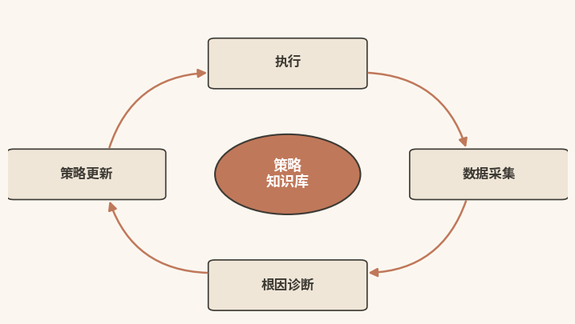
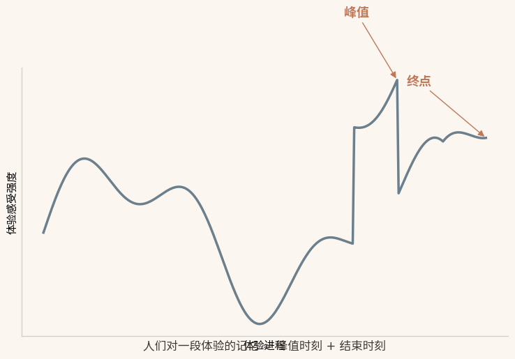
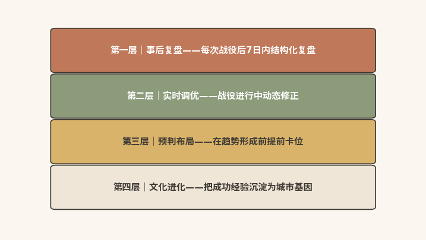

# 进化之力

## 让每一次出圈都为下一次蓄能

|  |
|:---|
| 本章速读：进化力让每一次出圈都为下一次蓄能。A/B测试与策略闭环把单次学习变成系统进化；事后复盘、实时调优、预判布局、文化进化四层防线，让城市从依赖运气走向依赖系统。 |

【本章导读】

中篇前三章逐一阐述了破圈力的三种子能力：感知力（知道该说什么）、生成力（能说出来）、连接力（能送到对的人面前）。三力协同，解决的是同一个核心问题：一次成功的出圈如何实现。但还有一个更深层的问题悬而未决：一次成功之后，下一次乃至每一次的成功如何得到保障。

这正是进化力要回答的问题。它是四力中最容易被忽视、却最关键的一环。没有进化力的城市，每一次出圈都是从零开始：经验没有系统化，教训没有被吸收，投入没有产生"复利效应"。有进化力的城市则完全不同：系统在积累，方法在优化，能力在增强，每一次出圈都在为下一次积蓄势能。

本章分四步展开进化力的建设方法。第一步，剖析传统城市营销的"一次性困境"：策划式营销的致命缺陷、经验驱动的瓶颈、失败经验的浪费。第二步，展开AI进化力的核心机制：A/B测试与在线学习、数据反馈驱动的策略闭环、峰终定律的AI应用、知识沉淀与策略复用。第三步，提出进化力的四层防线：事后复盘（基础）、实时调优（进阶）、预判布局（战略）、文化进化（最高层）。第四步，以哈尔滨、景德镇、荣昌、成都四座城市为镜鉴，验证四种进化力模式的实践成效。

## 归零困境：经验不沉淀，每次营销都从零开始

**【沙盘推演】（假设情境，数据为示例性演算）从一个场景切入。**2023年，某省会城市做了一次"营销资产盘点"：文旅局团队回顾了过去五年的全部营销活动，包括大型节庆、品牌推广、事件营销、社交媒体战役，总计超过100次。随后，他们问了自己一个问题："这100次活动中，有多少次的成功经验被系统化沉淀，可以在下一次直接复用？"

答案是：不到5次。

这是传统城市营销的普遍病灶："一次性困境"。每一次营销活动都是一场"孤立的战役"，战争经验无法转化为组织记忆。病灶的根源，可从三个层面分析。

### 策划之弊：每次营销都是一次性消费品

传统城市营销的运作模式，可概括为"策划式"：年初制定全年营销计划，分解为若干活动；每个活动独立策划、独立执行、独立总结，随后存档。到了下一年，新的计划、新的活动，一切从零开始。

这一模式的结构性缺陷在于：每一次营销都近似"一次性消费品"。两百万的音乐节、一百万的宣传片，活动一结束、钱一花完，照片和通稿存进文件夹，"成果"便被归档为"已完成的工作"。它们没有被拆解为可复用的"知识单元"，没有进入城市的"策略知识库"，更没有成为下一次决策的"参考依据"。

### 经验之顶：直觉无法发现未知的路径

传统城市营销的第二个局限，是"经验驱动"。经验丰富本身并非问题，问题出在运用方式上。经验驱动的本质，是依赖"某个人"的判断：局长、处长、资深策划人把直觉、偏好和过去的成功记忆，投射到每一次新的决策中。"上次音乐节效果不错，这次做一个更大的"，依据的是记忆；"我们的城市适合打历史文化牌"，依据的是直觉。

在缺乏数据时，经验和直觉当然有价值，它们是可靠的决策依据。但两者有一个共同的上限：无法回答"换一种做法会不会更好"。经验告诉你"上次这样做效果不错"，却无法告诉你"如果同时试验A方案和B方案，B可能更优"；直觉告诉你"适合打文化牌"，却无法告诉你"最近三个月'美食'话题的互动率已超越'文化'话题"。

经验驱动只能"沿着已知的路径走"，无法"发现未知的路径"。而在快速变化的数字时代，未知的路径往往才是"破圈"的真正机会。

### 失败之废：失败数据是进化的宝贵燃料

第三个病灶，是传统城市营销中隐蔽的损失：失败经验的浪费。一次失败的营销活动，投入预算和人力，效果却未达预期；在传统模式下，它只是一次"要避免的教训"：复盘后写进总结报告，此后不再提起。因为在体制内，"失败"是一种"负资产"，少有人愿意反复讨论。

但失败经验恰恰是营销进化中的高价值"数据"。一次失败告诉你"在什么条件下、什么策略、什么执行方式不奏效"，其价值不亚于一次成功告诉你"什么是奏效的"。在AI时代，失败经验的价值有时甚至超过成功经验：失败揭示了系统的"边界条件"和"脆弱点"，而这些恰恰是系统进化的关键输入。

对比两种结局，差别清晰可见。传统模式下，城市付出真实成本买来失败教训，然后把它锁进柜子；AI驱动的进化力体系下，每一次失败都是一次"系统升级"的机会。这并非"失败是成功之母"式的励志口号，而是因为失败产生的数据可以被AI分析、拆解、归因，最终转化为下一次决策的"免疫系统"。

## 四大机制：AI驱动从一次性战役到持续进化

如果说传统城市营销的进化靠"事后总结+主观判断"，那么AI时代的进化力就是"实时学习+数据驱动"。从"一次性"到"持续性"，AI提供了四个核心机制，以下逐一展开。

### 在线试错：A/B测试让决策由数据说了算

A/B测试是进化力最基础的机制，原理并不复杂，实践中却往往效果显著。

A/B测试，即同时对A、B两个版本的内容或策略进行投放，比较两者的效果数据（点击率、互动率、转化率），把更优版本推向大规模投放。如果A和B差异不大，就继续测试C版本、D版本，直到找到显著更优的方案。

A/B测试构成进化力的基础，原因在于它把决策从"人的判断"转移为"数据的判断"。局长说"我觉得红色版海报更好看"，这是人的判断；A/B测试显示"红色版海报的点击率比蓝色版高32%，p值\<0.01"（统计显著性水平），这是数据的判断。在数据面前，人的"我觉得"必须让位。

AI显著提升了A/B测试的效率。传统的A/B测试是"手动且一次性的"，每次只能测一组变量，还需要充足的样本和时间。AI则可以实现"多臂老虎机"算法：同时测试多个变量组合（颜色、文案风格、发布时间、目标人群），在探索（尝试新策略）与利用（使用已知有效策略）之间寻找最优平衡\[1\]。这意味着运营方不必等到"测试完成"才开始获益：AI会实时把流量向效果更好的方案倾斜，让"学习的过程"同时成为"收益最大化的过程"。

**【沙盘推演】**某城市准备在五一假期推出一组"避开人群的小众路线"内容。AI同时生成五个版本的封面图和标题组合，面向五个细分受众群体，在三个不同时间段发布。系统实时监测每个组合的互动数据，自动把曝光资源向高效组合倾斜。48小时后，系统即可锁定表现最优的"封面图+标题+发布时间+受众群体"组合，并把剩余预算集中投放。

### 策略闭环：执行、监测、分析、优化实时循环

A/B测试解决的是"单次决策的优化"。但进化力要的不只是"每次决策更优"，更是"系统本身持续升级"。策略闭环，正是把"单次学习"转化为"系统进化"的机制。

图7-1 数据反馈驱动的策略闭环

策略闭环是一个四步循环：执行→监测→分析→优化→再执行（见图7-1所示）。

第一步（执行）和第二步（监测）同时发生。AI实时监测每一项传播活动的核心指标：不同平台的效果差异（同样一条内容，在小红书的互动率是3.2%，在抖音是1.8%）、不同内容形态的传播效率（短视频的完播率远高于图文，但图文的收藏率远高于短视频），并逐一拆解其背后的成因。

第三步（分析）是AI的核心环节。AI要做的远不止"把数据变成图表"，它做三件事：自动识别异常数据（"这个KOL的这条内容互动率是平时的5倍，为什么？"），自动归因（"互动率飙升的主因是发布时间恰好撞上了热搜话题，与内容质量关系不大"），自动输出优化建议（"下次类似主题的内容，建议在话题爆发的24小时内发布"）。

第四步（优化）是把"分析"转化为"行动"。AI根据分析结果，自动调整下一轮的内容策略、渠道配比、投放时机和预算分配。例如，AI发现"周五晚8点发布的美食内容互动率是周一早9点的2.7倍"，系统就会自动把此后所有美食类内容的发布时间改到周五晚8点。这些调整不需要人逐一决策，人只需在每周的策略报告中"确认"AI已经完成的优化项。

四步循环的关键，在于速度。传统模式下，"活动结束→数据汇总→分析报告→策略建议→下次执行"的周期通常为一个月到三个月；AI模式下，"上一秒的数据→下一秒的分析→下一秒的策略调整"，实时或准实时即可完成。这意味着城市可以在营销活动进行中"边打边学"，而不必等到活动结束后才"复盘总结"。

### 峰终设计：AI主动创造峰值与美好终点

第三个机制，借用一个经典心理学定律：峰终定律（见图7-2）。

"峰终定律"最早由2002年诺贝尔经济学奖得主、心理学家丹尼尔·卡尼曼与芭芭拉·弗雷德里克森等人提出。相关研究1993年发表于《心理科学》（Psychological
Science），并通过冷水实验验证：人们对一段体验的记忆，不是由"体验的平均值"决定，而是由两个关键时刻决定，即峰值（体验中最强烈的正向或负向瞬间）和终点（体验结束时的感受）\[2\]。卡尼曼在2011年出版的《思考，快与慢》中对这一定律作了系统阐述\[3\]。

图7-2 峰终定律：记忆由峰值与终点决定

这一定律对城市营销影响深远。设想一个游客在一座城市停留三天，去了六个景点、吃了九顿饭、住了两晚酒店。他不会把这些体验"平均"成一个综合评分；他记住的是其中最好或最糟的那个瞬间（峰值），以及离开时的最后感受（终点）。如果峰值是一顿惊艳的晚餐、终点是酒店前台的一句"欢迎下次再来"，他对这座城市就会留下良好的整体印象，即使旅途中有些小不愉快。

AI将峰终定律应用于城市体验设计，路径是两端发力。

一端是科学识别峰值机会点。AI分析游客的社交媒体数据和OTA评价数据，自动找出"哪些环节最可能创造正向峰值""哪些环节最容易产生负向峰值"。正向峰值的高发区包括在地文化互动、意料之外的惊喜、被真诚对待的感动；负向峰值的高发区则是排队时间过长、信息不对称导致的预期落空、被不公正对待。摸清这些机会点和风险点之后，城市可以主动设计"正向峰值"，比如在每个景点设置一个"隐藏体验点"，游客完成特定任务后解锁；同时系统性消除"负向峰值"，比如部署AI排队预测系统，实时推送"建议游览时段"。

另一端是优化终值体验。终值，即体验结束时的感受，是游客"是否会再来""是否会推荐"的关键决定因素（净推荐值NPS研究同样表明，"是否愿意向朋友推荐"是衡量客户体验与增长潜力的核心指标\[4\]）。AI可以在游客离城时自动生成一份个性化的"旅行记忆报告"：所到之处的地图轨迹、所拍照片的时间线、消费总结，再随机附送一条"关于这座城市的冷知识"。这份报告不为"实用"，只为创造一个"积极的终点"：让游客离开时心里留下一句"我会记住这座城市"。

### 国际镜鉴：迪士尼"魔法手环"用行为数据驱动体验进化

迪士尼乐园运营着一套名为"MagicBand"的智能手环系统。2013年，华特迪士尼世界（奥兰多）推出第一代MagicBand手环。作为"MyMagic+"数字体验工程的组成部分，它实现了园区入园、酒店房门开启、餐饮零售消费、照片关联等"免手持"一体化服务\[5\]。MyMagic+项目自启动起，即获得迪士尼董事会层面的巨额预算支持\[6\]。经过近十年迭代，2022年迪士尼推出新一代MagicBand+：当年7月27日在华特迪士尼世界上线，10月26日登陆加州迪士尼乐园度假区\[5\]\[7\]。新一代手环新增变色灯光、触觉震动与手势识别功能：夜间焰火表演时，手环会随演出节奏同步点亮、震动，成为"魔法时刻"的一部分。

这些设计的底层逻辑，正是峰终定律：在游园体验中主动制造"正向峰值"，并用一场灯光与焰火交织的谢幕为一天画上"美好终点"。从2013年功能单一的入园手环，到2022年可互动、可感知、可沉浸的MagicBand+，迪士尼用近十年的持续迭代验证了一个核心判断：进化力的本质在于，下一次会因为这一次而变得更好。

### 组织记忆：经验沉淀为可调用的策略模板

最后一个机制，指向进化力的终极形态：组织记忆。它不止于"每次决策更优"（那只是"聪明的人做了聪明的选择"），而是让每一次成功的经验与失败的教训，都从"某个人的脑子里"沉淀进"系统的知识库"。

先看知识沉淀。每一次营销活动的所有关键数据、核心决策、执行细节、效果归因，都要"结构化地沉淀"为可调用的"策略模板"，而非写进Word文档存档：标签化（"亲子游""暑期""长三角市场""高客单价""KOL为主"）、参数化（关键变量和影响权重被提取为可量化参数）、可检索（未来策划类似活动时，相关人员都能通过关键词检索到历史策略模板和相关数据）。

再看策略复用。城市下一次策划类似活动时，AI会自动推荐："2023年暑期你做了一场类似的活动，当时的策略模板如下，核心参数如下，效果数据如下。基于当前的市场环境和受众数据，建议以下三个调整方向。"团队不必"从零开始"，而是站在过去的肩膀上，利用历史经验做适配和微调，而非"重新发明轮子"。

景德镇的AIGC互动体验区，就是"知识沉淀+策略复用"的范例。从首次摸索到模式跑通，团队将互动设计、内容框架与传播策略沉淀为可复用的经验；此后同类文化活动得以在此基础上快速适配，筹备周期明显缩短（案例详见第二章）。

## 四层防线：从复盘到文化进化的制度设计

上一节展开了AI进化力的核心机制。但进化力不只是"用什么技术"，更是"建立什么制度"。本节提出进化力的四层防线（见图7-3），从基础到最高层，层层递进。

图7-3 进化力的四层防线

### 事后复盘：确保每次出圈都不白做

目标：确保每一次出圈，无论成败，都不会"白做"。

标准动作：每次营销活动结束后7日内，完成一份结构化的"出圈复盘报告"。这份报告要严格基于数据做根因诊断，而非"这次活动做得好不好"的主观感受，包含三个部分：

数据全景：曝光量、互动量、转化量、传播路径、受众画像，全部以数据为依据。

成败归因：是"这次活动的传播峰值出现在第二天下午3点，核心驱动力是KOL
A的转发和B话题的热搜效应；高峰时段的流失节点是落地页加载速度过慢"，而非"这次活动很成功，因为团队很努力"。

策略提炼：从"这次做了什么"中提炼出"下次可以复用的是什么"，成功要素被标准化为策略模板，失败教训被标记为风险预警。

在这一人机分工中，AI自动生成数据全景和初步归因分析，人负责策略提炼和深层判断。人的价值不在于"看数据"，而在于"理解数据背后的故事"：AI告诉你"转发峰值出现在第二天下午3点"，人告诉你"因为那天是周五，大家都在上班刷手机"。

### 实时调优：让问题在下一秒就被修正

如果说事后复盘解决"做完之后学到什么"，实时调优的目标就是从"事后才知道"升级为"事中就能调"。

标准动作：在传播活动进行中，AI实时监测各项指标，自动识别效果差异并触发调优指令。上一秒数据揭示的问题，下一秒就被修正。

具体包括四个自动调优场景：

内容调优：AI发现A版本的点击率持续高于B版本30%以上，自动将B版本下线，把所有流量导向A版本，并基于A版本的"成功基因"自动生成C版本进行下一轮测试。

渠道调优：AI发现某条内容在抖音的互动率是小红书的3倍，自动把剩余预算从后者转移到前者。

人群调优：AI发现某条内容在"美食打卡族"中的转化率是"文化探索者"的5倍，自动调整投放定向。

预警调优：AI发现某条内容的评论中负面情感占比突破阈值，自动暂停投放并触发人工审核。

### 预判布局：提前锁定下一个出圈窗口

再上一层，目标从"被动响应"升级为"主动出击"。

标准动作：AI基于历史数据和趋势模型，预测下一个"出圈窗口"（什么季节、什么话题、什么人群最可能被触动），并提前储备内容和资源。

预判依赖三个输入：

季节性节律：基于历史数据，识别城市出圈的"季节性模式"，即哈尔滨的窗口在冬季（冰雪季），景德镇的窗口在春秋（气候适宜+假期密集+陶瓷文化主题展期），成都的窗口几乎全年（但夏冬是相对淡季）。

话题预判：AI监测全国性的"话题趋势"。当一个全国性话题（如"国潮""治愈系旅行""特种兵式旅游"）正在升温时，AI预判其达峰时间，以及可能与城市的哪些资源产生"化学反应"。

竞品预判：AI监测竞品城市的内容动态和传播趋势。如果竞品正在大力推广"秋季赏枫"，城市需要在避开同期竞争与借势承接之间作出选择。

### 文化进化：把进化力内化为城市基因

最高一层的目标，是把进化力从"方法"内化为"城市基因"。

这是进化力的最高形态，也是最难达到的一层。它意味着：城市不需要"刻意地"复盘、调优、预判，这些行为已融入日常运转，像呼吸一样自然。当市民自发传播城市的美好，当商家主动参与内容共创，当政府在任何舆情中本能地选择"真诚回应"而非"试图掩盖"，这座城市就在文化层面拥有了进化力。

成都的"烟火气"难以复制，因为它是"进化力文化"的产物，而非"进化力建设"的结果。茶的清香、火锅的热闹、慢节奏的生活态度，这些不是"被策划"的，而是自然"生长"出来的。当一座城市的文化本身就具备"自我更新""自我传播""自我净化"的特质，进化力就已融入其文化基因。

对绝大多数中国城市而言，文化进化是长期愿景，难以在短期内达到。但这并不意味着前三道防线没有意义；恰恰相反，它们的每一次成功运转，都在为"文化进化"积蓄土壤。

## 四城镜鉴：四种进化模式的实践验证

理论框架的价值，最终要靠真实案例来验证。本节以四座城市为镜鉴，提炼四种进化力模式的定义、适用条件与关键动作（逐一拆解后汇总对照见下表）。各案例的事件经过与数据细节，详见其主案例章。

### 哈尔滨模式：危机触发下的极限响应进化

模式定义：以负面舆情为触发点，依靠极限压力下的快速组织响应实现进化。

2023年12月，哈尔滨冰雪大世界开园首日因排队问题引发"退票"舆情，当地文旅部门24小时内现场处置、连夜整改，这成为其爆火出圈的起点（事件经过详见第四章）\[8\]。其进化机制为"感知公众不满→跨部门专班极速响应→系列'宠客'操作→舆情翻转"，此后每一次响应都在上一次的基础上迭代升级。适用条件：面临突发舆情危机、需要快速止损的城市场景。关键动作：成立跨部门应急专班、24小时内给出可见的补救动作。进化特征：响应速度快，但持续能力中等。它依赖外部事件不断"触发"，系统化程度较低，且过度依赖关键决策者的判断力。

核心启示：危机驱动验证了城市的极限响应能力。但如果下一次危机来临时，关键决策者不在位或判断失误，系统就可能失灵。因此，需要从"危机驱动"向"制度驱动"过渡。

### 景德镇模式：以产品迭代节奏自驱进化

模式定义：不依赖外部事件，而以内部产品创新节奏为触发点的自驱式进化。

景德镇的进化机制为"产品创新→成功经验标准化为策略模板→下一次创新复用并叠加优化"：技术参数被复用，传播策略被优化，用户反馈被吸收。适用条件：拥有可持续挖掘的核心文化资源、能够建立产品迭代节奏的城市。关键动作：建立"产品路线图"、把验证有效的模式沉淀为策略模板、按节奏推进迭代而非等待运气。进化特征：速度中等（以月或季度为周期），持续能力强，系统化程度高。

核心启示：产品驱动是"可规划性"较高的进化模式，不依赖运气、危机或某个能人，而是依赖一张可以按节奏推进的路线图。对大多数城市而言，这一模式更具学习和复用价值。案例详见第二章。

### 荣昌模式：接梗放大的事件响应进化

模式定义：以外部事件的"意外降临"为触发点，依靠"接住并放大"的快速组织响应实现进化。

2025年4月初，重庆荣昌因"卤鹅哥"投喂国际网红"甲亢哥"事件意外走红，区政府在流量窗口期内完成官方认证与资源加持（事件经过详见第八章）\[9\]。进化机制为"感知民间创意的爆发潜力→数日内官方认证与资源加持→召开新闻发布会→常态化事件运营机制"，从"一次偶发的个人行为"升级为"可被系统部署的事件响应机制"。适用条件：外部流量事件不期而至、需要快速承接的城市场景。关键动作：建立"接梗"的标准响应流程、快速给予官方身份与资源支持、把临时响应固化为常态机制。进化特征：响应速度快，持续能力中等偏高（"接梗"已制度化），但尚未形成产品层面的持续迭代能力。

核心启示：把"接梗"从"领导个人的判断力"转化为"组织的标准响应流程"，是从"事件级破圈力"向"能力级破圈力"跃迁的关键一步。

### 成都模式：文化生态自我更新的进化

模式定义：没有单一的触发点，城市本身就是一个持续进化的生态系统。

成都进化机制是城市文化生态的自我更新与自我传播："烟火气"是"长出来"的，策划不出来。每一个市民的日常都是城市内容的素材，每一个游客的体验都是城市品牌的传播节点。适用条件：城市生活文化本身具备自我更新能力，适合作为长期建设目标，而非短期模仿对象。关键动作：呵护而非干预城市文化生态、让政府在任何舆情中本能地选择"真诚回应"、让市民与商家成为内容共创的主体。进化特征：速度缓慢但持久（以年为单位），持续能力强（具有"抗归零性"和"抗脆弱性"），系统化程度高，进化力已内化为城市基因。

核心启示：成都的可学之处不在于"模仿成都"，而在于理解进化力的终极形态：指向"更美好的城市生活"，而非"更高效的营销机器"。当一座城市真正让人们"想要生活在这里"，它就拥有了难以复制的破圈力。案例详见第十章。

四种进化力模式对照

| **模式** | **进化机制** | **适用条件** | **关键动作** | **进化特征** |
|:---|:---|:---|:---|:---|
| 哈尔滨模式（危机触发） | 感知公众不满→跨部门专班极速响应→系列"宠客"操作→舆情翻转，每次响应都在上一次基础上迭代升级 | 面临突发舆情危机、需要快速止损的城市场景 | 成立跨部门应急专班，24小时内给出可见的补救动作 | 响应速度快，持续能力中等；依赖外部事件触发，系统化程度较低，且过度依赖关键决策者的判断力 |
| 景德镇模式（产品迭代） | 产品创新→成功经验标准化为策略模板→下一次创新复用并叠加优化 | 拥有可持续挖掘的核心文化资源、能够建立产品迭代节奏的城市 | 建立"产品路线图"，把验证有效的模式沉淀为策略模板，按节奏推进迭代而非等待运气 | 速度中等（以月或季度为周期），持续能力强，系统化程度高 |
| 荣昌模式（接梗放大） | 感知民间创意的爆发潜力→数日内官方认证与资源加持→新闻发布会→常态化事件运营机制 | 外部流量事件不期而至、需要快速承接的城市场景 | 建立"接梗"的标准响应流程，快速给予官方身份与资源支持，把临时响应固化为常态机制 | 响应速度快，持续能力中等偏高（"接梗"已制度化），尚未形成产品层面的持续迭代能力 |
| 成都模式（生态自更新） | 城市文化生态的自我更新与自我传播：市民日常即内容素材，游客体验即传播节点 | 城市生活文化本身具备自我更新能力；适合作为长期建设目标，而非短期模仿对象 | 呵护而非干预城市文化生态；政府在任何舆情中本能地选择"真诚回应"；让市民与商家成为内容共创的主体 | 速度缓慢但持续（以年为单位），持续能力强（抗归零性、抗脆弱性），系统化程度高，进化力已内化为城市基因 |

### 模式互鉴：从事件驱动走向生态驱动

四座城市，四种进化模式，看似路径迥异，却有两条共同逻辑贯穿其中。

第一，进化力的本质不是"这一次的成败"，而是"下一次会不会因为这一次而变得更强"。哈尔滨从危机中学到了"真诚是最好的公关"，景德镇从产品迭代中沉淀了"可复用的策略模板"，荣昌从"接梗"中建立了"事件响应的标准流程"，成都从百年城市生活中孕育了"烟火气"的品牌内核。每一次进化，都是在为下一次积蓄势能。

第二，从"事件驱动"到"产品驱动"再到"生态驱动"，是进化力从低阶到高阶的清晰路径。大多数中国城市目前正处于从事件驱动（靠运气）向产品驱动（靠能力）的跃迁期。AI的作用，就是加速这个跃迁：让事件数据转化为产品迭代的输入，让产品成功转化为组织知识的沉淀，让知识的持续积累最终升华为城市文化的一部分。

## 本章小结：进化闭环让每一次出圈都为下一次蓄能

本章是破圈力建设的第四战，即进化力，也是中篇的收官之战。

第一节揭示了传统城市营销的"一次性困境"：策划式模式让每一次营销都成为"孤立的战役"，经验驱动无法发现"未知的路径"，失败经验的浪费让城市反复踩同样的坑。

第二节展开了AI进化力的四个核心机制：A/B测试与在线学习（从"人的判断"到"数据的判断"）、数据反馈驱动的策略闭环（从"一次性"到"持续性"）、峰终定律的AI应用（从"想当然的体验设计"到"数据驱动的峰值创造"）、知识沉淀与策略复用（从"个人记忆"到"组织记忆"）。

第三节提出了进化力的四层防线：事后复盘（基础层）、实时调优（进阶层）、预判布局（战略层）、文化进化（最高层）。四层递进，构成了从"做了之后知道"到"做的过程中调整"、再到"做之前预判"、最终到"不需要刻意做"的完整进化路径。

第四节以哈尔滨（危机触发）、景德镇（产品迭代）、荣昌（接梗放大）、成都（生态自更新）四座城市为镜鉴，展示了进化力的四种实战模式，并揭示了从"事件驱动"到"产品驱动"再到"生态驱动"的清晰跃迁路径。

中篇四章至此完整收官。四力各司其职、环环相扣，构成了AI时代城市破圈力的完整能力体系。

> 没有进化力的城市，每一次出圈都是从零开始；有进化力的城市，每一次出圈都在为下一次积蓄势能。
>
> 如果你能从失败中"提取"数据并"注入"系统，则失败不是成功的反面，而是进化最重要的燃料。
>
> 进化力的终极形态不是"更高效的营销机器"，而是"更美好的城市生活"。

### 参考文献

\[1\] SUTTON R S, BARTO A G. Reinforcement learning: an
introduction\[M/OL\]. 2nd ed. Cambridge, MA: MIT Press,
2018\[2026-08-07\]. http://incompleteideas.net/book/the-book-2nd.html.

\[2\] KAHNEMAN D, FREDRICKSON B L, SCHREIBER C A, et al. When more pain
is preferred to less: adding a better end\[J\]. Psychological Science,
1993, 4(6): 401-405.

\[3\] 丹尼尔·卡尼曼. 思考，快与慢\[M\]. 胡晓姣，李爱民，何梦莹，译.
北京：中信出版社，2012.

\[4\] REICHHELD F F. The one number you need to grow\[J\]. Harvard
Business Review, 2003, 81(12): 46-54.

\[5\] Disney Parks Blog. Just announced: MagicBand+ will debut in 2022
at Walt Disney World Resort\[EB/OL\]. (2021-09-30)\[2026-08-07\].
https://disneyparksblog.com/wdw/just-announced-magicband-will-debut-in-2022-at-walt-disney-world-resort-as-part-of-50th-anniversary-celebration/.

\[6\] KUANG C. Disney\'s \$1 billion bet on a magical wristband\[J/OL\].
Wired, (2015-03)\[2026-08-07\].
https://www.wired.com/2015/03/disney-magicband.

\[7\] Disneyland Resort. Disneyland Resort launches MagicBand+ wearable
technology, Oct. 26, 2022, with wide range of hands-free conveniences
and interactive experiences\[Z/OL\]. (2022-10-12)\[2026-08-07\].
https://disneyconnect.com/disneyland-press/release/disneyland-resort-launches-magicband-wearable-technology-oct-26-2022-with-wide-range-of-hands-free-conveniences-and-interactive-experiences/.

\[8\] 新华社. "火爆并非偶然"------哈尔滨冰雪旅游一线观察\[N/OL\].
(2024-01-04)\[2026-08-07\].
http://www.news.cn/local/20240104/8af1171a92d846258fb9f9f3998f1029/c.html.

\[9\] 中国城市报. 重庆市荣昌区：一只"鹅"带火一座城\[N/OL\].
(2025-05-12)\[2026-08-07\].
https://paper.people.com.cn/zgcsb/pc/content/202505/12/content_30072617.html.
