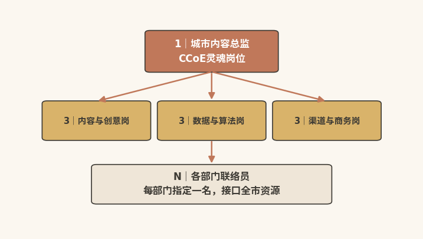
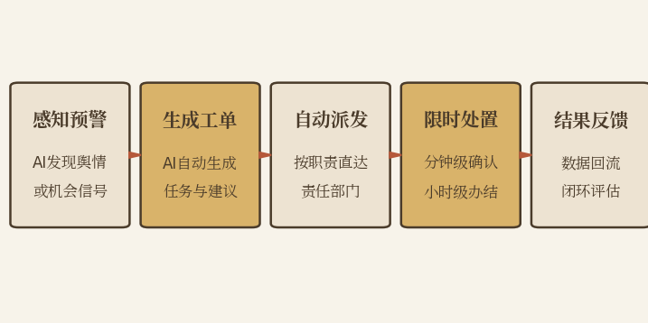

# 组织之基

## ------让破圈力从部门之事变全市之能

  ---------------------------------------------------------------------------------------------------------------------------------------
  本章速读：破圈力建设是一把手工程，但不是一把手包办。品牌委员会、CCoE"1+3+N"团队、全民共创网络三层架构，让破圈从部门之事变为全市之能。

  ---------------------------------------------------------------------------------------------------------------------------------------

**【本章导读】**

中篇四章逐一展开破圈力的感知力、生成力、连接力、进化力等四种子能力，四力构成一个完整的"能力闭环"。但闭环要真正转起来，还缺最关键的一环：组织。

先回到本书的核心判断：破圈力不是文旅局的能力，而是全市的能力。这一判断，在中篇的技术方法论层面一直是"隐含的"。感知力要打通文旅、交通、商务、公安等多部门的数据；生成力要动员市民、商家、达人等多主体的参与；连接力要统合官方、媒体、平台等多渠道的资源；进化力要建立跨部门的复盘与协同机制。四种能力，任何一力都天然跨越单一部门的管辖边界。

然而，中国多数城市把营销职能"压缩"在文旅局（或宣传部）的某个处室。这个处室通常只有三到五个人，负责全市的宣传推广：既无权调用交通局的数据，也没有机制联动商务局的资源，更动员不了街道办的力量。破圈力一旦被"组织边界"锁死在一个处室，再好的方法论也只是纸上谈兵。

因此，本章作为下篇的开篇，是全书从"方法论"走向"组织论"的转折点。它要回答的核心问题，是如何让破圈力从"某个部门的事"变成"全市的能力"。这不只是"如何设立协调机制"的操作问题，更是"如何改变组织DNA"的制度问题。

## 一把手工程：组织化前提是有人能拍板

**【案例】**2025年4月初，重庆荣昌的一次快速响应，提供了观察城市组织能力的典型样本。荣昌自媒体创作者林江身穿花棉袄，先后在成都、重庆、香港、深圳、长沙五座城市，给国际网红"甲亢哥"投喂家乡的荣昌卤鹅，相关视频迅速走红。而在镜头里，他只是一个"想让自己家乡的卤鹅被更多人知道"的普通人。

接下来发生的事，展现了一座城市的响应速度。2025年4月10日，林江回乡次日，荣昌区委主要领导即宣布：为林江报销五城投喂行程的全部费用，重奖10万元，授予其"荣昌卤鹅首席推介官"和"荣昌美食全球推介使"称号\[1\]。此后当地迅速跟进，出台卤鹅产业发展配套方案和惠民消费举措，文旅、商务、市场监管等多部门联动承接流量，把一次个人行为升维为城市营销事件\[2\]。

效果立竿见影。2025年"五一"假期，荣昌全区接待游客234.5万人次，同比增长168.2%；卤鹅销量突破29万只，同比增长752.53%；消费市场零售额突破20亿元，同比增幅达258%\[3\]。

荣昌的破圈力不属于文旅局，这是本案最直接的答案。如果这件事从头到尾只有文旅局在运作，结果很可能是：林江的短视频火了，工作人员还在走OA请示"是否可以使用官方账号转发"；等流程走完，传播窗口期早已关闭。真正决定响应速度的，是区委书记的"拍板"：跳过常规审批流程，在流量窗口期内一口气完成决策、授权、发布的全链路。

### 三城启示：拍板、调度与机制缺一不可

荣昌的启示是：必须有一个"能拍板的人"。

荣昌案例的关键词是"速度"。从"民间创意出现"到"城市官方响应"，窗口期只有24---48小时。在常规体制内，这一窗口期连一次"开会讨论"都不够。

在荣昌，这一角色由区委书记担任：区委事前充分授权、明确容错边界，由其担任破圈战役总指挥，在授权范围内直接调度全区资源------不需要层层请示，因为授权前置；不需要多头协调，因为机制已经理顺。

"一把手工程"并不意味着一把手要亲自参与每一次营销决策，那既无必要也不可行。其真正含义是：在最关键的决策节点上，必须有一个"能拍板的人"，确保组织不被流程拖死。

哈尔滨的启示是：需要一个"能调度的人"。

哈尔滨冰雪季的成功，靠的是市级统筹，文旅、交通、公安、市场监管等多部门联动响应；否则，"宠客"就会变成"坑客"。（哈尔滨案例的完整展开，详见第四章。）

成都的启示是：需要一个"可持续的机制"。

成都为大运会专设遗产规划管理办公室，赛后持续推进遗产利用，以制度化的协作安排确保机制不随赛事结束和领导更替而解散\[4\]。大运会本身不是城市营销事件，但其遗产转化机制是组织能力的体现。（成都案例的完整展开，详见第十章。）

三座城市的启示可以概括为一句话：破圈力的组织化需要"一把手工程+多部门协同+制度化保障"。一把手要"确保没有人可以说'这不关我的事'"，无须"亲自做每一件事"；多部门协同的关键不是"开协调会"，而是"有一个真正能调度资源的机制"；制度化保障要"形成不随人事更替而中断的工作惯性"，"写进文件"只是第一步。

### 挂帅松手：一把手定战略而非管执行

这里需要做一个关键澄清："一把手工程"不应被误读为"什么事都等一把手拍板"。

"一把手工程"解决三个问题：其一，破圈力建设的战略合法性，即这件事值得做，有人为此负责；其二，跨部门协调的权威性，即没有人可以说"这不关我的事"；其三，关键决策节点的效率，即窗口期只有24---48小时时，不必走OA（办公自动化）。

但它不解决、也不应解决日常运营中的每一个执行决策。如果每条抖音文案都要一把手审批，破圈力就谈不上"增强"，只会"瘫痪"。合理的分工是：一把手定战略、建机制、授权限、看结果；执行层在授权范围内自主决策。一把手要确保组织"能打仗"，但不指挥"每一枪打哪里"。

### 权责清单：三问测试划清决策边界

"挂帅"与"松手"必须操作化为清单。否则，"一把手工程"要么异化为"包办"，要么退化为"挂名"。

必须一把手拍板的，有五类事：战略级定位的调整；跨部门资源的重大调配；窗口期内的应急响应（必须留一条"跳过常规流程"的通道）；重大预算的审批；重大声誉危机的处置。

必须授权执行层自主决策的，也有五类事：日常内容的选题与发布；常规渠道的投放与优化；常规合作洽谈；常规数据监测与报告；一般性舆情的第一时间响应（有预案话术的即时处理）。

具体事项应当"拍板"还是"授权"，用三问测试判定：事项是否不可逆；是否超出授权边界（预算、权限、风险）；是否涉及跨部门利益冲突。任何一问为"是"，提交一把手；均为"否"，执行层自主决策、事后备案。这张清单还应写进品牌委员会章程并公开。公开的边界，才是能被执行的边界。

## 三层架构：决策、执行与参与的协同设计

如果说组织化的前提是"一把手工程"，组织化的落地就靠"三层架构"。本节给出一个可以在大多数中国城市直接部署的组织架构模板。

### 决策之层：品牌委员会只议战略级问题

组成：由城市主要负责同志（一把手）担任主任，文旅、宣传、大数据、商务、交通、公安、市场监管、财政等核心部门负责人担任委员。

职责：制定城市破圈力建设的战略方向和年度目标；审批年度预算和重大营销活动方案；协调跨部门资源配置；定期听取破圈力评估报告，并据此调整战略。

运作节奏：每季度一次正式会议，每次不超过90分钟。议程严格限定为三个议题：上季度破圈力评估报告解读（20分钟）、本季度核心挑战和下季度战略方向（40分钟）、需要一把手协调的跨部门堵点（30分钟）。会议绝不是"各部门轮流汇报工作"。品牌委员会只讨论"需要一把手决策的战略级问题"。

设计原则：品牌委员会的第一原则是"少开会、开有用的会"。部分城市的跨部门协调机制形同虚设，症结不在"制度不好"，而在"会太多、议程太散、没有真正的决策权"。因此，每一次会议都必须以"作出至少一个可执行的决策"收场。

### 执行之层：CCoE（内容卓越中心）充当体制内的战时指挥部

组成：由文旅局牵头，宣传、大数据、商务、交通等部门各指定一名联络员，依托现有机构设置专职岗位，组成一个5---8人的常设团队，并设一名"城市内容总监"，负责日常运营的统筹协调。

职责：将品牌委员会的战略决策转化为可执行的行动计划；管理AIGC内容工厂的日常运营和"人机共智"工作流；统筹跨平台内容矩阵的选题、生产和分发；协调跨部门的数据共享和资源调配；监测破圈力核心指标，向品牌委员会提交月度数据简报。

定位：CCoE（内容卓越中心）不是"新设一个部门"。新设部门意味着增加编制和预算，这对多数城市而言并不现实。它更务实的定位，是"在现有体制内建立的战时指挥部"：人还是原来的人，归属还是原来的部门；但在CCoE的工作时间内，他们受CCoE统一调度，对城市品牌委员会负责。

运作机制：CCoE实行"周报+月度复盘+季度战略建议"的节奏。周报向各成员部门同步本周关键数据和下周重点工作；月度复盘对当月所有营销活动的效果做根因分析；季度战略建议则为品牌委员会的下一次会议备好"建议议题"和"数据支撑"。

CCoE的人员构成与选拔标准

5---8人的CCoE团队，人员结构建议采用"1+3+N"（见图8-1）。

"1"是一名城市内容总监，CCoE的灵魂岗位。理想的候选人要"既懂体制内语言、又懂互联网语言"，"资历最老的科长"未必胜任。"3"是三个核心职能岗：内容与创意岗（AIGC工作流运营和选题策划）、数据与算法岗（数据中台运维和仪表盘更新，能把数据翻译成决策语言）、渠道与商务岗（平台关系和商业化合作）。"N"是各部门联络员：每部门指定一名，不驻场，但每周例会必到、跨部门工单必接。

{width="4.330555555555556in"
height="2.4694444444444446in"}

图8-1 CCoE"1+3+N"人员结构

选拔方式建议"部门推荐+实战测试+试用考核"三步走：实战测试给定真实选题，要求48小时内提交策划方案；试用期三个月，届满由品牌委员会确认；城市内容总监建议竞争性选拔。

例会节奏与部门接口机制：CCoE的例会体系分三层：每日晨会（15分钟，同步当日重点和舆情预警）、每周例会（60分钟，全员过周报、工单、选题）、每月复盘会（半天，做根因分析）。

接口机制的关键是"三张清单"：数据接口清单（数据范围、频率、对接责任人）、响应接口清单（各类工单对应到部门、到人、到时限）、资源接口清单（可调用资源及申请流程）。三张清单经品牌委员会审议后发文。"配合CCoE工作"，就从"情面"变成了"职责"。

考核指标设计：考核要避免两个极端："唯流量"和"唯过程"。建议采用"四维考核"（见表8-1
所示）。

**表8-1 内容卓越中心四维考核指标**

  -----------------------------------------------------------------------
       **考核维度**       **考核内容**
  ----------------------- -----------------------------------------------
      效果维度（40%）     AI认知份额、圈外触达率、游客量及旅游收入变化

      效率维度（20%）     从感知到行动的平均响应时间、工单按时办结率

      资产维度（20%）     UGC自然增长率、方法论沉淀、市民参与活跃度

      协同维度（20%）     成员部门满意度、跨部门工单一次办结率
  -----------------------------------------------------------------------

考核结果与成员绩效、部门考核加分、下年度预算挂钩，"干得好"和"得资源"由此形成正循环。

### 参与之层：全民共创网络扩大传播声量

组成：商家、景区、KOL、KOC、市民，即所有"可以为城市生产内容、传播内容、评价内容"的个体和组织。

职责：参与城市内容的共创和传播，把城市的"官方叙事"转化为"个人故事"。

激活机制：参与层是"被赋能的伙伴"，而非"被管理的对象"。城市要做三件事来激活这张网络：提供工具，如AIGC打卡模板、话题策划工具包；提供激励，如城市破圈积分体系、首席推介官授牌机制；提供平台，如UGC聚合展示页面、城市官方账号的转发互动。

三层架构的协同逻辑，可以概括为三句话：

决策层定方向："我们要在什么样的人群心中，成为什么样的城市"；执行层造弹药："用AIGC+UGC生产什么样的内容、通过什么渠道、触达什么样的人"；参与层扩声量："让每一个被内容打动的人，都成为内容的再传播者。"

三层之间不是"上级指挥下级"的军事逻辑，而是"园丁培育生态"的共生逻辑：决策层设定生长方向，执行层提供生长养料，参与层就是那个蓬勃生长的生态本身。

## 协同赋能：AI打通数据、决策与行动

三层架构设计得再精妙，如果各部门数据不通、系统不连、决策靠传话，组织化仍然是一纸空文。本节聚焦一个问题：AI如何提升组织的协同效率。

### 数据中台：数据是城市资产而非部门资产

中篇第四章（感知力）讨论过"数据孤岛"：文旅局、交通局、商务局的数据彼此隔离，并给出建立全域数据汇聚平台的技术性方案。但技术方案要落地，先需要一个"组织方案"，解决"谁愿意把自己的数据拿出来"的问题。

跨部门数据共享的最大障碍在"部门利益"，而非技术。交通局不愿共享，因为"数据是我的权力"；商务局不愿共享，因为"数据是我的政绩"；公安局不愿共享，因为"数据涉及安全和隐私"。每个部门都有合理的理由，守住自己的"数据边界"。

破解这一僵局，品牌委员会要扮演核心角色。数据共享无法靠"部门之间的商量"解决，它需要决策层一次明确定调：城市的所有公共服务数据，在脱敏和合规的前提下，都是"城市的资产"，而非"部门的资产"。换言之，数据共享并非"我把我的数据给你"：各部门的数据汇聚成一个城市级的决策支持系统，每个部门既是贡献者，也是受益者。

组织原则确定之后，AI提供技术支撑。具体做法是建立统一的"城市文旅数据中台"，制定统一的数据标准（字段定义、格式规范、API接口），让各部门的数据"即接即用"。

南京"城市之眼"感知系统融合平台的经验值得借鉴：该平台对全市20万路视频感知资源、近百万物联感知资源统一纳管，依托视觉大模型实现"零样本算法生成"，构建起从数据归集治理、算法训练部署到服务应用的全流程闭环（据公开资料）\[5\]。武汉城市运行管理平台也已集成1500余项城市体征指标，打通公安、交管、城管、应急等14个市直部门和16个区的专业指挥信息系统，支撑"一网统管"的跨部门协同调度\[6\]。

### 决策仪表盘：一页纸三色呈现核心指标

品牌委员会开会，最忌讳"凭感觉讨论"："我觉得我们最近做得不错""我感觉游客对XX景点的兴趣在下降"。缺少数据时，直觉尚有用武之地；但当一群部门负责人各凭经验判断时，要找到共识往往耗时且低效。

"破圈力仪表盘"是CCoE为品牌委员会提供的一页纸战略视图：不展示所有数据（那是月度数据报告的任务），只展示与战略决策直接相关的核心指标（见表8-2所示）。

表8-2 破圈力仪表盘核心考核指标

  -----------------------------------------------------------------------------------------
   **考核维度**  **考核内容**
  -------------- --------------------------------------------------------------------------
      感知力     城市AI认知份额（本月vs上月vs去年同期）、社交声量趋势、核心话题的情感分布

      生成力     AIGC内容产出量、UGC自然增长率、爆款内容产出率

      连接力     圈外触达率、"五真"信任评分走势、渠道转化效率

      进化力     策略迭代频率、成功经验复用率、从"感知"到"行动"的平均响应时间

       综合      破圈力综合得分（四力加权）、与3---5个对标城市的横向对比
  -----------------------------------------------------------------------------------------

指标：每组指标内部做"三层下钻"，总览值供一把手扫读，趋势与结构供委员定位问题，原始明细供CCoE根因分析。指标权重还可随淡旺季动态调整，调整规则由品牌委员会每年审定。

仪表盘的核心设计原则是"一页纸、三颜色"：每个指标用绿色（健康）、黄色（关注）、红色（预警）标注状态。品牌委员会的会议从"看仪表盘"开始：所有人对着同样的事实讨论，而不是对着各自的"感觉"争论。

### 智能工单：让感知自动触发协同行动

感知力的输出，不应只是一份"舆情报告"。报告只是在"通知"人，不是在"触发"行动。AI感知力的最高层次，是自动触发跨部门的协同行动。

以一处情境为例。当AI感知系统检测到"某景区排队时间异常增加"，它应自动生成一张跨部门智能工单（见图8-2）：推送给景区管理部门（建议增开通道或启动分流）、交通部门（建议在景区周边增派公交运力）、文旅局（建议通过官方渠道发布实时排队信息）、属地街道办（建议增加现场志愿者和临时服务设施）。

{width="4.330555555555556in"
height="1.0215277777777778in"}

图8-2 智能工单流转流程

"智能工单"的关键，不在"谁收到了通知"，而在"谁需要做动作"。因此，工单要写成"请在30分钟内完成以下三项动作，完成后在系统内确认"，而不是一句"请关注XX问题"。从"感知到异常"到"触发行动"再到"行动完成确认"，形成可追踪、可评估、可复盘的闭环。

### 沙盘推演：一个中等城市的智能工单处置

周五上午9:12，该市AI感知系统从三个数据源捕捉到同一组异常信号：短视频平台上该市郊野公园的提及量48小时内上涨340%；地图导航搜索量同比增长两倍；停车场饱和度达85%且仍在上升。系统判断将出现超承载力的客流高峰，自动生成一张红色级跨部门预警工单。

9:15，工单按预设路由同时推送给四个责任方：园林绿化部门，"启动分时段预约、增派保洁和安保"；交通部门，"开通周末临时接驳专线"；文旅局（CCoE值班岗），"两小时内发布客流提示和周边替代景点推荐"；属地街道，"组织周末志愿服务岗"。每项指令都附有时限和确认入口。

接下来的执行有条不紊：9:40，园林绿化部门确认"预约通道已开启"；10:30，文旅局官方账号发布"赏秋攻略+三个周边宝藏景点"推送，一次动作同时完成"分流预警"和"内容营销"；18:00前，接驳专线和志愿服务岗全部到位。

周六，公园实际客流达平日三倍，但因预约分流和接驳疏导，未发生拥堵和安全事件；被引导至周边的游客，还为小众景点带来第一波自然流量。周一，工单全程数据自动归档为"复盘卡"，存入"成功经验库"。下一次同类信号出现时，系统可直接调用这套被验证的处置模板，响应速度将从"小时级"向"分钟级"进化。

## 市民参与：让破圈力扎根城市土壤

前三节讨论的都是"体制内的组织化"：决策层、执行层、跨部门协同。但破圈力最深厚的根基，不在体制内，而在城市的大街小巷，在每一个市民的日常中。

回看荣昌，破圈的起点本身就是一次市民行为：林江凭"想让家乡的卤鹅被更多人知道"的朴素自豪感，完成了那次五城投喂。官方的接棒能成功，同样离不开市民的跟进：本地商家自发推出"卤鹅套餐"，市民在社交平台上接力传播，摊主们在客流暴涨时守住了品质和价格。没有这一层市民土壤，区委书记的"拍板"只会停留在一次官方动作，成不了全民参与的城市叙事。

荣昌的启示在于：当市民从"旁观者"变成"参与者"，城市就拥有了最坚固的破圈力根基。官方策划的营销战役可能失败，外包团队制作的内容可能翻车，KOL的合作可能因丑闻而反噬；但十万、百万市民发自内心的城市自豪感和待客之道，通常不会因个别外部事件而瓦解。

### 三层动力：荣誉感、获得感与参与感驱动

市民参与的动力，不来自行政命令，也不来自道德绑架，而来自"三层动力"的自然驱动。

第一层：荣誉感，"我是这座城市的主人。"当市民看到自己的城市被全网关注、被真心夸奖，那种"我的城市被看到了"的荣誉感，是参与最深层的驱动力。城市无法"制造荣誉感"，能做的是"证明荣誉感的合理性"：让市民真切感受到，他们付出的善意、热情和努力，确实在让城市变得更好。

第二层：获得感，"我能从参与中获得实际收益。"这不一定是金钱：荣誉也是收益（"首席推介官"称号），便利也是收益（积分兑换公共服务），优先也是收益（积分高的市民可以优先参加城市大型活动）。关键在于，让参与产生可见的正向回报，否则仅凭热情往往难以持续。

第三层：参与感，"我的声音被听见了，我的贡献被认可了。"这是三层动力中最细腻、也最重要的一层。一个市民拍了一条"我家楼下那条街"的视频，被城市官方账号转发并标注了拍摄者，他感受到的不是"我火了"，而是"我的城市看到了我"。一个市民在市长信箱建议"景区应该增加母婴室"，三个月后他带着孩子去景区，发现母婴室真的建好了。"建议被采纳"是事实，"这座城市在乎我"才是真切的感受。

### 参与机制：积分激励与分层工具设计

三层动力模型提供了理论框架，AI则提供可落地的机制设计，具体包括四个方面。

"城市破圈积分"体系中，市民可通过以下行为积累积分：创作并发布城市相关内容（根据互动数据阶梯计分）、参与城市志愿服务（由活动组织方确认计分）、提出被采纳的改进建议（由相关部门确认计分）、邀请外地朋友来城市旅游（由朋友的实际到访数据确认计分，数据经本人授权并脱敏处理）等。积分可兑换城市公共服务资源（如博物馆VIP通道、景区免费入园）、城市官方活动的优先参与权（如大型节庆的VIP席位），以及合作商家的消费折扣。AI负责内容的自动审核、积分的自动计算、兑换的自动处理，不需要人来"审批每一个积分申请"。

"被看见"的情感激励：AI情感分析算法自动从海量UGC中筛出最具创意、最富真情实感的内容，再由城市官方账号、媒体矩阵转发互动。这等于城市在推广市民的作品，而非推广自己的宣传片。这种"被看见"的情感激励，往往比物质奖励更能维持长期的参与热情。

分层工具设计：参与意愿不同，需要的工具"门槛"不同。对轻度参与者，提供"一键式"工具：AIGC城市明信片生成器、打卡照片美化模板、话题标签自动推荐，把生产成本压到3分钟以内；对中度参与者（本地博主、摄影爱好者），提供"增强型"工具：官方授权的城市素材库、AI脚本助手、优质内容的流量扶持；对深度参与者（本地KOC、市民领袖），提供"共建型"工具：月度选题共创会席位、部分脱敏数据开放、"市民观察员"身份。其内在逻辑是：参与门槛逐级放宽，回报逐级升高。

激励的可持续性机制：任何激励体系都会面临"激励衰减"，可持续的激励需要三个设计。第一，激励内容动态轮换：积分权益每季度更新，从"物质类"（折扣、门票）逐步向"身份类"（推介官授牌、活动主宾席位）和"共建类"（项目冠名建议权）迁移；第二，引入"社群化"激励：把参与者组织成"城市创作社群"，定期举办线下活动。当参与嵌入真实的人际关系，让人坚持的就不再是"积分"，而是"归属感"；第三，年度仪式感设计：每年举办一次"城市破圈共创者大会"，由城市主要领导现场表彰年度共创之星。

### 制度固化：把热情驱动转为结构驱动

市民参与最大的风险是"一阵风"，甚于"没人参与"。要避免它，就要把参与机制从"运动式"固化为"制度式"。

具体路径有四条。进法规与规划：将市民参与机制写入城市文旅发展规划和年度政府工作报告，让参与机制有"法理身份"，不因人事更替而悬空；进预算：设立年度专项预算科目，预算金额与上年度参与活跃度挂钩；进考核：将"市民参与活跃度"纳入相关部门年度绩效考核和仪表盘的"资产维度"；进迭代：每年委托第三方评估一次，评估结果直接转化为下一年度的优化清单。

制度的本质，就是把"靠热情驱动"转化为"靠结构驱动"。

### 国际镜鉴：巴塞罗那"首席数据官"以顶层授权统合城市数据

2017年前后，巴塞罗那通过市政"政府措施"正式设立"首席数据官"（CDO）职位，成为西班牙第一个任命CDO的城市；在此之前，芝加哥、纽约、波士顿等北美城市已先行建立这一制度。巴塞罗那的CDO不是IT部门的技术主管，而是领导新设的"市政数据办公室"（Municipal
Data
Office）的战略角色。其核心职责是：统合市政各部门的数据资源，建立统一的数据治理标准和城市数据平台，确保"数据是城市的资产而非部门的资产"。巴塞罗那的CDO制度为破圈力的组织化提供了三个关键启示。第一，数据共享需要"顶层授权"：CDO制度由市议会层面的政府措施确立，而非部门之间的协商。第二，需要一个"专职的人"来推动跨部门协同，协调不是"兼职"能做好的。第三，数据和营销不是两个独立的领域：城市营销的智能化，前提是城市数据的统一化\[7\]。

## 本章小结：组织化让破圈力从部门之事变成全市之能

本章是下篇的开篇，也是"破圈力从方法论到组织论"的转折点。

第一节以荣昌、哈尔滨、成都三座城市为镜鉴，论证了"一把手工程"是破圈力的组织前提：一把手的职责是"确保没有人可以说'这不关我的事'"，无须"亲自做每一件事"。核心在于三个"确保"：战略合法性、跨部门协调的权威性、关键决策节点的效率。

第二节提出了破圈力的三层组织架构：决策层（城市品牌委员会，定方向）、执行层（城市内容卓越中心CCoE，造弹药）、参与层（全民共创网络，扩声量）。三层如"园丁培育生态"，而非"上级指挥下级"。

第三节聚焦AI赋能组织协同：跨部门数据共享平台（打破"部门的资产"思维）、破圈力仪表盘（一页纸、三颜色、数据驱动决策）、智能工单流转（从"感知"到"行动"的自动化闭环）。

第四节将组织化的视角延伸到体制之外，论证了市民参与是破圈力最深厚的根基，提出三层动力模型（荣誉感、获得感、参与感），并给出AI驱动的"城市破圈积分"体系和"被看见"情感激励机制的实操设计。

综上，破圈力的终极组织形态，不是"一个高效运转的营销部门"，而是"一座市民与城市共创价值的生活共同体"。

  --------------------------------------------------------------------------------------------------------------------------------------------------------------------------------------------------------------------------------------------------------
  破圈力不是文旅局的能力，而是全市的能力。任何一个部门的短板，都会成为整座城市破圈力"最短的那块木板"。一把手工程的核心不是"亲自做每一件事"，而是"确保没有任何部门能以'这不关我的事'推诿"。当市民从"旁观者"变成"参与者"，城市就拥有了最坚固的破圈力根基。

  --------------------------------------------------------------------------------------------------------------------------------------------------------------------------------------------------------------------------------------------------------

### 参考文献

\[1\] 中国城市报. 重庆市荣昌区：一只"鹅"带火一座城\[N/OL\].
(2025-05-12)\[2026-08-07\].
https://paper.people.com.cn/zgcsb/pc/content/202505/12/content_30072617.html.

\[2\] 中国经济网. 一只卤鹅的"逆袭"：县域经济破圈的中国样本\[N/OL\].
(2025-05-12)\[2026-08-07\].
http://www.ce.cn/xwzx/shgj/gdxw/202505/12/t20250512_39358008.shtml.

\[3\] 新华每日电讯.
一道卤味带火一座城------重庆荣昌如何成为全国游客"新宠"\[N/OL\].
(2025-05-08)\[2026-08-07\].
https://www.xinhuanet.com/mrdx/20250508/ad2417ad27ef4ff99ddd81d1214fa027/c.html.

\[4\] 人民网四川频道. 大运遗产融入市民生活\[N/OL\].
(2023-08-24)\[2026-08-07\].
http://sc.people.com.cn/n2/2023/0824/c345167-40542938.html.

\[5\] 住房和城乡建设部信息中心. "感知+AI"双轮驱动
南京"城市之眼"构建城市治理新范式\[Z/OL\]. (2026-07-15)\[2026-08-07\].
https://www.mohurdic.org.cn/xinwen/dfxx/art/2026/art_6e68d587a95c4e89b46db53bb3ea8021.html.

\[6\] 新华网.
打造"数字武汉"城市治理样板，武汉携手华为探索治理现代化新路径\[N/OL\].
(2025-09-18)\[2026-08-07\].
https://www.news.cn/info/20250918/fc226f3192784d70baba6f941e8f1a5b/c.html.

\[7\] Barcelona City Council. Barcelona City Council digital plan:
government measure concerning ethical management and accountable data
(Barcelona Data Commons)\[R/OL\]. (2017)\[2026-08-07\].
https://concetticontrastivi.org/wp-content/uploads/2024/04/barcelona_data_management_0.1.en\_.pdf.
