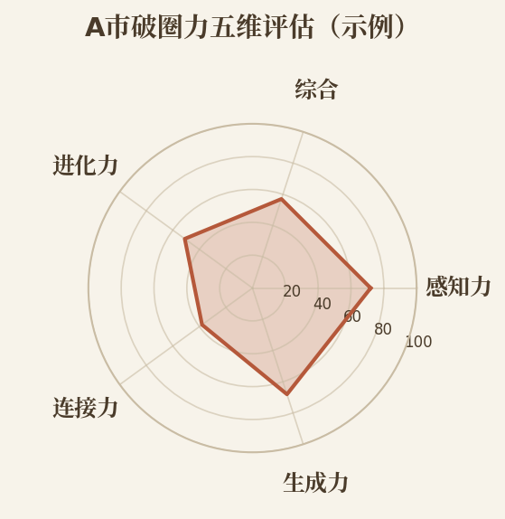
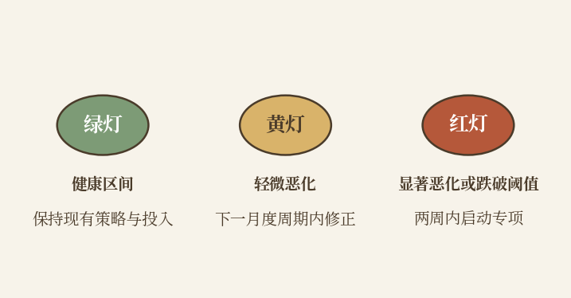
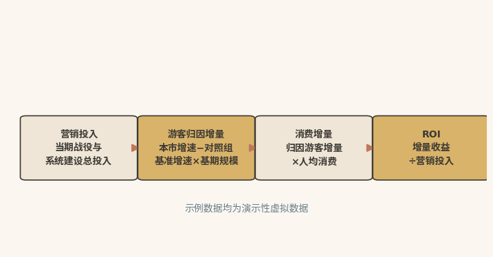

# 评估之尺

## 让破圈力成为可量化的投资

|  |
|:---|
| 本章速读：五维雷达一眼看出短板，红黄绿灯标注指标状态，ROI审计回答财政之问：破圈力是可量化、可审计的投资，而非一笔说不清的营销费用。 |

【本章导读】

第八章讨论了组织化：破圈力不再是"某个部门的事"，而是"全市的能力"。但组织化之后，一个更现实的问题随之而来：建设感知系统、搭建内容工厂、部署智能分发、设立品牌委员会，每一项都是数百万元甚至数千万元的投入，这笔钱花得值不值，必须给出可量化的证明。

向人大常委会报告预算时会被问到，向财政局申请专项经费时会被问到，向公众说明支出理由时同样会被问到。"我感觉效果不错"，从来不是合格的答案。

这就是评估的意义。评估要回答"我们哪里好、哪里不好、下一步该投哪里"，而非"证明我们做得很好"。评估不是营销活动的"终点"，而是下一轮决策的"起点"。

本章将系统展开破圈力的评估体系。先论证"评估驱动建设"而非"做完再评估"；再提出与四力模型对应的五维AI评估体系，每个维度都有可量化的核心指标和AI自动采集方法；随后给出"城市破圈力体检报告"的标准格式与ROI审计的实操框架；最后以"反面镜鉴"收尾，给出出圈失败的三种典型路径和AI预警指标体系，为全书的乐观叙事提供审慎平衡。

## 评估先行：评估驱动建设而非事后补算

**【沙盘推演】**2024年底，某地级市召开了一次内部的"城市营销预算听证会"。文旅局长汇报过去一年的营销投入和效果。汇报中出现了这样的对话：

财政局长："你们说'全网曝光量达到5亿'，我很想知道这5亿曝光量里，有多少转化成了实际游客？"

文旅局长沉默了三秒。"我们目前只有曝光量数据，转化数据还没有建立起来。"

人大财经委主任："那你们是怎么判断这些钱花得值不值的？"

文旅局长："从社交媒体的互动数据和行业获奖情况来看，效果应该是不错的。"

财政局长与人大主任未置评论。会后，下一年度的城市营销预算被削减了15%。

这个故事并非个案。营销预算的问责压力，是全球性现象。Gartner于2025年5月发布的年度CMO支出调查（覆盖北美、英国和欧洲402名CMO及营销领导者）显示：2025年企业营销预算占公司收入的比例仅为7.7%，与2024年持平；59%的受访CMO表示预算不足以执行既定战略\[1\]。

预算越紧，算账越严。这背后是一个根本性的困境：城市营销在"花钱"时用的是市场逻辑，与商业营销并无二致；在"算账"时，用的却是"品牌影响力""美誉度提升""长远价值"等难以量化的概念。这种"花钱市场化、算账模糊化"的双重标准，让城市营销在政府预算体系中始终处于弱势。财政一趋紧，它往往最先被压缩。

### 四大功能：知己、导航、对话与免疫

第一，知己：知道"我们现在在哪"。城市的破圈力处于什么水平、四种子能力孰强孰弱、在同类城市中排第几，靠"感觉"无法回答，需要一套可量化的评估体系给出客观答案。

第二，导航：知道"下一步往哪走"。评估的输出是一张"导航图"，光有"成绩单"不够。感知力强但生成力偏弱，下一步就建AIGC内容工厂；生成力强但连接力相对薄弱，资源就投向精准分发和信任体系建设。评估把"凭感觉判断何处需要加强"，变成"由数据指明何处需要加强"。

第三，对话：能"与财政部门说得清"。财政局长问"这500万花得值不值"时，"品牌影响力提升了"不是合格的回答，那只是宣传口径。合格的回答应当是："500万投入，产出3200万元社交传播等效价值，带动12.7%的游客增量，其中内容资产驱动占67%；根据归因模型测算，ROI为1:6.4，内容效率在同类城市中的排名从第9位提升到第4位。"

评估把城市营销从"花钱的艺术"变成了"可量化的投资"。

第四，免疫：知道"哪里在出问题"。评估不仅是"年度体检"，更应该是"实时监控"。AI认知份额连续两个月下降、UGC正向情感率跌破阈值、本地居民满意度持续走低，这些信号意味着破圈力看似在增强，实则在透支。预警功能让城市能在问题初现之时及时介入，不必等到难以挽回才察觉。

## 五维评估：为四力各配一把可量化的尺

破圈力的评估，天然映射到四力模型：感知力、生成力、连接力、进化力各对应一个评估维度，再加一个"综合破圈力"加权维度，即构成五维评估体系（见表9-1所示）。需要说明的是，本章及全书出现的量化阈值（如各指标的健康区间、预警线等），均为基于作者咨询实践与行业观察的经验启发值，实操中应结合城市实际校准。

**表9-1 五维评估核心指标速览**

| **维度** | **核心指标** | **AI自动采集方式** |
|:---|:---|:---|
| 感知 | AI认知份额；社交声量趋势；话题健康度；趋势预判准确率 | 舆情监测SaaS自动抓取讨论量与情感分布；每月固定时间用四款主流AI工具测试20个核心问题，记录推荐位次变化 |
| 生成 | AIGC内容产出量；UGC自然增长率；爆款内容产出率；人均内容消费时长 | 内容管理系统后台数据自动聚合；社交媒体平台数据中心API接入 |
| 连接 | 圈外触达率；AI信任评分（含权威信源覆盖率、多平台信息自洽度、负面回应率与时效）；渠道转化效率；目标人群覆盖率 | 社交平台数据分析工具；AI搜索定期测试+信源矩阵扫描与人工抽检；OTA/票务/闸机数据比对 |
| 进化 | 感知到行动平均响应时间；策略迭代频率；成功经验复用率；知识库增长率 | 策略管理系统后台数据；工单系统流转时间记录；知识库系统更新日志 |
| 综合 | 破圈力综合得分（四维加权）；横向对标排名；游客量与旅游收入变化；预警信号组（剪刀差、满意度背离、爆款集中度） | 仪表盘自动计算与自动监测；第三方数据+同类城市互测；文旅统计+大盘数据修正 |

### 感知维度：衡量城市听到并听懂了多少

本维度要回答的核心问题是：你的城市"听到"了多少，"听懂"了多少。

核心指标：

AI认知份额：在主流AI工具（DeepSeek、文心一言、通义千问、豆包）中，你的城市在核心问题（如"XX省最佳旅游城市""秋季旅行推荐"）中被推荐的次数，除以该品类所有城市被推荐的总次数。这是感知力的"最终产出指标"：唯有"听到"圈外的声音，城市才可能被AI推荐。

社交声量趋势：主流社交平台上关于你城市的总讨论量及月度变化趋势。"绝对值"仅作参考，要看"加速度"：讨论量是在加速增长，还是在减速增长。

话题健康度：正面、中性、负面讨论的比例分布。核心并非"正面比例越高越好"，过高的正面比例反而可能意味着"虚假评价"。真实的健康话题分布通常是"正面60---70%、中性20---30%、负面5---10%"（经验启发值）。负面比例一旦突破15%，即触发预警。

趋势预判准确率：AI在过去三个月预判的"即将爆发的话题"中，实际爆发的比例。这是评估感知力"预测能力"的核心指标。

AI自动采集方式：社交媒体舆情监测SaaS工具（自动抓取讨论量、情感分布）；AI搜索定期测试（每月固定时间用四款主流AI工具测试20个核心问题，记录城市的推荐位次变化）。

### 生成维度：衡量内容产能与爆款概率

本维度要回答的核心问题是：你的城市"产出"了多少内容，产出的内容是否"有效"。

**核心指标：**

**AIGC内容产出量：**月均AIGC生产的内容条数（按图文、短视频、长视频分别统计）。评价标准不看"越多越好"，要看保持质量的前提下产能是否持续增长。

**UGC自然增长率：**游客和市民自发生产的城市相关内容的月均增长率。UGC无需额外激励便能自然增长，说明生成力的"飞轮效应"已经启动。

**爆款内容产出率：**互动量超过平台均值5倍的"爆款内容"占全部产出的比例。"有没有爆款"含有偶然因素，真正要关注的是"爆款出现的概率"，这才反映能力水平。

**人均内容消费时长：**用户在你城市内容上的平均停留时长。这是评估"内容质量"而非"内容数量"的核心指标。

**AI自动采集方式：**内容管理系统的后台数据自动聚合；社交媒体平台的数据中心API接入。

### 连接维度：衡量触达了谁以及是否被信任

本维度要回答的核心问题是：你的内容"触达"了谁，触达的人是否"相信"。

核心指标：

圈外触达率：全部触达用户中，非本城市已有粉丝的用户所占比例。这是评估连接力"破圈效果"的核心指标。

AI信任评分：基于"五真"信任体系（数据真实、源头真切、逻辑真确、体验真诚、承诺真正）的综合信任评分，包括权威信源覆盖率、多平台信息自洽度（官网、OTA、地图上的核心数据一致性）、负面评价回应率与回应时效。这些数据均可由AI自动采集和计算。

渠道转化效率：每个内容分发渠道"从曝光到行动"的转化率。"哪个渠道流量大"不要紧，要紧的是"哪个渠道带来的游客实际到访率高"。

目标人群覆盖率：四类目标受众群体（文化探索者、美食打卡族、亲子家庭客、打卡出片族）中，城市的主动触达覆盖率。

AI自动采集方式：社交平台数据分析工具（圈外触达率）；AI搜索定期测试+信源矩阵自动扫描（AI信任评分）；OTA和地图平台的数据比对（多平台信息自洽度）。

### 进化维度：衡量学习速度与知识积累

本维度要回答的核心问题是：你的城市是否"学习"了，学习的速度快慢如何。

核心指标：

从"感知"到"行动"的平均响应时间：从一个舆情信号被系统捕获，到相关部门作出可追溯的响应行动，平均间隔多长时间。这是评估进化力"速度"的核心指标。

策略迭代频率：月均A/B测试次数，以及基于测试结果的策略调整次数。关键不在调整了多少次，而在有多少次调整是基于A/B测试数据的。

成功经验复用率：过去三个月的营销活动中，有多少比例的决策基于"历史策略模板"的适配，而非"从零开始策划"。复用率并非越高越好，过高可能意味着"吃老本"。健康的复用率通常为40%---60%（经验启发值）。

知识库增长率：月均新增"结构化策略模板"的数量。知识库持续扩容，说明城市在坚持"从实践中学习"。

AI自动采集方式：策略管理系统的后台数据；工单系统的流转时间记录；知识库系统的更新日志。

### 综合得分：加权四力并对标同类城市

本维度要回答的核心问题是：综合来看，你的城市破圈力处于什么水平。

计算方式：将四个维度的指标按城市当前的战略优先级加权平均，得出0---100分的综合破圈力得分。权重视发展阶段而定：处于跃迁期的城市，感知力和生成力权重更高；处于能力巩固期的城市，进化力权重更高。

辅助指标：

横向对标排名：在同类城市（同等人口规模、同等旅游资源禀赋、同等经济发展水平）中的综合破圈力排名

纵向增长趋势：综合破圈力得分的同比增长率（是"在加速改善"还是"在减速恶化"）

## 体检报告：一页纸呈现评估诊断结论

指标采集完成后，还要转化为一份决策者能快速读懂的"体检报告"。本节提供标准化的报告格式，共五个组成部分。

### 五维雷达：一眼看出哪根支柱短了

把五个维度的得分画在一张雷达图上（见图9-1所示），短板直观可见：一眼就能看出"哪根支柱短了"。若感知力和生成力都在70分以上，连接力却只有35分，这座城市的破圈力就是一张"瘸腿的桌子"：内容质量再高，也送不到目标人群。

图9-1 破圈力五维评估雷达图（A市示例）

### 三色诊断：用红黄绿灯标注指标状态

对每一个核心指标，用"红黄绿灯"标注状态（见图9-2所示）：

图9-2 红黄绿灯诊断示意图

绿灯：指标处于健康区间，继续保持现有策略和投入

黄灯：指标出现轻微恶化或低于对标城市均值，需要在下一个月度周期内关注和修正

红灯：指标出现显著恶化或跌破预设阈值，需要在两周内启动专项优化行动

### A市演示：从诊断到资源匹配的完整闭环

为了让"红黄绿灯"从抽象规则变成可操作流程，下面用虚拟城市"A市"的数据，演示"诊断→优先级→资源匹配"的完整闭环。

**【沙盘推演】**A市季度评估核心数据：AI认知份额18%（上季度22%，同类均值15%；虽高于均值，但环比下滑4个百分点，属显著恶化）------红灯；UGC自然增长率+6%（阈值+5%）------绿灯；圈外触达率41%（对标均值52%）------黄灯；"感知"到"行动"的平均响应时间11天（健康区间≤7天，8---14天为黄灯区间）------黄灯；话题健康度正面68%/中性24%/负面8%------绿灯。

**第一步，诊断。**雷达图显示：感知力和生成力两根支柱较高（72分、68分），连接力明显塌陷（38分），进化力中等偏下（51分），四维等权平均约57分，属于典型的"内容做得出、送不到人"的瘸腿结构。叠加红灯项看，AI认知份额连续下滑，意味着连接力的塌陷已开始反噬感知力。

**第二步，优先级。**AI认知份额下滑属"红灯+高影响"，两周内启动专项，排查权威信源覆盖缺口与多平台信息不一致点；圈外触达率偏低属"黄灯+高影响"，下一月度周期内制定智能分发提升计划；响应时间偏长属"黄灯+中影响"，优化工单流转节点即可。

**第三步，资源匹配。**建议A市下季度增量预算的45%投向连接力建设，25%投向进化力建设，20%用于感知力维护与红灯专项，10%用于生成力惯性维持。三个月后复评，核心检验项只有两个：AI认知份额是否止跌回升，圈外触达率是否收窄。

这个演示说明：红黄绿灯的作用在于"把数据转化为行动次序"：先处置红灯，再弥补黄灯，绿灯项保持稳定，而非贴标签。

### 优先排序：先救红灯再补黄灯

基于雷达图和红黄绿灯诊断，给出未来三个月破圈力建设的优先级排序：

紧急且重要（红灯+高影响）：必须在两周内处理，否则将对城市品牌或当期效果造成直接损害，如AI认知份额连续下滑、负面情绪比例突破阈值

重要但不紧急（黄灯+高影响）：需在下一个月度周期内制定专项提升计划，如连接力的圈外触达率长期偏低

紧急但不重要（红灯+低影响）：需要快速处理但不占用核心资源，如某个渠道的转化效率短期波动

日常维护（绿灯）：保持现状，定期监控

### 资源匹配：让预算跟着优先级走

资源匹配的原则只有一条：让预算跟着优先级走，增量预算优先投向红灯与黄灯对应的能力短板，绿灯项维持惯性投入。具体的配比演示，已在"A市演示"中完整呈现，不再重复。

## ROI审计：算清投入产出的明白账

"五维评估"回答了"破圈力强不强"，但还没回答另一个更尖锐的问题："花的钱值不值"。这正是ROI审计要解决的，也是面对财政部门与人大常委会时的关键依据。

### 投入核算：区分一次性建设与持续运营

平台建设投入：AI感知系统、AIGC内容工厂、智能分发系统的建设费用（开发费用等）。这些属于"固定资产投入"，一次建设，多年使用，按年度摊销。

团队运营投入：CCoE专职团队的人力成本、品牌委员会会议和协调成本、外包服务费用（如果部分能力选择外包而非自建）。

内容生产投入：AIGC内容生产的SaaS年费、工具订阅费和电力成本（边际成本极低）、UGC激励计划的运营成本（积分兑换、活动组织费用）。

渠道投放投入：付费媒体的广告投放费用、KOL/KOC合作费用。

这里有一条关键原则：区分"一次性建设投入"和"持续性运营投入"。前者在ROI计算中按年度摊销，后者按当期费用计入。混淆二者，ROI就会被高估或低估。

### 产出核算：经济、品牌与资产分层计算

直接经济产出：游客增量（增量人数 ×
人均消费）、文旅消费增量、招商成果增量，这些是最直接的"钱"的回报。

间接品牌产出：社交传播等效价值（全网曝光量 ×
平台CPM均价，即把"传播效果"量化为"购买同等曝光量需要花多少钱"）；品牌搜索指数增量（百度指数\[2\]、微信指数的同比增长）。

长期资产产出：内容资产价值（城市内容资产库的总规模及其预估的"长尾传播价值"）；数据资产价值（城市文旅数据中台汇集的数据量及其对AI训练和策略优化的支持价值）；信任资产价值（AI信任评分的提升及其对"降低未来营销成本"的长期杠杆效应：信任度越高的城市，获取同等转化所需的投入越少）。

同样有一条关键原则：三个层面应分层呈现，不能混为一谈。只算"短期的钱"，会低估破圈力建设的价值；只算"长期的价值"，又说服不了关注年度预算的财政部门。三个层面都要算，但必须标明各自的"可信度区间"：直接经济产出可信度最高，长期资产产出因属估算而相对较低。

### 增量归因：剔除大盘只算营销超额贡献

ROI计算最难在"增量来自哪里"，"怎么算"反倒是技术问题。设想一种情况：若游客增长是"全国旅游市场整体回暖"带来的，而非营销努力的成果，ROI中的"增量游客"就应扣除"大盘增长"部分，只算营销带来的超额增长。

具体有三个归因方法：

横向对比法：将你的城市与一组"对标城市"（在旅游资源禀赋、经济发展水平上相似，但在营销投入上差异较大）做横向比较。你的城市比对标城市"多增长"的部分，可以归因为营销投入的贡献。

横向对比法中的"对照城市"选择，同样有严格的实操要求。对照组应满足四个条件：旅游资源禀赋相近、客源结构相近、经济水平相近、评估周期内营销投入强度显著低于本市；以3---5个为宜，取中位数可平滑偶发事件的噪声。计算时，先以对照组游客量平均增速作为"市场基准增速"；本市实际增速减去基准增速，得到增速差；增速差乘以本市基期游客规模，即为可归因的游客增量。条件允许时可做逐季度滚动检验：增速差须在多个季度稳定存在，归因结论才经得起追问。

纵向基线法：选取"营销投入正常化之前"的时间段作为基线期，测算游客自然增长率；营销投入后的增长率减去基线增长率，即为营销的超额贡献。实操的关键是构造"反事实基线"，回答一个假设性问题：若这一年没有追加营销投入，游客量会是多少。具体做法是：先选取基线期（不少于连续24个月，覆盖完整季节周期）的游客数据，剔除异常月份，外推"无营销干预情景"下的逐月基线值，再叠加全国旅游市场大盘的同比增速修正。以文化和旅游部《2024年文化和旅游发展统计公报》为例：2024年国内居民出游56.2亿人次，同比增长14.8%，出游总花费5.8万亿元、同比增长17.1%\[3\]。在这样的大盘高增长年份，基线修正尤其不可省略。实际游客量减去反事实基线，差值才是可归因的"超额增量"。还需警惕两个常见错误：基线期太短，会把季节波动误当增长趋势；忽略大盘修正，会把市场整体回暖误记为营销功劳。

AI归因模型：利用AI的因果推断算法，在控制天气、节假日、全国旅游市场趋势等外部变量后，测算营销投入的"净贡献率"。该方法精度高，成本也高，更适合预算充足的大城市。

### 完整算例：800万投入算出1:9.0回报

图9-3 ROI审计计算框架

以下示例中的城市与全部数据均为演示性虚拟数据，仅用于展示ROI报告的标准化计算与呈现方式（见图9-3所示）。

**【沙盘推演】**某地级市2025年度城市营销总投入800万元（平台建设摊销200万+团队运营300万+内容生产100万+渠道投放200万，合计800万）。

直接经济产出：评估周期内该市游客总量从808万人次增至826万人次，总增量18万人；按全国旅游市场大盘同比增速测算的"无追加营销投入情景"自然增量约为12万人（纵向基线法+大盘修正），两者之差即营销驱动的超额增量约6万人。6万人
× 人均消费1200元 = 归因贡献的旅游收入增量约7200万元。

直接ROI：7200万 ÷ 800万 = 1:9.0

间接品牌产出：全年全域曝光量约8亿次 × 单次曝光等效均价0.015元（约合CPM
15元，为示例性假设值，实操中应取各投放平台的实际CPM均值）=
等效广告价值1200万元。

综合ROI（含品牌溢出）：（7200万+1200万）÷ 800万 = 1:10.5

关键注脚：以上计算不含长期资产产出，若纳入，ROI将进一步提高。但鉴于长期资产的价值估算存在较大不确定性，建议向财政部门报告时以直接ROI为主、综合ROI为辅，长期资产价值作为补充参考。

## 反面镜鉴：诊断三种出圈失败的根因

本书在多数章节中以成功案例为主要论证材料。但一本负责任的书，不能只展示"阳光面"。本节以"失败的出圈"为镜鉴，为全书的乐观叙事提供审慎平衡。以下三个案例均为基于公开报道中的典型现象综合改写的【沙盘推演】情景案例，隐去城市实名，用以呈现机制而非评价具体城市。

### 失败三型：承接不力、过度透支与路径依赖

路径一：承接不力型，流量来了，接不住。

【沙盘推演】2024年，一座以"古韵水乡"闻名的古城，因一部热播综艺取景突然走红。清明假期三天，涌入的游客超过平日一个月的总量，而停车场容量只有需求的四分之一，进入古城的主干道只有一条，堵成了停车场。游客在社交媒体上抱怨："排了三小时队，进去十分钟就想出来。"一周之内，该城市的OTA评分从4.7骤降至3.9，AI搜索的推荐权重也随之断崖式下降。三个月后，游客量不仅回到走红前的水平，甚至更低，"差评"已被AI永久性地纳入了城市的知识图谱。

根因诊断：这座城市的事件级感知力尚可（能"听到"流量来了），其余三种能力却全面缺失。没有引导分流的疏导内容（生成力），没有匹配人群与时段的方案（连接力），没有从第一波客流中快速学习（进化力）。更关键的是缺乏AI预警机制。当"流量与满意度的剪刀差"信号出现时，决策者还在为"游客暴涨"欣喜。没有系统能力的出圈，不是机遇，而是灾难。

路径二：过度透支型，流量还没走，城市已经"变形"了。

【沙盘推演】某文旅古镇，凭一条"最完整的明清建筑群"的短视频走红后，商户迅速涌入。不到一年，古镇主街上的店铺从28家激增至142家，其中超80%售卖"全国各大古镇都能买到的同款商品"。原住民在租金诱惑下陆续迁出，老宅被改造成连锁奶茶店和网红民宿，古镇的"本真性"被系统性稀释。一年后，OTA评价中"商业化""没意思""千篇一律"成为最高频词汇。AI在交叉验证时发现了"历史古镇"的品牌定位与"过度商业化"的真实体验之间的根本矛盾，这座古镇在AI知识库中的信任评分由此被系统性降级。

根因诊断：这座城市的感知力出了问题。它"听"到了流量的声音，却"没听到"居民搬离时的叹息和游客"感觉被骗了"的失望。更根本的是进化力缺失：城市没有建立"商业化与本真性"的动态平衡机制。文化稀释是不可逆的品牌资产贬值，一旦"本真性"被透支，修复的成本远高于获取的成本。

**路径三：路径依赖型，只靠"一招鲜"，没有"第二招"。**

**【沙盘推演】**某小城，因一段"本地人早餐必吃的牛肉面"短视频走红。随后的六个月里，"牛肉面"在城市搜索热度中的占比从最初的32%飙升至87%，其他文化资源（古城遗址、非遗剪纸、石窟壁画）的搜索占比持续萎缩。当牛肉面的热度自然消退后（所有网红食品都有生命周期），城市发现自己没有任何"第二招"可以顶上，游客数量在三个月内断崖式回落至走红前的水平以下。问题不在"牛肉面不好吃"，而在城市把全部精力押注在这一个品类上：既没用牛肉面的热度"反哺"其他吸引物，也没建立"爆款→产品矩阵→多元吸引力"的进化链路。

根因诊断：这座城市的生成力是"事件驱动"而非"产品驱动"，能"蹭"上热度，却不能"造"出热度；进化力同样缺失，每次出圈都依赖同一个爆款元素。依赖单一要素的破圈力，就像只有一条腿的桌子，那条腿一撤，桌子就塌了。

### 预警信号：三组红灯提示从破圈滑向透支

三种失败路径看似不同，共性却清晰可见，据此可以提炼出一套AI预警指标体系。以下任何一组信号出现，都意味着城市正在从"破圈"滑向"透支"：

预警信号组一：流量与满意度的剪刀差。游客增长率持续上升，但游客满意度（NPS净推荐值，由Frederick
Reichheld于2003年在《哈佛商业评论》提出的忠诚度度量指标\[4\]）和UGC正向情感率持续下降。即到访者持续增加，满意而归者的比例却在下降。

预警信号组二：游客与居民的满意度背离。游客满意度维持或上升，本地居民满意度（通过社情民意调查、本地社交平台情感分析获取）却持续下降。这意味着，城市在"讨好游客"的同时，正在"失去居民"。

预警信号组三：爆款集中度持续走高。城市的热度越来越集中在单一"爆款元素"上（如某一种美食、某一个景点），其他吸引物的搜索和讨论量持续下降。这意味着，城市正在从"多元化的吸引力"退化为"单一要素的赌博"。

这三组信号中的任何一组亮起红灯，城市决策者都应高度警惕：不宜"待流量退去后再观察"，而应当即启动纠偏行动。

## 本章小结：评估体系让破圈力成为可量化、可交代的投资

本章是破圈力建设的"度量衡"，回答了三个核心问题："怎么知道我们有多强""怎么证明钱花得值""怎么在出问题之前就知道"。

第一节论证了"评估驱动建设"，阐明评估的四个核心功能（知己、导航、对话、免疫）。评估把城市营销从"花钱的艺术"变成"可量化的投资"。第二、三节提出五维AI评估体系与标准化体检报告格式：五维雷达图+红黄绿灯+优先级排序+资源匹配建议，构成完整的"评估→诊断→建议"闭环。第四节给出ROI审计的实操框架，即投入、产出、归因三个维度的结构化方法，并以完整算例演示ROI报告的标准化呈现。第五节以"反面镜鉴"收尾，给出三种出圈失败路径的根因诊断与AI预警指标体系，为全书的乐观叙事提供审慎平衡。

读完本章，你应当理解：没有评估的破圈力，就像没有仪表盘的飞机，即便飞得很高，也无法判断位置、方向与剩余航程。评估守护的是破圈力的存量。而它最终要兑换成的，是城市在AI认知体系中的主权资产。这一命题，将在第十章与结语中收束。

> 没有系统能力的出圈，不是机遇，而是灾难。
>
> 评估不是营销的"终点"，而是下一轮决策的"起点"。
>
> 文化稀释是不可逆的品牌资产贬值，一旦"本真性"被透支，修复的成本远高于获取的成本。

### 参考文献

\[1\] Gartner. Gartner 2025 CMO spend survey reveals marketing budgets
have flatlined at 7.7% of overall company revenue\[N/OL\].
(2025-05-12)\[2026-08-07\].

https://www.gartner.com/en/newsroom/press-releases/2025-05-12-gartner-2025-cmo-spend-survey-reveals-marketing-budgets-have-flatlined-at-seven-percent-of-overall-company-revenue.

\[2\] 百度. 百度指数\[DB/OL\]. \[2026-08-07\]. https://index.baidu.com/.

\[3\] 中华人民共和国文化和旅游部.
中华人民共和国文化和旅游部2024年文化和旅游发展统计公报\[R/OL\].
(2025-05-30)\[2026-08-07\].

https://zwgk.mct.gov.cn/zfxxgkml/tjxx/202505/t20250530_960335.html.

\[4\] REICHHELD F F. The one number you need to grow\[J\]. Harvard
Business Review, 2003, 81(12): 46-54.
