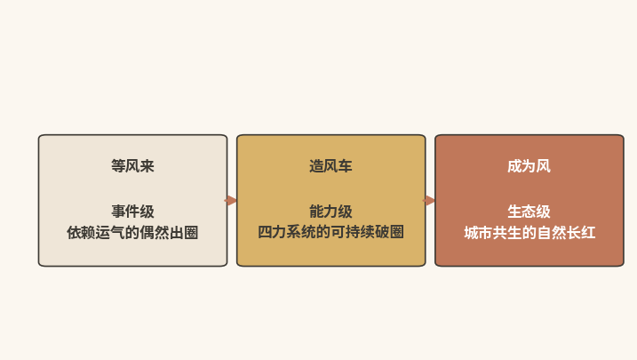
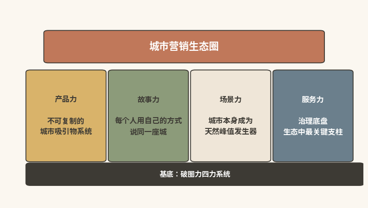
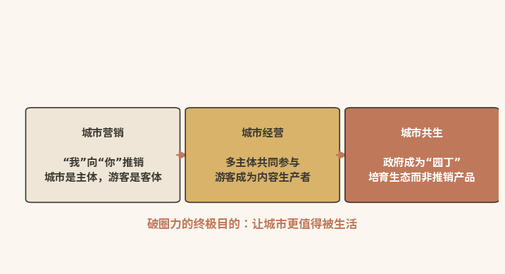

# 生态之境

## ------破圈力从城市营销升维为城市共生

  ----------------------------------------------------------------------------------------------------------------------------------------------------
  本章速读：破圈力的终点是生态级。产品力、故事力、场景力、服务力四大支柱托起城市营销生态圈；从城市营销升维为城市共生，让城市成为"值得被生活"的地方。

  ----------------------------------------------------------------------------------------------------------------------------------------------------

【本章导读】

本章回答破圈力建设的终点问题。下篇前两章分别讨论了破圈力的组织化与评估：前者解决"谁来做"，后者解决"做得好不好"。这两个问题背后，是一个更根本的追问：终点何在。

破圈力建设的终点，不是建成一套高效运转的AI营销系统，不是培养一支精通AIGC的内容团队，也不是打通所有部门的数据壁垒。这些都是过程，不是终点。

破圈力建设的终极目标，不是"让城市更会营销"，而是"让城市不再需要刻意营销"。当破圈力从"外部附加的能力"内化为"城市DNA的一部分"，质变随之发生：感知、生成、连接、进化，都从"系统的动作"变成"城市的本能"，即城市天然知道世人在想什么，每个市民的日常都是最好的城市故事，对的人和对的城市天然相遇，城市本身就在生长。至此，破圈力完成根本跃迁：从"城市的工具"，变成"城市的生命"。

这就是本章的终极命题：破圈力的生态化。它是全书从"方法论"到"哲学"的最后一跃，回答的问题已从"怎么做"变成"城市应该成为什么"。

## 三层级、两跃迁：破圈力从等风来、造风车到成为风

第二章提出过事件级、能力级、生态级三个层级，当时只做了概念区分。全书即将收尾，本节重新审视三者之间的跃迁路径（见图10-1）。

{width="4.330555555555556in" height="1.20625in"}

图10-1 从等风来、造风车到成为风

需要明确的是，这三个层级是三个认知境界，而非三个依次达标的阶段。每跃升一级，城市看待自身与世界关系的方式，就发生一次根本转变。

### 能力之迁：从等风来到造风车的认知革命

事件级破圈力的核心词是"运气"。一次偶然的热搜、一股突然的潮流，都可能让流量降临到一座城市。城市可能接住了，如哈尔滨；也可能没接住，如第九章第五节的反面案例。但无论接住与否，这都不是"能力"，只是"反应"。

能力级破圈力的核心词是"系统"。城市不再等外部事件触发，而是拥有一套可持续运转的系统能力：感知力让它随时知道"该说什么"，生成力让它随时"说得出来"，连接力让它随时"送到对的人面前"，进化力让它每一次都比上一次做得更好。

从事件级到能力级的跃迁，本质上是一次"认知革命"：过去，城市是一座待售的房子，只能等识货的买家上门；此后，城市是一台永不停歇的发电机，持续产生光和热。

景德镇是这次跃迁的典型样本。五年前，它还依赖"千年瓷都"这张历史名片；五年后，它已形成一套自主运转的内容生产和服务能力（详见第二章第三节），不再"等"下一个热搜，而是有能力"创造"下一个被搜索的理由。

### 生态之迁：从造风车到成为风的主体转换

能力级破圈力的核心特征是：城市"拥有"破圈力。AI感知系统、AIGC内容工厂、精准分发平台、策略迭代机制，都由城市的某个部门（如CCoE）运营维护，需要被管理、被优化、被升级。

生态级破圈力的核心特征则是：城市"就是"破圈力。破圈力融进了城市的日常肌理，不再是外部附加的能力。市民的日常聊天、街角的一杯茶、菜市场里的一声吆喝，都不是"被策划的内容"，却往往就是最好的内容。

从能力级到生态级的跃迁，本质上是一次"主体转换"：从"城市在做营销"，到"城市的每一个细胞都在自然传播"。深层逻辑在于：城市生活的质量，本身就是最持久的破圈力来源。

成都正是这次跃迁的活态证明：它的"长红"不是营销能力的产物，而是城市生活质量的"自然溢出"（完整剖析见本章第四节）。

### 角色转换：AI从能力倍增器变为生态连接器

在事件级到能力级的跃迁中，AI扮演"倍增器"，让城市的感知更全量、生成更规模、连接更精准、进化更实时。没有AI，这一跃迁仍可能发生（景德镇在AI大规模应用之前就已开始能力建设），但速度会慢得多，成本会高得多。

而在能力级到生态级的跃迁中，AI的角色发生了质变：从"倍增器"变成"连接器"。此时AI的核心功能，不再是"更快地生产内容"，而是"更高效地连接生态中的每一个节点"：让政府的数据成为市民决策的依据，让市民的创意成为AIGC的种子，让游客的反馈成为城市进化的燃料。

最深远的变化在于：能力级，城市管理者使用AI；生态级，城市管理者用AI"让其他人更好地使用AI"。这是从"管理者"到"赋能者"的角色转变。

## 生态四柱：四大支柱协同支撑城市营销生态圈

生态级破圈力由四根支柱支撑（见图10-2所示），通往终点的过程，就是夯实这四根柱子的过程。在进入四根支柱之前，需先说明它们与全书核心框架四力模型的关系：四力是"能力建设视角"的手段，四柱是"生态结果视角"的呈现，感知力与生成力的长期积累，沉淀为产品力与故事力；连接力与进化力的日常运转，外化为场景力与服务力。四力回答"怎么建"，四柱回答"建成什么样"，二者是同一枚硬币的两面。这四根柱子不是"四个KPI"，而是"四个持续运转的生命系统"。

{width="4.330555555555556in" height="2.1875in"}

图10-2 城市营销生态圈的四大支柱

### 产品之力：构筑不可复制的城市吸引物系统

产品力回答的问题是：这座城市凭什么让人来。

这不是"有没有5A级景区"的问题。传统旅游城市把"产品"理解为孤立的"景点"：游客来了，打卡，离开，这是"景点经济"的逻辑。生态级的城市产品力，则是"景点+体验+生活+故事"的综合体，是一个完整的城市吸引物系统。

景德镇陶瓷文化的持续吸引力，并非来自"古窑民俗博览区"这类多数城市都能建的设施。真正的原因在于：它有古窑、文创街区和遍布全城的陶瓷工坊，有让人想拥有的文创产品、让人想参与的数字化体验，还有全球艺术家带来的持续新鲜感。这些要素单独看都不足以支撑"长红"，合在一起，便构成了不可复制的城市吸引物系统。

产品力的核心，在于打卡点之间有没有形成体验链条，而不在于打卡点的数量。游客在景德镇的体验，是"在博物馆看到一件明代瓷器→在工坊亲手拉一只碗→在市集买到那件瓷器的文创复刻品"，而非"看了A、去了B、买了C"。这是一条完整的"文化体验链条"，不是三个孤立的"消费场景"。

### 故事之力：让每个人用自己的方式说同一座城

故事力回答的问题是：这座城市的"故事"如何被讲出来、如何被传出去。

传统城市营销的"故事力"，就是"一条宣传片+一句品牌口号"：宣传片三五年更新一次，口号随决策层更替而改换。这种"故事力"在数字时代远远不够。社交媒体的内容消费周期以"天"甚至"小时"计，城市需要的是"每天都在更新的城市叙事"。

这正是第五章（生成力）讨论的AIGC+UGC共生生态的战略意义：AIGC提供"故事种子"，UGC提供"故事生命力"。每个游客、每个市民都在用自己的视角为城市续写新故事；官方则提供"故事主线"，确保多元叙事最终汇聚成有内核、有温度、有辨识度的城市品牌形象。

生态级的故事力，不是"大家都在说同一句话"，而是"每个人都在用自己的方式，说着同一座城市"。景德镇的故事，是"法国陶艺家在地摊上和老匠人用手势交流拉坯技法""上海年轻人辞职来学做陶瓷，三年后开起自己的工作室"，而不是官方那句"千年瓷都、匠心传承"。这些故事没有一条出自官方策划，但每一条都在为"千年瓷都的当代活力"做注解。

### 场景之力：让城市本身成为天然的峰值发生器

场景力回答的问题是：这座城市让人"记住什么"。

第七章（进化力）讨论过"峰终定律"：人们对体验的记忆，主要由峰值和终点塑造。这一定律在生态级破圈力中有了更深的含义：能力级，峰终定律是"一种体验设计方法"；生态级，它从"方法"变成了"本能"，城市不需要刻意设计峰值，因为城市本身就是一个"峰值发生器"。

成都的"烟火气"就不是设计出来的。人民公园的鹤鸣茶社据公园方志建于1923年（创始人龚焕文，一说取家乡鹤鸣山之意；"白鹤入梦"则是民间附会），2023年办了百年庆典。它从来不是"为了吸引游客"才存在的，却天然就是一个"峰值"：人们坐在竹椅上喝盖碗茶、摆龙门阵，时间仿佛慢了下来。这种"峰值"的力量在于：真实、有机、不可复制。

场景力的核心，不在"把城市包装成一个剧场"，而在"让城市成为一个值得被体验的地方"。前者是迪士尼的逻辑，后者是成都的逻辑。两种逻辑没有高下之分：迪士尼旗下主题公园每年接待游客超过一亿人次\[1\]，证明"精心设计"同样可以非常成功。但生态级破圈力追求的是后者，因为"生活"比"演出"更可持续、更不可复制、更深植于城市的土壤。

### 服务之力：治理底盘是生态中最关键的支柱

服务力回答的问题是：这座城市能否让人"放心来"。

产品力让人想来，故事力让人知道，场景力让人记住；服务力则决定了人来了之后，是"庆幸自己来了"，还是"后悔自己来了"。

哈尔滨退票风波的正面翻转（详见第四章），靠的是"更真的诚意"，而非"更美的冰雕"。那些快速响应的技术含量并不高，传递的信号却足够强烈："我们真的在乎你。"

那些在危机之后依然"长红"的城市，流量只是表象，底盘在治理："在这座城市，你不会被宰、不会被冷落、不会感到不安全。"这些不是营销，而是治理。

在生态级破圈力中，服务力是四根柱子里最不起眼、却最关键的一根。再好的产品、故事与场景，一次糟糕的服务体验就可能让它们大打折扣；一次超出预期的服务体验，却可能成为城市品牌最有力的"信任背书"。

### 四柱协同：生态健康取决于最短的那根支柱

产品力、故事力、场景力、服务力，是一个生态系统的四大支柱，遵循"短板效应"：任何一根支柱坍塌，都会拖垮整个生态系统。

产品力是内核：没有好东西，再好的故事也是"虚假宣传"。

故事力是表达：没有好的传播，再好的东西也是"养在深闺人未识"。

场景力是体验：没有记忆点，再好的东西也只是"到此一游"。

服务力是保障：没有让游客"放心"的底线，前面三根支柱都是"空中楼阁"。

四柱协同的最高境界，是"彼此不再可分"：产品本身就是最好的故事素材，如景德镇的陶瓷体验；故事本身就是一种场景营造，"在成都的茶馆坐了一下午"本身就是最动人的场景叙事；场景本身就包含服务的温度，如哈尔滨的"宠客"场景；服务本身就是产品的一部分，如成都"从不令人失望"的市井善意。

反过来，四大支柱一旦失衡，城市营销会呈现三种典型"病症"。它们大多不致命，但会让城市在错误的支柱上持续投入，越努力越偏离。

病症一：有产品无故事，即"宝藏城市综合征"。

这类城市往往资源禀赋过硬，却困于"酒香也怕巷子深"：叙事体系陈旧，传播渠道单一，外界的认知还停留在十年前的一句口号上。修复路径是补齐故事力，而非"再建一个景区"。先用感知力找到"外界已产生的零星好奇"，再用AIGC+UGC共生机制，把它放大为持续的叙事流。产品已经存在，缺的只是被讲述的方式。

病症二：有故事无场景，即"滤镜城市综合征"。

这类城市擅长制造声量：宣传片精美、话题运营娴熟、KOL矩阵齐整。但游客抵达之后，会发现"买家秀与卖家秀"落差巨大：宣传里的诗意街巷，现实中是千篇一律的商业街。故事透支了信任，场景撑不起预期。修复路径是果断"降虚火、补实功"，把内容预算的一部分转到体验链条的打磨上，让每一个被传播的画面都能在现场被真实复现。故事的音量，不应超过场景的承载力。

病症三：有场景无服务，即"昙花城市综合征"。

这类城市往往因一次事件爆红，短期内体验达到峰值；但流量一涌入，宰客、排队混乱、投诉无门、公厕告急等治理短板便集中暴露。场景带来了人，服务却赶走了人。修复路径是把服务力建设前置为"流量的准入门槛"：放大声量之前，先完成市场监管、价格诚信、应急响应的底盘加固。宁可晚三个月红，也不要红了三天就被服务差评反噬。

三种病症的共同处方是同一个：不要只看最长的支柱有多高，要常问最短的支柱有多短。生态的健康，从不取决于最长的那根支柱。

## 第四生态：以第四产业理论锚定城市共生观

全书的论述，从"决策成本的结构性迁移"出发，经过"四力模型"的展开，走到了"四大支柱"的生态化升级。但"生态化"还需要一个理论锚点，为其提供更深的思想根基。

这个锚点，来自中国工程院院士王金南2020年提出的一个开拓性概念："生态产品第四产业"。需要说明的是："第四产业"是王金南院士的原创理论；本节标题所称"第四生态"，则是本书将这一理论引申到城市营销语境后提出的概念，二者不可混同。

### 理论启示：城市一切资源皆可量化为生态产品

王金南院士的核心洞见是：把"绿水青山"作为生态资源核心要素，通过GEP核算将生态系统提供的清新空气、水源涵养、景观文化等服务的隐性价值显性化、量化\[2\]；再借助生态补偿、碳汇交易、经营开发等机制推动其市场化变现。由此形成围绕生态产品价值实现的"生态产品第四产业"：它并非简单叠加在农业、工业、服务业之后的法定第四门类，而是支撑生态文明、以生态资源为主导生产要素的新产业集合。一座山、一条河过去提供的调节服务与文化服务具有公共产品属性，长期作为正外部性存在：人人可以享用，却无人为此付费。生态产品第四产业理论的关键一步，就是用科学核算与制度设计把这些未被定价的生态价值纳入现代经济体系，让保护修复生态获得合理回报。

这一理论对城市营销具有直接的借鉴意义。

城市的文化资源（千年历史、非遗技艺、在地生活方式）、自然禀赋（山水林田湖草沙）、市民热情（天水人的质朴、哈尔滨人的真诚、成都人的巴适）、治理能力（服务效率、安全保障、公平透明），都是城市的"生态产品"。过去，它们只是城市营销的"背景素材"：价值从未被系统量化，未被纳入城市品牌资产的计算，也未被当作可持续经营的"产品"。正如西蒙·安霍尔特（Simon
Anholt）在《竞争性认同》中所言，城市与国家一样，皆是参与竞争性认同建构的品牌主体\[3\]。而认同建构得以展开的前提，正是对这些资源价值的系统认知与持续经营。

第四产业理论为破圈力的生态化，提供了三条根本性启示。

启示一：城市的一切都可以被重新定义为"产品"。

不只是景点和美食，还有空气质量、街道整洁度、市民友善程度、政府热线响应速度，每一个影响"城市生活体验"的要素，都可以被量化为"城市生态产品"，并通过AI技术连接市场。游客搜索"哪个城市适合带孩子出行"时，AI不仅推荐景点和酒店，还会引用"空气质量优良天数""儿童友好设施密度"等指标。这就是"城市生态产品"的AI价值量化。

启示二：生态产品的价值不是"消耗性"的，而是"再生性"的。

工业产品用完即耗尽；生态产品只要保护得当，就源源不断。同理，城市的文化资源不是"消耗品"，只要守住文化的本真性，它就能持续产生品牌价值；而过度商业化就是在"消耗"城市的生态产品，比如把古街变成千篇一律的旅游商品街，透支城市品牌的未来。

启示三：生态产品的价值实现，需要"市场机制"。

一座山的好空气不需要"推销"，但要让它产生经济价值，就需要碳交易市场。同理，一座城市的"真诚"和"温暖"不需要打广告，但要让这些品质转化为品牌资产和出行决策，就需要AI系统来"量化、认证、推荐"它们。破圈力的四力模型和五真信任体系，正是为"城市生态产品"建立市场机制的技术基础设施。

### 城市共生：政府从营销推广者变为生态园丁

第四产业理论把破圈力的生态化，上升到了哲学高度。站在这个高度，"城市营销"这个词本身，已经不足以描述正在发生的事情。

"营销"的底层逻辑是"我"向"你"推销：我是主体，你是客体。这一逻辑在事件级和能力级破圈力中仍然适用：城市需要用感知力、生成力、连接力"主动触达"用户。但在生态级，它开始蜕变。"营销"不再是一座城市对另一群人做的事，而变成城市内部政府、企业、市民、游客、AI等多主体的"价值共创"：政府提供治理和服务，企业提供产品，市民提供温度，游客提供传播，AI提供连接。没有人是纯粹的"生产者"或"消费者"：每个人都在为城市"品牌"贡献价值，也都在从中收获价值。

{width="4.330555555555556in"
height="1.2965277777777777in"}

图10-3 从城市营销到城市共生

其间往往经历"城市经营"的过渡形态：多主体共同参与、游客成为内容生产者，最终完成从"城市营销"到"城市共生"的认知跃迁（见图10-3所示）。

在这种共生关系里，城市政府从"推广者"变成了"园丁"：不设计每一朵花，而是培育让百花盛开的土壤；不策划每一条内容，而是创造让好内容自然发生的生态；不管理每一个游客的体验，而是让游客自主发现属于他们的峰值。

"园丁"这个角色，有三层容易被忽略的内涵。其一，园丁的工作对象是"土壤"而非"花朵"：政府的核心职责，从"生产内容"转向"改善生态要素"，比如数据的开放度、创意的容错度、市民参与的便利度。土壤肥了，花自己会开；其二，园丁尊重生长节律：不揠苗助长，一次透支信任的流量狂欢，可能需要数年才能修复土壤；其三，园丁懂得"修剪"比"浇水"更重要：对过度商业化、侵害市民生活品质的流量行为，及时说"不"。在共生的城市里，政府的克制本身，就是一种生态治理能力。

## 蓉城样本：生态级破圈力的成都实践

成都是本书反复出现的城市，前八章中它多次作为"生态级破圈力"的概念参照登场。本节是首次（也是全书仅有的一次）完整、深入地剖析成都的破圈力生态。

### 圈外之城：成都不曾出圈，因为一直在圈外

成都是中国城市中一个独特的存在。它没有"突然火了"的时刻：没有一次靠营销制造的全网热搜事件，没有一个全民追捧的爆款单品，也没有一个让人一提起成都就想到的"年度热梗"。

哈尔滨有"宠客"，荣昌有"卤鹅哥投喂甲亢哥"，天水有"麻辣烫"。成都没有与之对应的单一符号。

成都有的是："每个人的成都"。

对从北上广逃离的年轻人，成都是"可以慢下来的地方"；对美食博主，成都是"随便走进一家苍蝇馆子都不会踩雷的地方"；对文艺青年，成都是"玉林路的小酒馆和杜甫草堂的诗意"；对带孩子的家庭，成都是"熊猫基地里孩子的尖叫声"。

成都没有统一的"品牌形象"，它也不需要。因为它的品牌不是"被策划"的，而是"被活出来"的。每一个在成都生活过、旅行过、向往过的人，都有属于自己的"成都故事"。千千万万个故事，汇聚成这座城市共同的气质："烟火气"。

### 成都诠释：四大支柱在蓉城的活态呈现

**产品力：成都的产品不是"景区"，而是"生活方式"。**茶馆、火锅、麻将、人民公园的相亲角、玉林路的小酒馆、大熊猫繁育研究基地，是成都人日常生活的横截面，而非孤立的"景点"。成都真正的"产品"是一句话："在这座城市，你可以理直气壮地享受生活。"

故事力：成都的故事不是官方生产的。"和我在成都的街头走一走，直到所有的灯都熄灭了也不停留"，赵雷2016年发行的这首《成都》，让无数人对一座城产生向往。"成都，一座来了就不想离开的城市"，这句话源自2003年张艺谋执导的成都城市宣传片，但它真正活下来，靠的是此后二十多年无数游客和市民的自发转述。它早已从一句宣传片主题语，变成了全民共享的"公共叙事"\[4\]。

场景力：成都的"峰值"不是被设计的，而是天然存在的。在人民公园的鹤鸣茶社点一杯盖碗茶，从下午坐到黄昏，这个场景不需要AI来"设计"。它已天然存在了一个世纪\[5\]。在太古里，穿过千年古刹大慈寺的红墙，走进隔壁的全玻璃幕墙奢侈品旗舰店，这种"千年和当下撞个满怀"，本身就是极具冲击力的体验峰值。

服务力：这可能是成都四大支柱中最不突出、却也最稳定的一根。它没有哈尔滨式的"宠客"大动作，但有润物细无声的"便民"：公交覆盖全城、公共卫生干净整洁、市民普遍友善。这是一种"不令人惊喜但从不令人失望"的服务力，底盘是持续的城市治理投入：2024年，成都实施城中村改造项目70个、片区更新项目44个、老旧院落改造项目630个，并入选全国首批城市更新示范城市\[6\]。在生态级破圈力中，这种"稳定的底盘"比"偶尔的惊喜"更珍贵。

### AI角色：不制造烟火气，只让烟火气被看见

成都是一个不需要"破圈力建设"的城市，因为破圈力已内化为它的城市DNA。但这不意味着AI在成都没有角色。恰恰相反，AI正从"能力建设者"转变为"生态连接者"。

AI可以帮助成都做三件事。

第一，发现和放大"未被看见的烟火气"。成都有无数个"鹤鸣茶社"：深藏街巷、未被主流攻略覆盖、却充满生活肌理的小店小摊。AI可以通过全域感知，发现这些"小角落"里的"大流量潜力"，精准匹配给最可能被触动的游客。

第二，量化和认证"成都生活"的价值。"烟火气"是模糊的概念，AI可以将它量化为可搜索、可比较、可推荐的"城市生态产品"：茶馆密度、公共空间人均面积、市民友善度指数等。当游客问AI"哪座城市最适合慢下来生活"，这些量化指标，就是AI推荐成都的依据。

第三，保护和维系"烟火气"的本真性。成都面临的最大挑战，不是"怎么出圈"，而是"怎么在出圈之后不失本真"。AI可以通过实时监测商业化程度、居民满意度等指标，在"过度商业化"的早期发出预警，帮成都守住"真实的烟火气"。

### 成都启示：烟火气不可复制，生态哲学可学习

成都无法被复制。一座城市需要百年积淀，才能拥有自己的"烟火气"，这不是任何AI系统能加速的。但成都可以被学习：不是学它的"烟火气"，而是学它"让城市本身成为答案"的哲学。

破圈力建设的终极目标，是让城市"活出值得被传播的样子"，而不只是"拥有强大的营销能力"。当一座城市真正成为"更好的自己"，它的"出圈"就不再需要"策略"和"预算"，它只是城市生活质量的"自然溢出"。

具体来看，成都经验有三条可迁移的路径。

第一条：生态思维的迁移。学成都，要学它"把城市生活本身当作产品"的底层思维，而不是"开茶馆""办灯会"这些表层动作。任何城市都可以审视：市民日常中，哪些场景是外人羡慕而本地习以为常的。那些"习以为常"里，往往埋着生态级破圈力的种子。迁移的是视角，不是形式。

第二条：支柱配比的诊断。成都的四根支柱并非天生均衡。其他城市可以借助第九章的五维评估框架，诊断自身的"支柱配比"：哪一根是长板、哪一根是短板、哪一根被高估了。成都的启示不在"四柱皆强"，而在于它清楚自己的配比结构，并且从不拿短板去赌流量。

第三条：渐进式培育的节奏。成都的"烟火气"积淀了一百年，但其生态建设节奏值得所有城市参照：先修生活，再修体验，最后才谈传播。把时间表从"营销战役的季度"拉长到"生态培育的五年十年"，这本身是对成都最深刻的学习。

这就是成都给所有中国城市的终极启示：不要想着怎么"出圈"，要想怎么"成为一座值得出圈的城市"。

## 本章小结：破圈力的归宿是从城市营销升维到城市共生

本章是全书的哲学高潮：从"怎么做"上升到"为什么做"。

第一节回顾了破圈力的两次跃迁：从事件级（等风来）到能力级（造风车），再从能力级到生态级（成为风）；每一次跃迁，都不只是能力的升级，更是认知的进化。

第二节提出城市营销生态圈的四大支柱：产品力（让人想来）、故事力（让人知道）、场景力（让人记住）、服务力（让人放心），协同的最高境界是"彼此不再可分"。

第三节以王金南院士的"生态产品第四产业"理论为锚点（"第四生态"为本书在城市营销语境中的引申），提出"从城市营销到城市共生"的终极生态观：城市不是营销的主体，而是共生的平台；政府从"推广者"变成"园丁"。

第四节以成都为活态样本，展示了生态级破圈力的真实形态：不需要刻意出圈，因为城市本身就在圈外。

成都的启示，浓缩为全书最重要的一句话：不要想着怎么"出圈"，要想怎么"成为一座值得出圈的城市"。

至此，破圈力的十章全部完成：上篇定义它，中篇建设它，下篇升级它。接下来的结语，将回到全书的起点（认知主权），为这场从"网红"到"长红"的旅程画上句号。

+:-------------------------------------------------------------------------------------+
| 破圈力的终极形态，不是"城市拥有了强大的营销能力"，而是"城市活出了值得被传播的样子"。 |
|                                                                                      |
| 不要想着怎么"出圈"，要想怎么"成为一座值得出圈的城市"。                               |
|                                                                                      |
| 从"城市营销"到"城市共生"：政府不是推广者，而是园丁。                                 |
+--------------------------------------------------------------------------------------+

### 参考文献

\[1\] TEA, AECOM. TEA/AECOM 2023 Theme Index: Global Attractions
Attendance Report\[R\]. Los Angeles: Themed Entertainment Association,
2024.

\[2\] 王金南, 王志凯, 刘桂环, 等.
生态产品第四产业理论与发展框架研究\[J\]. 中国环境管理, 2021, 13(4):
5-13.

\[3\] ANHOLT S. Competitive Identity: The New Brand Management for
Nations, Cities and Regions\[M\]. Basingstoke: Palgrave Macmillan, 2007.

\[4\] 网易. 锦官文明志：破解成都的文明密码\[N/OL\].
(2025-12-17)\[2026-08-07\].
https://www.163.com/dy/article/KH09ULQ605346936.html.

\[5\] 人民网四川频道. 成都"网红"鹤鸣茶社100周岁了！\[N/OL\].
(2023-03-19)\[2026-08-07\].
http://sc.people.com.cn/n2/2023/0319/c379469-40342496.html.

\[6\] 人民网四川频道. 公园城市蓉颜焕新\[N/OL\].
(2025-11-18)\[2026-08-07\].
http://sc.people.com.cn/n2/2025/1118/c345167-41414494.html.
